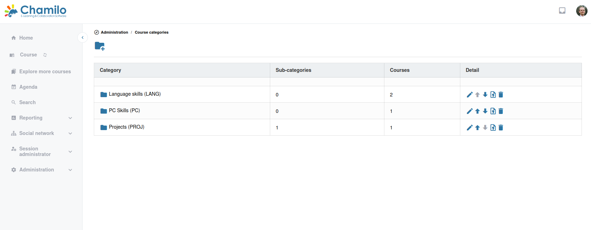

# Kurskategorien

Kurskategorien helfen dabei, Ihren Kurskatalog zu strukturieren, sodass Lernende relevante Kurse leichter finden.

## Eine Kategorie erstellen

1. Navigieren Sie im Administrationsbereich zu **Kurskategorien**
2. Klicken Sie auf **Kategorie hinzufügen**
3. Geben Sie ein:
   * **Kategoriecode** — Eine kurze, eindeutige Kennung
   * **Kategoriename** — Der Anzeigename (z. B. „Informationstechnologie“, „Managementkompetenzen“)
   * **Hinzufügen von Kursen in dieser Kategorie erlauben?** — Ob Kurse diese Kategorie setzen dürfen oder sie lediglich als Zwischenebene in einer Hierarchie dient 
   * **Übergeordnete Kategorie** — (Optional) Platzieren Sie diese Kategorie unter einer anderen Kategorie, um eine Hierarchie zu erzeugen
   * **Beschreibung** — (Optional)
   * **Bild** — (Optional) Repräsentiert diese Kategorie, obwohl es praktisch nirgendwo angezeigt wird
4. Drücken Sie *Kategorie hinzufügen*

Chamilo legt standardmäßig 3 Kategorien an: *Language skills*, *PC Skills* und *Projects*. Diese können umbenannt, entfernt oder beibehalten werden, je nach Bedarf.

## Kategoriehierarchie

Kategorien können verschachtelt werden, um eine Baumstruktur zu erzeugen:

* Business
  * Management
  * Marketing
  * Finance
* Technology
  * Programming
  * Networking
  * Cybersecurity

Lernende, die den Kurskatalog durchsuchen, können diese Hierarchie nutzen, um Kurse zu finden.

## Kategorien verwalten

* **Bearbeiten** — Kategoriename, Code oder übergeordnete Kategorie ändern
* **Verschieben** — Die Position einer Kategorie in der Liste ändern
* **Löschen** — Eine Kategorie entfernen. Kurse einer gelöschten Kategorie werden nach „unkategorisiert“ verschoben.

## Tipps

* **Einfach halten** — Verwenden Sie breite Kategorien, die Lernende auf einen Blick verstehen
* **Tiefe begrenzen** — Vermeiden Sie tief verschachtelte Kategorien. Zwei oder drei Ebenen sind in der Regel ausreichend.
* **Kategorien bei der Kurserstellung zuweisen** — Ermutigen Sie Lehrende, beim Anlegen von Kursen eine Kategorie zu wählen, damit der Katalog organisiert bleibt