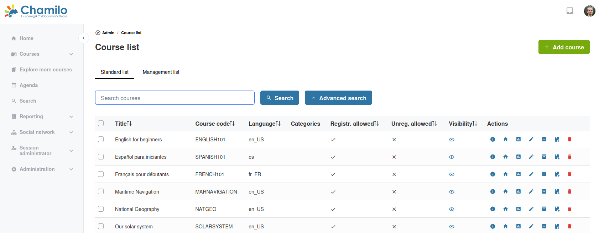

# Kurse verwalten

Als Administrator können Sie alle Kurse auf der Plattform verwalten, unabhängig davon, wer sie erstellt hat.

## Kursliste

Klicken Sie im Administrationsbereich auf **Kursliste**, um alle Kurse anzuzeigen. Die Liste zeigt:

* Kurstitel und Code
* Sprache
* Kategorien
* Sichtbarkeitsstatus

Verwenden Sie das Werkzeug **Erweiterte Suche**, um bestimmte Kurse zu finden.

## Einen Kurs erstellen

Als Administrator können Sie Kurse erstellen und sie einem beliebigen Lehrer zuweisen:

1. Klicken Sie im Administrationsbereich auf **Kurs hinzufügen**
2. Füllen Sie die Kursdetails aus (Titel, Code, Kategorie, Sprache)
3. Weisen Sie dem Kurs einen Lehrer zu
4. Speichern

Hinweis: In Chamilo 1.11.x wurde der Kurscode als Teil der Kurs-URL angezeigt und konnte nach der Erstellung des Kurses nicht mehr geändert werden. Dieses Verhalten hat sich ab Version 2.x geändert. Der Kurscode ist in der URL nicht mehr sichtbar, und zukünftige Versionen könnten Lehrern erlauben, den Kurscode nachträglich zu ändern, da er für die Plattform weniger wesentlich wird.

## Einen bestehenden Kurs verwalten

Suchen Sie einen Kurs in der Liste, um die Verwaltungsoptionen in der Spalte *Aktionen* zu nutzen:

* **Informationen** — Informationen zum Kurs anzeigen 
* **Kursstartseite** — Führt Sie direkt zur Startseite des Kurses 
* **Berichte** — Engagement- und Leistungsdaten einsehen
* **Bearbeiten** — Kurstitel, Kategorie, Sichtbarkeit und andere Einstellungen ändern
* **Sicherungskopie erstellen** — Zum Wartungsbereich des Kurses wechseln, in dem Sie Kopien erstellen und andere Aktionen ausführen können
* **Zum Katalog hinzufügen** — Diesen Kurs zum Kurskatalog hinzufügen
* **Löschen** — Den Kurs und seinen gesamten Inhalt dauerhaft entfernen

> Das Löschen eines Kurses entfernt alle Inhalte, Lernerdaten, Noten und Tracking-Informationen dauerhaft. Erwägen Sie, den Kurs zuvor als Sicherung zu exportieren.

## Massenoperationen

Wählen Sie mehrere Kurse in der Liste aus, um Stapelaktionen wie das Löschen durchzuführen. Um einen Kurs zu exportieren, betreten Sie den Kurs und verwenden Sie das Werkzeug **Wartung** — in der Admin-Kursliste gibt es keine Massenexport-Aktion.

## Sichtbarkeitseinstellungen für Kurse

Administratoren können die von Lehrern festgelegte Sichtbarkeit überschreiben:

| Sichtbarkeit | Wirkung |
|-----------|--------|
| **Öffentlich** | Für alle zugänglich, einschließlich anonymer Besucher |
| **Offen** | Für alle angemeldeten Nutzer zugänglich |
| **Privat** | Nur eingeschriebene Nutzer können auf den Kurs zugreifen |
| **Geschlossen** | Niemand kann auf den Kurs zugreifen (außer dem Lehrer und Administratoren) |
| **Versteckt** | Niemand kann den Kurs sehen oder darauf zugreifen (außer den Administratoren) |