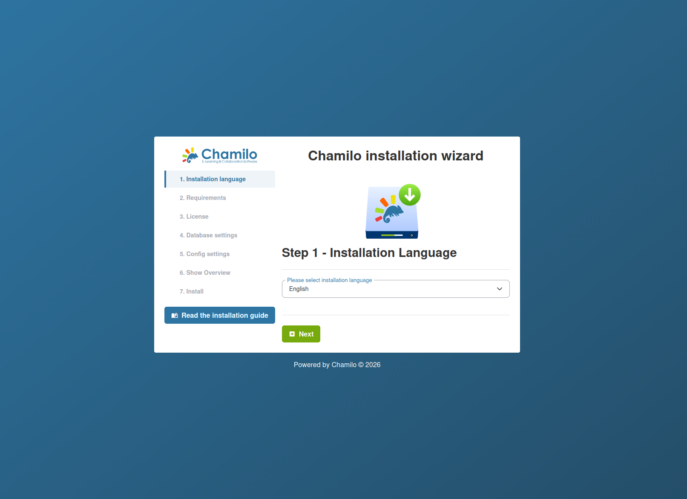
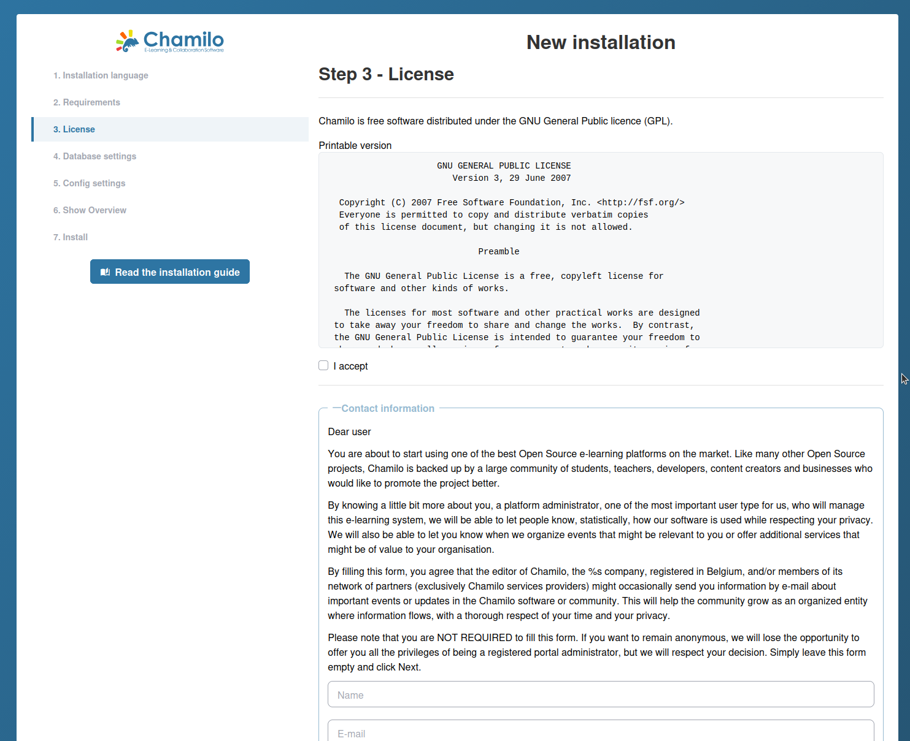
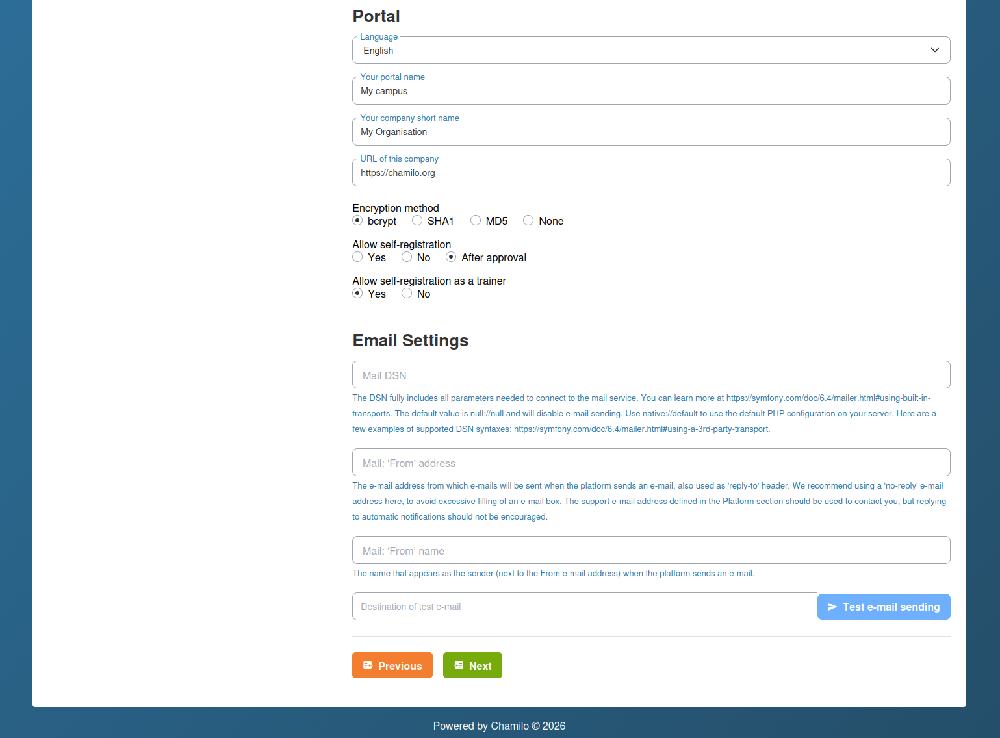

# Installationsassistent

Chamilo 3.0 enthält einen webbasierten Installationsassistenten, der Sie durch die Ersteinrichtung führt. Der Assistent startet automatisch, wenn Sie die Plattform zum ersten Mal aufrufen.

## Bevor Sie beginnen

Stellen Sie sicher, dass die folgenden Voraussetzungen erfüllt sind:

1. Ihr Server erfüllt alle [Serveranforderungen](server-requirements.md).
2. Sie haben eine paketierte Version (zip oder tar.gz) von Chamilo heruntergeladen.
3. Ihr Webserver ist so konfiguriert, dass das Verzeichnis `public/` als Document Root dient.
4. Ihre Datei `.env` existiert und ist leer (der Assistent führt Sie durch die Datenbankeinrichtung).

## Schritt 1: Installationssprache

Im ersten Schritt wählen Sie die Sprache für den Installationsvorgang. Wählen Sie Ihre bevorzugte Sprache aus der Dropdown-Liste.

Wenn Chamilo eine bestehende Installation erkennt (für ein Upgrade), wird der Migrationsstatus angezeigt und statt einer Neuinstallation ein Upgrade-Pfad angeboten.

## Schritt 2: Anforderungsprüfung

Der Assistent prüft Ihre Serverumgebung:

* **PHP-Version** ist 8.3, 8.4 oder 8.5
* **Erforderliche PHP-Erweiterungen** sind installiert (intl, gd, curl, zip, mbstring, xml usw.)
* **Empfohlene PHP-Einstellungen** — `date.timezone` ist konfiguriert, ausreichende Upload-/Speicherlimits
* **Verzeichnis- und Dateiberechtigungen** — `var/`, `config/` und `public/upload/` sind für den Webserver beschreibbar

Wenn Anforderungen nicht erfüllt sind, zeigt der Assistent Warnungen oder Fehler an. Beheben Sie diese, bevor Sie fortfahren.

## Schritt 3: Lizenz

Dieser Schritt zeigt die GNU/GPLv3-Lizenz. Sie müssen das Kontrollkästchen **„I accept“** aktivieren, um fortzufahren.

Optional können Sie den Abschnitt **Contact information** aufklappen, um Angaben zu Ihrer Organisation zu machen (Name, E-Mail, Unternehmen, Land). Dies ist freiwillig und hilft der Chamilo-Community zu verstehen, wer die Plattform nutzt, ermöglicht uns aber auch, Sie *sehr selten* über Veranstaltungen in Ihrer Nähe zu informieren.

## Schritt 4: Datenbankeinstellungen

Geben Sie Ihre Datenbankverbindungsdaten ein:

| Feld | Beschreibung |
|-------|-------------|
| **Database host** | Der Hostname oder die IP Ihres Datenbankservers (z. B. `localhost` oder `127.0.0.1`) |
| **Database port** | Standard: 3306 für MySQL/MariaDB |
| **Database name** | Der Name der zu verwendenden Datenbank (nur alphanumerische Zeichen und Unterstriche) |
| **Database user** | Ein Datenbankbenutzer mit vollen Rechten auf der angegebenen Datenbank |
| **Database password** | Das Passwort des Datenbankbenutzers |

Klicken Sie auf **Check database connection**, um zu testen. Der Assistent lässt Sie erst fortfahren, wenn die Verbindung erfolgreich ist. Wenn die Datenbank bereits existiert, wird eine Warnung angezeigt.

## Schritt 5: Konfigurationseinstellungen

Dieser Schritt kombiniert die Erstellung des Administratorkontos, Portaleinstellungen und die E-Mail-Konfiguration.

### Administratorkonto

| Feld | Beschreibung |
|-------|-------------|
| **Login** | Der Benutzername des Administrators |
| **Password** | Wählen Sie ein starkes Passwort — dieses Konto hat vollen Zugriff auf die Plattform |
| **First name** | Der Vorname des Administrators |
| **Last name** | Der Nachname des Administrators |
| **Email** | Wird für Systembenachrichtigungen und Passwortzurücksetzungen verwendet |
| **Phone** | Optionale Kontaktnummer |

Diese Admin-Angaben werden von Chamilo auch für die Support-Kontaktdaten verwendet. Konfigurieren Sie diese daher nach Abschluss der Installation in den Einstellungen neu.

### Portaleinstellungen

| Feld | Beschreibung |
|-------|-------------|
| **Language** | Die Standardsprache der Benutzeroberfläche |
| **Portal name** | Der Name Ihrer Plattform (z. B. „My Organization LMS“) |
| **Company short name** | Der Kurzname Ihrer Organisation |
| **Company URL** | Die Website Ihrer Organisation |
| **Encryption method** | Algorithmus zum Hashen von Passwörtern — **bcrypt** wird empfohlen |
| **Allow self-registration** | Yes / No / After approval |
| **Allow self-registration as trainer** | Yes / No |

### E-Mail-Konfiguration

Im Abschnitt für E-Mail-Einstellungen konfigurieren Sie den Mail-Transport (SMTP, Amazon SES, Mailjet usw.) und testen den E-Mail-Versand. Details finden Sie unter [E-Mail-Konfiguration](email-configuration.md).

Alle diese Einstellungen können später im Administrationsbereich geändert werden.

## Schritt 6: Letzte Prüfung vor der Installation

Dieser Schritt zeigt eine Zusammenfassung aller eingegebenen Angaben zur Überprüfung:

* Administrator-Zugangsdaten (das Passwort ist standardmäßig ausgeblendet — klicken Sie auf das Augen-Symbol, um es anzuzeigen)
* Portal-Einstellungen
* Datenbankverbindungsdetails

Prüfen Sie alles sorgfältig und klicken Sie anschließend auf **Install Chamilo**, um die Installation auszuführen. Der Assistent erstellt alle Datenbanktabellen, füllt die Anfangsdaten und konfiguriert die Plattform.

## Schritt 7: Installation abgeschlossen

Nach erfolgreichem Abschluss der Installation zeigt der Assistent:

* **Erste Schritte** — Empfiehlt, Ihren ersten Kurs anzulegen, um die Plattform zu erkunden (als Administrator müssen Sie dies über das Admin-Panel tun)
* **Sicherheitsempfehlungen**:
  * Machen Sie das Verzeichnis `config/` schreibgeschützt (`chmod 0555`)
  * Löschen Sie das Verzeichnis `public/main/install/`
* Einen **Link zu Ihrem Portal**, um sich mit den soeben erstellten Administrator-Zugangsdaten anzumelden

## Nach der Installation

Nach Abschluss des Assistenten:

* **Installer entfernen oder den Zugriff einschränken** -- Der Assistent sollte nach der Installation nicht mehr erreichbar sein. Chamilo sperrt ihn in der Regel automatisch; prüfen Sie jedoch, ob ein erneuter Aufruf der Installations-URL zur Anmeldeseite umleitet.
* **E-Mail-Zustellung konfigurieren** -- Siehe [E-Mail-Konfiguration](email-configuration.md).
* **Backups einrichten** -- Bevor Sie Inhalte hinzufügen, konfigurieren Sie automatisierte Datenbank- und Datei-Backups (Chamilo stellt hierfür keine eigene Lösung bereit; das Kopieren des Ordners var/ und der Datenbank sind die beiden wichtigsten Elemente).
* **Sicherheitseinstellungen prüfen** -- Siehe [Sicherheitseinstellungen](../platform-settings/security-settings.md).

## Fehlerbehebung

| Problem | Lösung |
|---------|----------|
| Leere Seite unter der Installations-URL | Prüfen Sie die PHP-Fehlerprotokolle. Setzen Sie vorübergehend `APP_ENV=dev` in .env, um Fehler im Browser anzuzeigen. |
| Datenbankverbindung schlägt fehl | Überprüfen Sie die Zugangsdaten, stellen Sie sicher, dass die Datenbank existiert, und prüfen Sie, ob der Datenbankserver Verbindungen vom Host des Webservers zulässt. |
| Fehler wegen fehlender Berechtigungen | Stellen Sie sicher, dass `var/` für den Benutzer des Webservers beschreibbar ist. |
| Assets werden nicht geladen (kein CSS/JS) | Führen Sie `yarn install && yarn build` aus, um die Frontend-Assets zu kompilieren. |