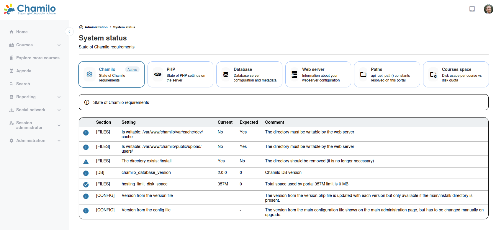

# Systemstatus

Die Seite Systemstatus hilft Ihnen zu überprüfen, ob Ihr Chamilo-Server korrekt konfiguriert ist, und mögliche Probleme zu erkennen.

## Zugriff auf den Systemstatus

Klicken Sie im Administrationsbereich auf **Systemstatus** (oder **Systeminformationen**).

## Was angezeigt wird

### PHP-Konfiguration

* **PHP-Version** — Chamilo 3.0 unterstützt PHP 8.3, 8.4 und 8.5
* **Erforderliche Erweiterungen** — Prüft, ob alle notwendigen PHP-Erweiterungen installiert sind
* **PHP-Einstellungen** — Überprüft wichtige PHP-Einstellungen wie Speicherlimit, Upload-Limits und Ausführungszeit

### Datenbankstatus

* **Datenbankverbindung** — Bestätigt, dass die Datenbank erreichbar ist
* **Datenbankversion** — Zeigt die Version des Datenbankservers

### Dateiberechtigungen

* **Beschreibbare Verzeichnisse** — Prüft, ob Chamilo in die erforderlichen Verzeichnisse schreiben kann (Cache, Uploads, Logs)

### Serverinformationen

* **Betriebssystem** — Angaben zum Server-Betriebssystem
* **Webserver** — Apache, Nginx oder anderer
* **Festplattenspeicher** — Verfügbarer Speicherplatz

## Empfohlene Prüfungen

Führen Sie diese Prüfungen regelmäßig durch:

* **Nach der Installation** — Überprüfen Sie, ob alle Anforderungen erfüllt sind
* **Nach Upgrades** — Stellen Sie sicher, dass PHP-Version und Erweiterungen weiterhin kompatibel sind
* **Bei auftretenden Problemen** — Prüfen Sie bei der Fehlersuche zuerst den Systemstatus