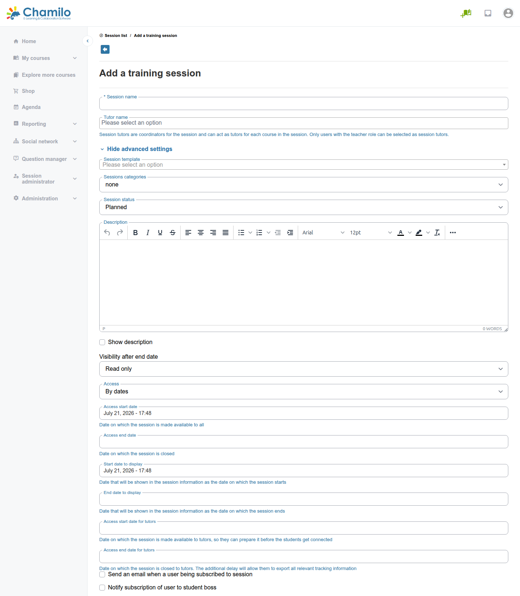
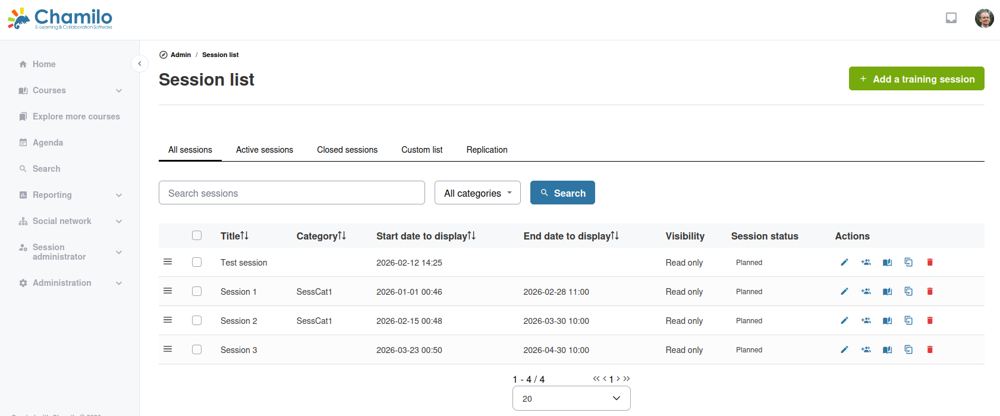
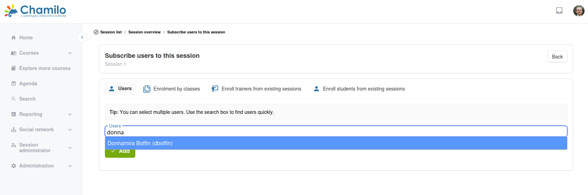

# Sitzungen verwalten

## Eine Sitzung erstellen

1. Klicken Sie im Administrationsbereich auf **Sitzung erstellen**
2. Füllen Sie die Sitzungsdetails aus:
   * **Sitzungsname** — Ein beschreibender Name (z. B. „Onboarding Frühjahr 2026“)
   * **Start- und Enddaten** — Zeitraum der Sitzung (optional — Sitzungen können unbegrenzt laufen). Es gibt 3 Datumsgruppen: Anzeigedaten, Daten zur Einschränkung des Lernendenzugriffs und Daten zur Einschränkung des Tutorenzugriffs
   * **Sitzungstutor** — Die Person, die die gesamte Sitzung betreut
   * **Kategorie** — Zuordnung zu einer Sitzungskategorie zur Organisation
   * **Sichtbarkeit** — Steuerung von Zugriff und Listenverhalten
3. **Kurse hinzufügen** — Wählen Sie einen oder mehrere Kurse für die Sitzung aus
4. **Lernende einschreiben** — Einzelne Benutzer oder Benutzerklassen hinzufügen
5. **Kurstutoren zuweisen** — Für jeden Kurs eine Lehrkraft (Kurstutor) zuweisen
6. Speichern

## Sitzungsdaten

Sitzungen unterstützen eine flexible Datumskonfiguration:

| Datum | Zweck |
|------|---------|
| **Anzeige Start/Ende** | Wann die Sitzung in den Listen der Lernenden erscheint |
| **Zugriff Start/Ende** | Wann Lernende tatsächlich auf die Sitzungsinhalte zugreifen können |
| **Tutorenzugriff Start/Ende** | Wann Tutoren auf die Sitzung zugreifen können (beginnt oft vor und endet nach dem Lernendenzugriff) |

So können Sie die Sitzung vorbereiten, bevor Lernende eintreffen, und den Tutorenzugriff nach Sitzungsende für Bewertung und Berichte offen halten.

## Sitzungsliste

Die Sitzungsliste zeigt alle Sitzungen mit:

* Sitzungsname
* Start- und Enddaten
* Status (aktiv, bevorstehend, vergangen)

Nutzen Sie Suche und Filter, um Sitzungen nach Name, Datum, Kategorie oder Status zu finden.

## Eine Sitzung bearbeiten

Klicken Sie auf eine Sitzung, um sie zu bearbeiten:

* Daten, Name oder Kategorie ändern
* Kurse hinzufügen oder entfernen
* Kurstutoren ändern
* Lernende hinzufügen oder entfernen
* Tracking-Daten der Sitzung anzeigen

## Benutzer einschreiben

Sie können Benutzer in eine Sitzung einschreiben durch:

* **Einzelneinschreibung** — Einzelne Benutzer suchen und hinzufügen
* **Klasseneinschreibung** — Eine ganze Klasse (Gruppe vordefinierter Benutzer) auf einmal hinzufügen
* **CSV-Import** — Eine Datei mit Benutzer-Sitzungs-Zuordnungen hochladen

## Sitzungszugriff

Lernende greifen über **Meine Sitzungen** in der Seitenleiste auf ihre Sitzungen zu. Sitzungen sind organisiert in:

* **Aktuelle Sitzungen** — Derzeit aktiv
* **Vergangene Sitzungen** — Beendet
* **Bevorstehende Sitzungen** — Noch nicht gestartet

## Tipps

* **Daten sorgfältig planen** — Stellen Sie sicher, dass die Tutorenzugriffsdaten über die Lernendendaten hinausreichen, damit Tutoren vorbereiten und nacharbeiten können
* **Klassen für wiederkehrende Einschreibung nutzen** — Wenn Sie häufig dieselben Gruppen einschreiben, erstellen Sie Klassen und weisen Sie sie Sitzungen zu
* **Sitzungen organisiert halten** — Nutzen Sie Kategorien und klare Namenskonventionen für eine einfache Verwaltung