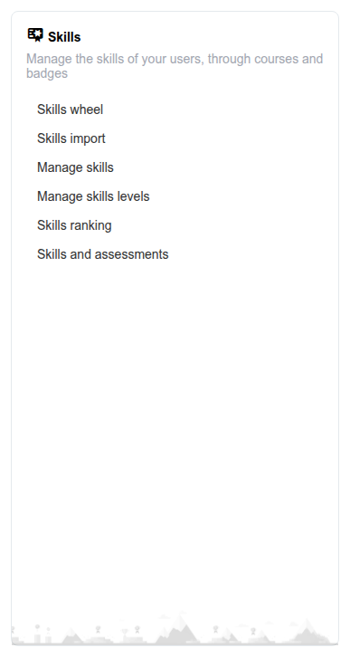

# Kompetenzen

Der Block **Kompetenzen** auf dem Administrations-Dashboard gruppiert die Werkzeuge zum Definieren, Organisieren und Nachverfolgen von Kompetenzabzeichen („Skills“) auf der gesamten Plattform. Eine Kompetenz kann automatisch vergeben werden, wenn ein Lernender eine Schwelle im Notenbuch erreicht, bestimmte Kurse abschließt, oder manuell durch eine Lehrkraft, und kann ein abzeichenartiges Symbol sowie eine Stufe tragen (zum Beispiel Bronze/Silber/Gold).

Der gesamte Block erscheint nur, wenn die Einstellung **Kompetenzwerkzeug aktivieren** (`skill.allow_skills_tool`, unter Konfigurationseinstellungen > Kompetenzen) eingeschaltet ist — sie ist standardmäßig aktiviert.

## Zugriff auf den Block Kompetenzen

Im Administrationsbereich erscheint der Block **Kompetenzen** neben den anderen Dashboard-Blöcken. Klicken Sie auf einen seiner Links, um das entsprechende Werkzeug zu öffnen.

## Inhalt des Blocks

* **[Kompetenzen verwalten](managing-skills.md)** — Kompetenzen anlegen, im Stapel importieren und jeder eine Stufenskala zuweisen
* **[Kompetenzrad](skills-wheel.md)** — Eine zoombare visuelle Karte des gesamten Kompetenzbaums
* **[Kompetenzranking](skills-ranking.md)** — Eine Rangliste der Benutzer nach erworbenen Kompetenzen
* **[Kompetenzen und Bewertungen](skills-assessments.md)** — Notenbuchkategorien mit den Kompetenzen verknüpfen, die sie vergeben

## Zugehörige Einstellungen

Einige weitere Einstellungen unter Konfigurationseinstellungen > Kompetenzen ändern, wer mit diesem Block was tun darf:

* **HR-Kompetenzverwaltung zulassen** (`allow_hr_skills_management`) — Ermöglicht Benutzern mit der Rolle Human Resources Manager, Kompetenzen gemeinsam mit Administratoren zu verwalten
* **Private Kompetenzen zulassen** (`allow_private_skills`)
* **Lehrkräfte können Kompetenzen zuweisen** (`skills_teachers_can_assign_skills`)
* **Kompetenzstufen ausblenden** (`hide_skill_levels`)
* **Vollständigen Kompetenznamen im Kompetenzrad anzeigen** (`show_full_skill_name_on_skill_wheel`)