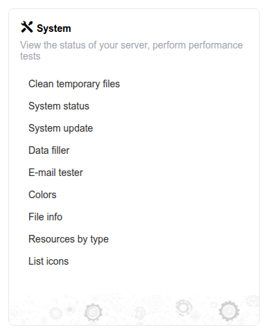

# System

Der Block **System** auf dem Administrations-Dashboard gruppiert Wartungswerkzeuge auf Serverebene, den Selbstaktualisierungs-Workflow, Dienstprogramme zur Prüfung von Speicher und Ressourcen sowie das Branding der Plattform.

## Accessing the System Block

Im Administrationsbereich erscheint der Block **System** neben den anderen Dashboard-Blöcken. Klicken Sie auf einen seiner Links, um das entsprechende Werkzeug zu öffnen.

## What's in the Block

* **[System Tools](system-tools.md)** — Temporäre Dateien bereinigen, den Selbstaktualisierungs-Workflow ausführen, gespeicherte Dateien und Ressourcen prüfen und den integrierten Icon-Satz durchsuchen
* **System status** — Behandelt in [System Status](../maintenance/system-status.md), unter Maintenance
* **[Branding](branding/README.md)** — Farbschemen (der Link „Colors“ im Block öffnet dieselbe Seite Color Themes), Portal-Anpassung und Vorlagen

Zwei weitere Einträge — **Data filler** und **E-mail tester** — erscheinen nur, wenn auf dem Server ein Verzeichnis `tests/` vorhanden ist; das ist eine Entwicklungs-/QA-Umgebung, keine Produktionsumgebung. Sie erscheinen nicht in einer typischen Produktionsinstallation; siehe [System Tools](system-tools.md#development-only-tools) für ihre Funktion, wenn sie vorhanden sind.