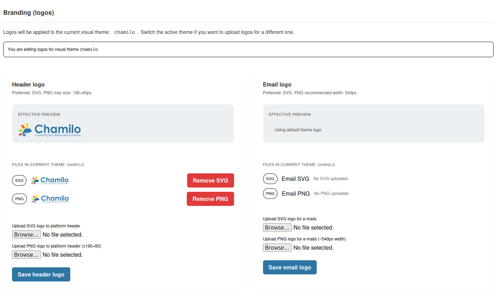

# Portal-Anpassung

Passen Sie an, wie Ihre Chamilo-Plattform aussieht und welche Informationen den Nutzern angezeigt werden.

## Plattformidentität

Konfigurieren Sie die grundlegende Identität Ihres Portals:

* **Plattformname** — Der Name, der im Browser-Titel und in der gesamten Oberfläche angezeigt wird
* **Institutionsname** — Der Name Ihrer Organisation
* **Institutions-URL** — Ein Link zur Website Ihrer Organisation
* **Plattformlogo** — Laden Sie das Logo Ihrer Organisation hoch (wird in der oberen Leiste angezeigt)

## Tipps

* **Halten Sie die Startseite übersichtlich** — Zu viel Inhalt auf der Startseite kann überfordern. Konzentrieren Sie sich auf wesentliche Ankündigungen und den Kurszugang.
* **Regelmäßig aktualisieren** — Halten Sie Systemankündigungen aktuell und entfernen Sie veraltete
* **Laden Sie ein hochwertiges Logo hoch** — Das Logo ist eines der sichtbarsten Markenelemente. Verwenden Sie ein scharfes, angemessen dimensioniertes Bild.