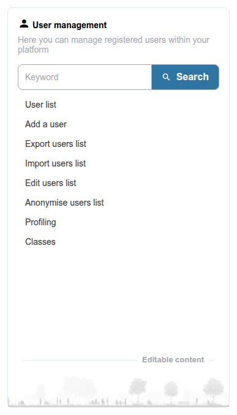

# Benutzer

Dieser Abschnitt behandelt die Verwaltung von Benutzerkonten auf Ihrer Chamilo-Plattform — das Anlegen von Benutzern, das Zuweisen von Rollen, das Organisieren von Benutzern in Gruppen und die Verwaltung von Profilen.

* **[Benutzerrollen](user-roles.md)** — Die verschiedenen Benutzerrollen und ihre Berechtigungen verstehen
* **[Benutzer verwalten](managing-users.md)** — Benutzerkonten anlegen, bearbeiten, importieren und exportieren
* **[Benutzergruppen](user-groups.md)** — Benutzer in plattformweite Gruppen organisieren
* **[Benutzer-Profiling](user-profiling.md)** — Zusätzliche Profilfelder und Benutzer-Metadaten konfigurieren