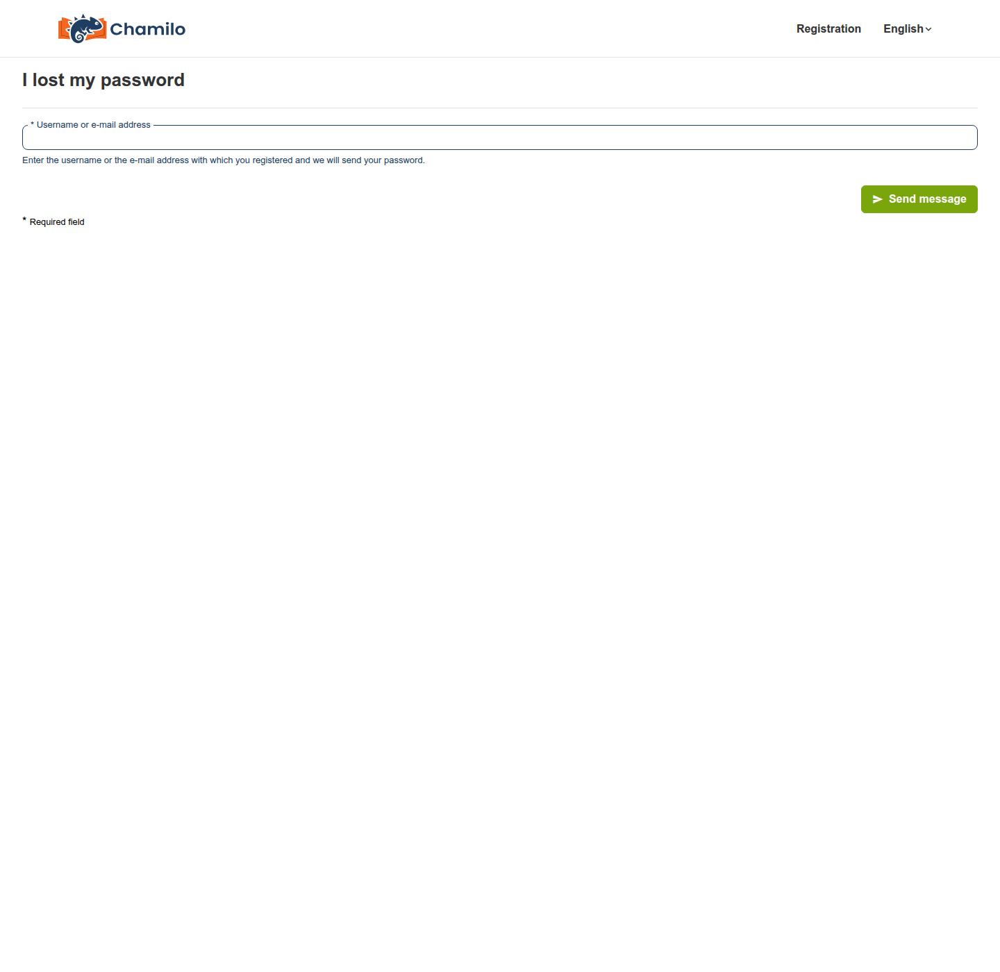
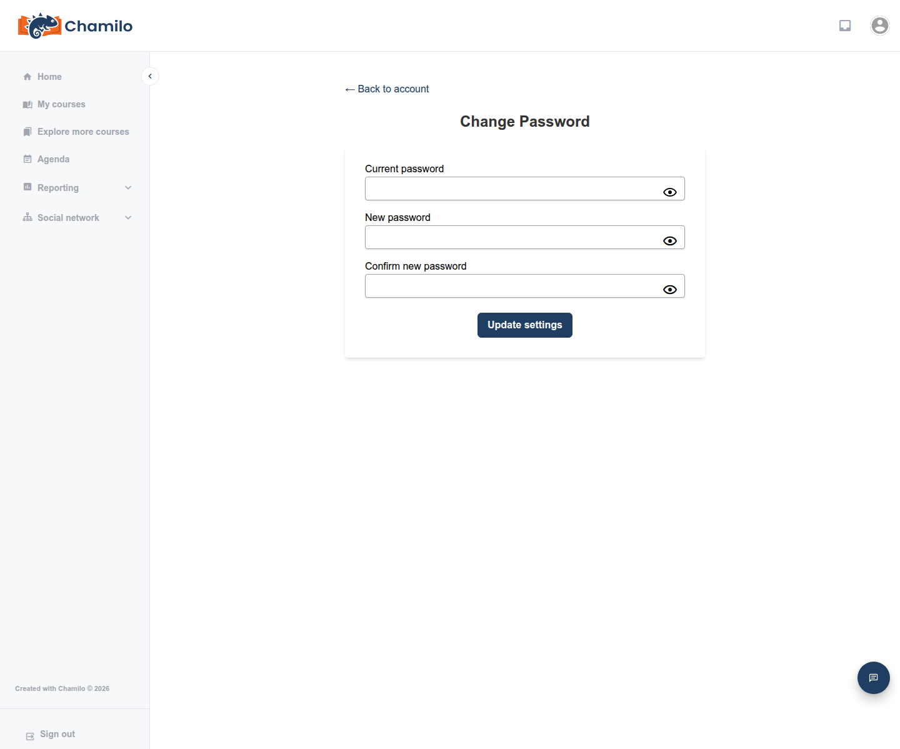

# Zurücksetzen Ihres Passworts

Wenn Sie Ihr Passwort vergessen haben — oder es einfach ändern möchten — erfahren Sie hier, wie das in beiden Situationen funktioniert: bevor Sie angemeldet sind und während Sie bereits angemeldet sind.

## Bevor Sie angemeldet sind

Klicken Sie auf der Anmeldeseite auf **Passwort vergessen?**. Falls dieser Link nicht vorhanden ist, hat Ihr Administrator diese Funktion deaktiviert — wenden Sie sich direkt an ihn, um wieder Zugang zu erhalten.

1. Geben Sie Ihren **Benutzernamen oder Ihre E-Mail-Adresse** in das einzige Feld des Formulars ein.
2. Falls eine CAPTCHA-Abfrage erscheint, lösen Sie sie (siehe [CAPTCHA](captcha.md)).
3. Klicken Sie auf **Nachricht senden**.

Was als Nächstes geschieht, hängt davon ab, wie Ihr Administrator diese Funktion konfiguriert hat:

* **Sie erhalten einen Link per E-Mail.** Klicken Sie darauf, um ein Formular zum Zurücksetzen des Passworts mit den Feldern **Passwort** und **Passwort bestätigen** zu öffnen — wählen Sie selbst ein neues Passwort und senden Sie das Formular ab. Dieser Link ist einmalig verwendbar und läuft nach einer begrenzten Zeit ab (standardmäßig eine Stunde, Ihr Administrator kann dies jedoch ändern); wenn er abgelaufen ist, teilt Ihnen die Zurücksetzungsseite dies mit und Sie müssen einen neuen Link anfordern.
* **Sie erhalten direkt ein neues Passwort per E-Mail.** Auf manchen Plattformen generiert das System statt einer eigenen Wahl ein Passwort für Sie und sendet es in der E-Mail. Melden Sie sich damit an und erwägen Sie anschließend, es in etwas Einprägsames zu ändern (siehe unten).

Wenn Sie eine externe Authentifizierung verwenden (Single Sign-On über Ihre Einrichtung), werden Passwortzurücksetzungen überhaupt nicht von Chamilo verarbeitet — nutzen Sie stattdessen den eigenen „Passwort vergessen“-Prozess Ihrer Einrichtung.

## Während Sie angemeldet sind

Sie können Ihr Passwort jederzeit ändern, ohne darauf zu warten, es zu vergessen:

1. Öffnen Sie Ihr **Avatar-Menü** (oben rechts) und klicken Sie auf **Mein Profil**.
2. Klicken Sie auf **Passwort ändern**.
3. Geben Sie Ihr aktuelles Passwort ein, dann zweimal Ihr neues Passwort, und senden Sie das Formular ab.

Dies ist dieselbe Seite, auf der Sie die [Zwei-Faktor-Authentifizierung](two-factor-authentication.md) aktivieren können, sofern Ihre Plattform sie unterstützt — in diesem Fall sehen Sie hier außerdem ein Kontrollkästchen „Zwei-Faktor-Authentifizierung aktivieren“, das oben nicht dargestellt ist, da es nicht auf jeder Plattform aktiv ist.

## Tipps

* **Prüfen Sie Ihren Spam-Ordner**, falls eine Zurücksetzungs-E-Mail nicht innerhalb weniger Minuten eintrifft.
* **Handeln Sie bei Zurücksetzungslinks schnell** — sie laufen ab, und Plattformen setzen diese Frist häufig auf nur eine Stunde.
* **Immer noch festgefahren?** Wenn das Selbstbedienungs-Zurücksetzen nicht aktiviert ist oder nicht funktioniert, kann Ihr Plattformadministrator Ihr Konto jederzeit manuell zurücksetzen.