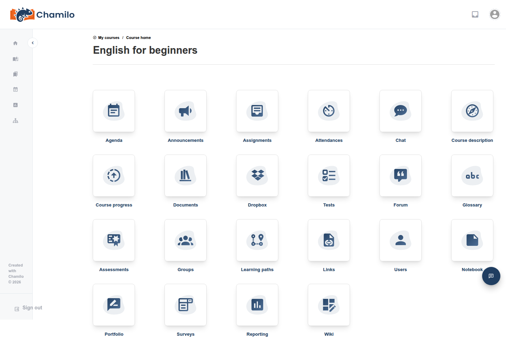
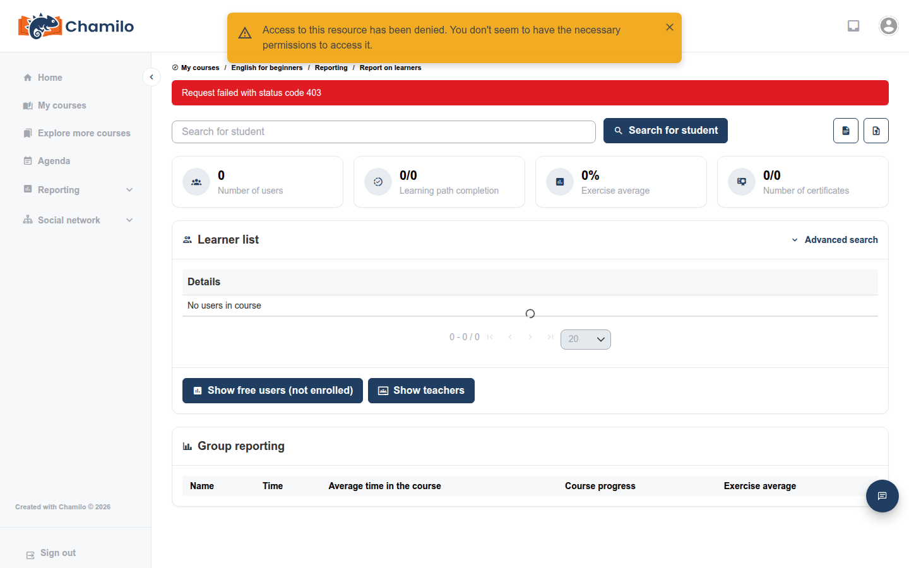

# Orientierung in einem Kurs

Sobald Sie einen Kurs öffnen, sehen Sie dessen Startseite mit einem Raster aus Werkzeugsymbolen. Diese Seite erläutert, was jedes Werkzeug für Sie als Lernende bzw. Lernender bedeutet, und verweist auf die Stellen, an denen die zugrunde liegende Funktion ausführlicher beschrieben wird.

In Ihrem Raster erscheinen nur die Werkzeuge, die Ihre Lehrkraft für Lernende sichtbar gemacht hat — Ihre Lehrkraft sieht möglicherweise zusätzliche, ausgeblendete Werkzeuge, die Ihnen nicht angezeigt werden. Fehlt ein erwartetes Werkzeug, ist es möglicherweise lediglich ausgeblendet oder für den gesamten Kurs deaktiviert; fragen Sie Ihre Lehrkraft.

## Das Werkzeugraster

| Werkzeug | Symbol | Was es für Sie bedeutet | Mehr erfahren |
|------|------|------------------------|------------|
| Dokumente |  | Dateien lesen und herunterladen, die Ihre Lehrkraft hochgeladen hat | [Dokumente](../../teacher-guide/adding-content/documents.md) |
| Lernpfade |  | Einer geführten Abfolge von Aktivitäten in der vorgegebenen Reihenfolge folgen und dabei den eigenen Fortschritt verfolgen | [Lernpfade](../../teacher-guide/adding-content/learning-paths.md) |
| Links |  | Externe Ressourcen öffnen, die Ihre Lehrkraft zusammengestellt hat | [Links](../../teacher-guide/adding-content/links.md) |
| Tests (Übungen) |  | Quizze und Prüfungen ablegen; einige werden automatisch bewertet, andere von Ihrer Lehrkraft | [Übungen](../../teacher-guide/assessing-learners/exercises.md) |
| Ankündigungen |  | Wichtige Aktualisierungen lesen, die Ihre Lehrkraft veröffentlicht hat | [Ankündigungen](../../teacher-guide/adding-content/announcements.md) |
| Bewertungen (Notenbuch) |  | Ihre eigenen Punktzahlen in den benoteten Aktivitäten des Kurses sowie etwaige erworbene Zertifikate einsehen | [Notenbuch](../../teacher-guide/assessing-learners/gradebook.md) |
| Glossar |  | Wichtige, für den Kurs definierte Begriffe nachschlagen | [Glossar](../../teacher-guide/adding-content/glossary.md) |
| Anwesenheiten |  | Ihre eigene erfasste Anwesenheit einsehen, sofern Ihre Lehrkraft diese erfasst | [Anwesenheit](../../teacher-guide/assessing-learners/attendance.md) |
| Kursfortschritt |  | Eine Übersicht darüber einsehen, wie weit Sie im Kurs fortgeschritten sind | [Kursfortschritt](../../teacher-guide/additional-tools/course-progress.md) |
| Agenda |  | Kursspezifische Termine und Fristen einsehen | — |
| Forum |  | In verschachtelten Diskussionen mit Ihrer Lehrkraft und Ihren Mitlernenden lesen und schreiben | [Foren](../../teacher-guide/collaboration-and-communication/forums.md) |
| Dropbox |  | Dateien privat mit Ihrer Lehrkraft oder Mitlernenden austauschen | [Dropbox](../../teacher-guide/additional-tools/dropbox.md) |
| Benutzer |  | Sehen, wer sonst noch im Kurs eingeschrieben ist | — |
| Gruppen |  | In einer kleineren, von Ihrer Lehrkraft zugewiesenen Gruppe mit eigenen gemeinsamen Werkzeugen arbeiten | [Gruppen](../../teacher-guide/collaboration-and-communication/groups.md) |
| Chat |  | Ihre Lehrkraft oder Mitlernende in Echtzeit benachrichtigen | [Chat](../../teacher-guide/collaboration-and-communication/chat.md) |
| Aufgaben |  | Dateien oder Text zur Durchsicht und Bewertung durch Ihre Lehrkraft einreichen | [Aufgaben](../../teacher-guide/assessing-learners/assignments.md) |
| Umfragen |  | Fragebögen beantworten, manchmal anonym | [Umfragen](../../teacher-guide/assessing-learners/surveys.md) |
| Wiki |  | Gemeinsam Seiten schreiben und bearbeiten | [Wiki](../../teacher-guide/collaboration-and-communication/wiki.md) |
| Notizbuch |  | Eigene private Notizen innerhalb des Kurses führen | [Notizbuch](../../teacher-guide/additional-tools/notebook.md) |
| Portfolio |  | Eine persönliche Sammlung von Arbeiten zum Vorzeigen oder Einreichen aufbauen | [Portfolio](../../teacher-guide/additional-tools/portfolio.md) |
| Berichte |  | Für Sie nichts — siehe unten | — |

## Werkzeuge, die Sie nicht sehen — und eines, das nicht funktioniert

Einige Einträge existieren nur für Lehrende und Kursadministratoren, um den Kurs selbst zu konfigurieren — Kurseinstellungen, Kurswartung (Sicherung/Import/Export), der Editor der Kursstartseite und (auf den meisten Plattformen) das Blog-Werkzeug befinden sich in einem Menü „Weitere Aktionen“, das nur Personen mit Bearbeitungsrechten am Kurs angezeigt wird. Als Lernende sehen Sie dieses Menü überhaupt nicht.

Die Kachel **Reporting** ist ein Sonderfall: Sie erscheint zwar in Ihrem Raster, öffnet aber die für Lehrende vorgesehene Tracking-Ansicht der gesamten Klasse, sodass ein Klick darauf statt etwas Nützlichem eine Meldung „Zugriff verweigert“ ergibt:

Keine Sorge — Ihr eigener Fortschritt ist anderswo verfügbar: über **Mein Fortschritt** in der Hauptseitenleiste (siehe [Die Benutzeroberfläche verstehen](../getting-started/understanding-the-interface.md) und [Mein Fortschritt](../my-progress.md)) sowie über die oben genannten Werkzeuge **Kursfortschritt** und **Assessments**, die jeweils Ihre eigenen Daten anzeigen.

Wenn in Ihrem Kurs KI-Funktionen aktiviert sind, können Sie außerdem feststellen, dass die Option „KI-Analysator“ für Lehrende (zum Vortrainieren des KI-Tutors auf den eigenen Kursinhalten) sich vom lernendenseitigen Chat **KI-Tutor** unterscheidet — siehe [KI-Tutor-Chatbot](ai-tutor.md).

## Tipps

* **Fehlt ein Werkzeug?** Fragen Sie Ihre Lehrkraft — es ist sehr wahrscheinlich ausgeblendet oder deaktiviert und nicht defekt.
* **Kursbeschreibung und Ankündigungen** können von Ihrer Lehrkraft vollständig deaktiviert werden; in diesem Fall erscheinen sie für niemanden, auch nicht für die Lehrkraft.
* **Alles hier kann je nach Kurs variieren** — Ihre Lehrkraft entscheidet für jeden Kurs einzeln, welche Werkzeuge aktiv und sichtbar sind.