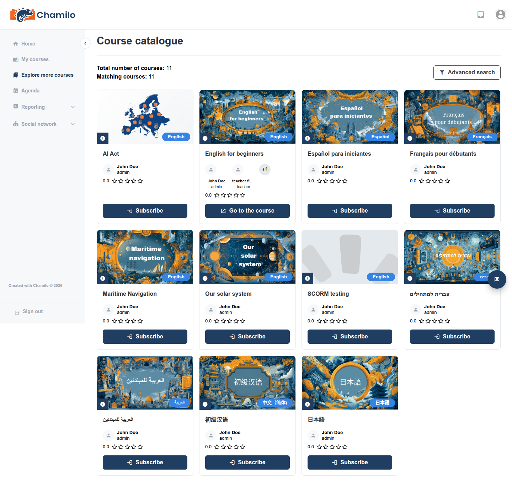

# Anmeldung zu einem Kurs

Bevor Sie auf die Inhalte eines Kurses zugreifen können, müssen Sie dafür angemeldet (eingeschrieben) sein. Je nach Ihrer Plattform kann das auf verschiedene Weise geschehen – in den meisten Fällen ist von Ihrer Seite gar keine Aktion erforderlich.

| Wie es geschieht | Was Sie tun müssen |
|-----------------|----------------------|
| Ein Administrator schreibt Sie ein | Nichts — der Kurs erscheint in **Meine Kurse**, sobald es erledigt ist |
| Ein Lehrender schreibt Sie manuell ein | Nichts — wie oben |
| Sie schreiben sich selbst über den Kurskatalog ein | Durchsuchen Sie **Weitere Kurse entdecken** und klicken Sie dann zum Beitreten |
| Sie erhalten eine Kurseinladung per E-Mail | Klicken Sie auf den Link; registrieren Sie sich, falls Sie noch kein Konto haben |

## Ihre Kurse prüfen

Klicken Sie jederzeit in der Seitenleiste auf **Meine Kurse**, um alles zu sehen, wofür Sie derzeit eingeschrieben sind. Fehlt ein erwarteter Kurs in der Liste, sind Sie noch nicht dafür angemeldet — nutzen Sie eine der untenstehenden Methoden oder wenden Sie sich an Ihre Lehrkraft oder Ihren Administrator.

## Selbstanmeldung über den Kurskatalog

Wenn die Sichtbarkeit eines Kurses es zulässt, können Sie sich selbst anmelden, ohne auf jemand anderen zu warten:

1. Klicken Sie in der Seitenleiste auf **Weitere Kurse entdecken**, um den Kurskatalog zu öffnen.
2. Durchsuchen oder suchen Sie den Kurs, dem Sie beitreten möchten.
3. Klicken Sie auf den Kurs, um die Details zu öffnen, und klicken Sie dann auf die Schaltfläche zum Beitreten.

Bei einem Kurs, für den Sie bereits eingeschrieben sind, erscheint **Zum Kurs gehen** statt einer Anmelde-Schaltfläche.

Manche Kurse erfordern ein Passwort zur Selbstanmeldung — Ihre Lehrkraft hat es Ihnen in diesem Fall separat mitgeteilt. Bietet ein Kurs gar keine Beitrittsschaltfläche, ist die Selbstanmeldung dafür nicht geöffnet; bitten Sie die Lehrkraft oder einen Administrator, Sie stattdessen anzumelden.

Wenn Ihre Plattform **Sessions** verwendet, gilt dasselbe Prinzip für **Meine Sessions** — manche Sessions können über den Katalog zur Selbstanmeldung offen sein, obwohl dies häufiger von einem Administrator oder Session-Tutor verwaltet wird, da die Anmeldung zu einer Session Sie für jeden darin enthaltenen Kurs anmeldet.

## Eine Kurseinladung annehmen

Statt eines Katalogeintrags kann eine Lehrkraft Ihnen eine **Kurseinladung** per E-Mail senden — das ist die einzige Methode, die kein bestehendes Plattformkonto voraussetzt. Das Öffnen des Links in der E-Mail:

* Füllt das E-Mail-Feld im Registrierungsformular mit Ihrer eingeladenen Adresse vor und sperrt es.
* Ermöglicht die Registrierung, auch wenn die allgemeine Selbstregistrierung auf der Plattform derzeit geschlossen ist.
* Meldet Sie automatisch für den Kurs an (oder für die gesamte Session, falls der Kurs in einer geöffnet ist), sobald Sie die Registrierung abgeschlossen haben, und meldet Sie an.

Der Link ist einmalig verwendbar und läuft nach 7 Tagen ab — funktioniert er nicht mehr, bitten Sie die Lehrkraft, die Sie eingeladen hat, einen neuen zu senden. Siehe [Was die eingeladene Person sieht](../../teacher-guide/assessing-learners/subscribing-users.md#what-the-invited-person-sees) für weitere Details zu diesem Ablauf und [Ein Konto erstellen](../getting-started/creating-an-account.md) dafür, wie das Registrierungsformular selbst aussieht.

## Tipps

* **Prüfen Sie „Weitere Kurse entdecken“, bevor Sie nachfragen** — viele Plattformen lassen die Selbstanmeldung zu Kursen offen, sodass Sie möglicherweise sofort beitreten können, ohne auf jemanden zu warten.
* **Behalten Sie Ihren Posteingang im Blick** — sowohl Kurseinladungen als auch Benachrichtigungen zur Kontofreigabe kommen per E-Mail.
* **Immer noch kein Zugang?** Anmeldemethoden können plattformweit eingeschränkt oder deaktiviert sein. Wenn nichts der oben genannten Wege funktioniert, kann Ihre Lehrkraft oder Ihr Administrator Sie jederzeit direkt anmelden.