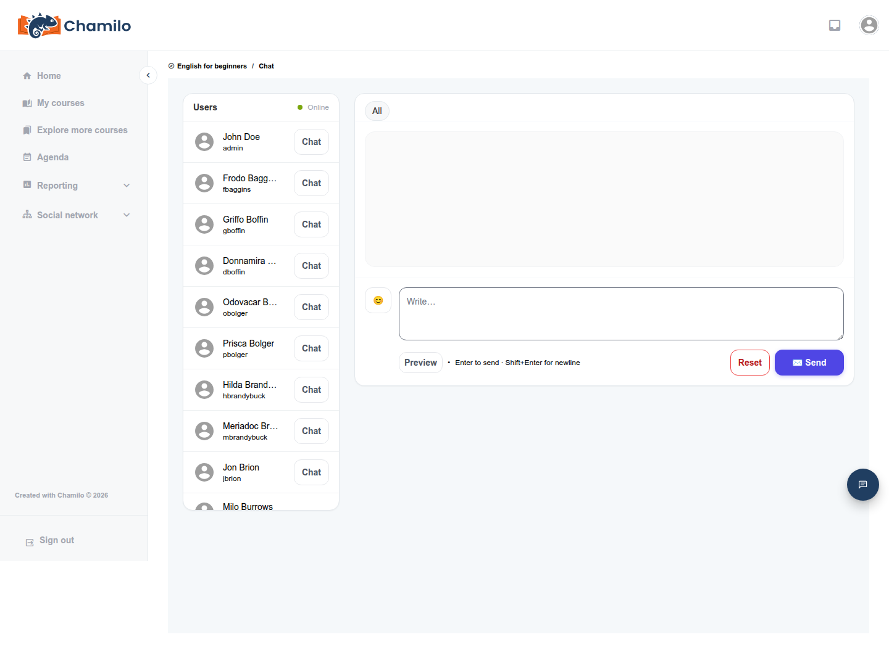

# Verwendung des Chat-Tools

Einige Kurse enthalten ein **Chat**-Tool — Echtzeit-Textnachrichten, die an den jeweiligen Kurs gebunden sind und sich für schnelle Austausche oder Live-Fragen und -Antworten eignen, während eine Lehrkraft erreichbar ist.

## Nachrichten senden

Öffnen Sie das **Chat**-Tool  von der Kursstartseite aus. Sie sehen eine **Benutzer**-Liste aller aktuell im Kurs Online befindlichen Personen, jeweils mit eigener **Chat**-Schaltfläche, sowie einen Tab **Alle** für die gesamte Gruppe:

Wählen Sie eine Person (oder **Alle**) und geben Sie Ihre Nachricht in das Feld unten ein. Drücken Sie **Enter**, um sie zu senden, oder **Shift+Enter**, um eine neue Zeile zu beginnen, ohne zu senden. Eine Option **Vorschau** ermöglicht die Prüfung der Formatierung vor dem Senden, und **Zurücksetzen** löscht Ihre Eingabe.

## Wenn der Chat auf Tutoren beschränkt ist

Ihre Administration kann den Kurs-Chat so einschränken, dass nur Ihre Lehrkraft (oder andere Kurstutoren) Beiträge verfassen können — in diesem Fall können alle anderen lesen, aber nicht direkt teilnehmen. Wenn Sie in einem Kurs-Chat keine Nachricht senden können, ist diese Einstellung die wahrscheinlichste Ursache, kein Fehler.

## Nicht zu verwechseln mit

Chamilo verfügt über drei verschiedene Funktionen, die alle mit Nachrichten zu tun haben, und es ist leicht, sie zu verwechseln:

* **Dieses Kurs-Chat-Tool** — in Echtzeit, an einen bestimmten Kurs gebunden, nur über die Startseite dieses Kurses erreichbar.
* **[Posteingang](../inbox.md)** — private, asynchrone Nachrichten mit beliebigen Personen auf der Plattform, unabhängig von einem bestimmten Kurs.
* **Das schwebende Chat-Panel** (unten am Bildschirm, fast überall verfügbar) — für Direktnachrichten und für den [KI-Tutor](ai-tutor.md), unabhängig von diesem Kurs-Tool.

Wenn Sie eines der anderen beiden suchen, siehe die jeweiligen Seiten.

## Tipps

* **Nutzen Sie es für Live-Austausche im Moment** — für alles, das Sie später wiederfinden möchten, verwenden Sie stattdessen das [Forum](using-the-forum.md).
* **Prüfen Sie, ob eine Live-Chat-Sitzung geplant ist** — Lehrkräfte kündigen manchmal bestimmte Zeiten an, zu denen sie im Kurs-Chat erreichbar sind, oft über die Agenda.
* **Wenn in Ihrem Kurs Videokonferenzen eingerichtet sind**, bevorzugt Ihre Lehrkraft diese möglicherweise für Live-Sitzungen statt des Text-Chats.