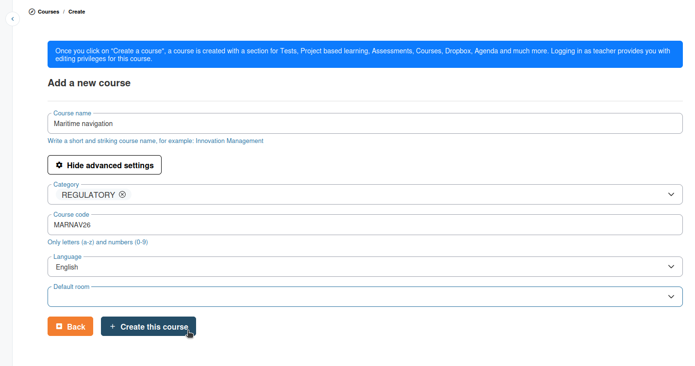
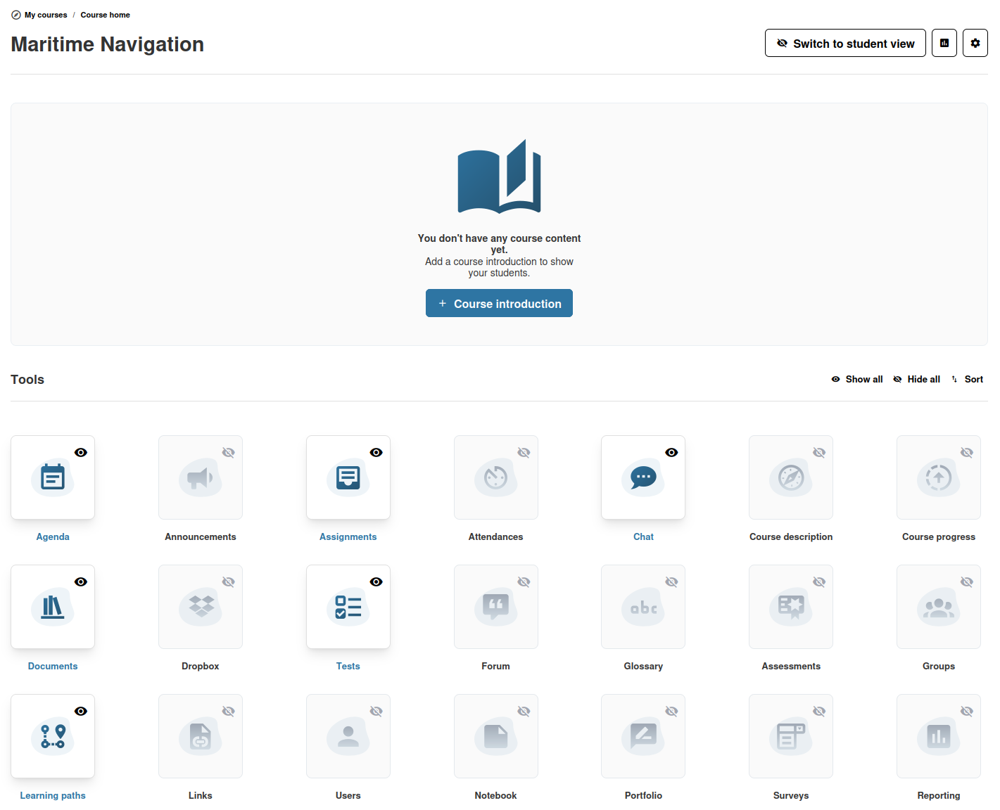

# Ihren Kurs erstellen

Dieser Abschnitt erklärt, wie Sie in Chamilo einen neuen Kurs anlegen und ihn an Ihre Bedürfnisse anpassen.

## Einen neuen Kurs erstellen

So erstellen Sie einen Kurs:

1. Klicken Sie in der Seitenleiste auf **Meine Kurse**
2. Klicken Sie auf die Schaltfläche **Kurs erstellen** (meist ein grünes Buch -Symbol mit einem +-Zeichen)
3. Füllen Sie das Formular zur Kurserstellung aus:

| Feld | Pflichtfeld | Beschreibung |
|-------|----------|-------------|
| **Kursname** | Ja | Ein kurzer, beschreibender Titel für Ihren Kurs (z. B. „Innovationsmanagement“) |
| **Kurskategorie** | Nein | Wählen Sie eine Kategorie, um Kurse auf der Plattform zu strukturieren |
| **Kurscode** | Nein | Ein kurzer Code nur aus Buchstaben und Zahlen (max. 40 Zeichen). Bleibt das Feld leer, wird automatisch einer aus dem Kursnamen erzeugt |
| **Sprache** | Nein | Die Hauptsprache des Kurses. Standard ist Ihre aktuelle Sprache |

Falls aktiviert, finden Sie möglicherweise auch eine Einstellung **Standardraum** sowie die Möglichkeit, eine **Kursvorlage** zu nutzen, damit Sie den Kurs nicht vollständig von Grund auf anlegen müssen.

4. Klicken Sie auf **Diesen Kurs erstellen**

Sie werden zur Startseite Ihres neuen Kurses weitergeleitet. Es erscheint eine Bestätigungsmeldung: „Kurs erfolgreich erstellt.“

## Die Kursstartseite

Nach der Erstellung gelangen Sie auf die Startseite des Kurses. Das ist die zentrale Anlaufstelle, über die Sie und Ihre Lernenden auf alle Werkzeuge und Inhalte zugreifen.

Die Startseite zeigt:

* **Kurstitel** — Der Name Ihres Kurses, oben angezeigt.
* **Kurzeinführung** — Eine optionale Beschreibung oder Willkommensnachricht. Klicken Sie auf die Schaltfläche **+ Kurseinführung**, um eine hinzuzufügen, oder oben auf **Einführung bearbeiten** , um sie zu ändern. Unterstützt wird Rich Text mit Bildern, Links und Formatierung.
* **Werkzeugraster** — Ein Raster aller verfügbaren Kurswerkzeuge, jeweils als Karte mit Symbol und Namen.

### Sichtbarkeit der Werkzeuge steuern

Als Lehrende können Sie steuern, welche Werkzeuge Ihre Lernenden sehen:

* Klicken Sie neben einem Werkzeug auf das **Augensymbol** , um es vor Lernenden zu verbergen. Ausgeblendete Werkzeuge zeigen ein **durchgestrichenes Auge**  und bleiben für Sie zugänglich.
* Nutzen Sie die Schaltflächen **Alle anzeigen** und **Alle ausblenden**, um alle Werkzeuge auf einmal zu ändern
* Klicken Sie auf **Sortieren**, um das Werkzeugraster per Drag-and-Drop neu anzuordnen

### Studierendenansicht

Klicken Sie auf die Schaltfläche **Studierendenansicht**, um die Kursstartseite genau so zu sehen, wie sie eine lernende Person sieht. So prüfen Sie, dass ausgeblendete Werkzeuge und unveröffentlichte Inhalte nicht sichtbar sind. Klicken Sie erneut auf die Schaltfläche, um zur Lehrendenansicht zurückzukehren.

## Nächste Schritte

* [Kurseinstellungen](course-settings.md) — Zugang, Einschreibung und weitere kursweite Optionen konfigurieren
* [Kursstartseite](course-homepage.md) — Ausführliche Anleitung zur Anpassung Ihrer Kursstartseite
* [Kursbeschreibung](course-description.md) — Eine strukturierte Beschreibung Ihres Kurses für den Kurskatalog verfassen