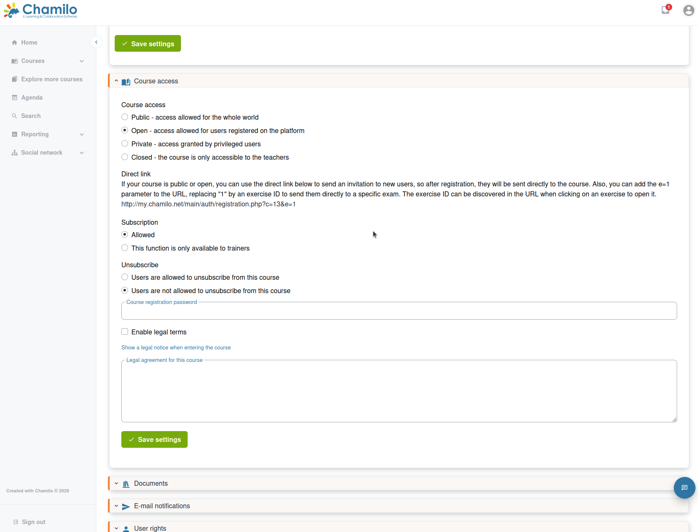

# Kurseinstellungen

Kurseinstellungen ermöglichen Ihnen, das Verhalten Ihres Kurses zu steuern — wer darauf zugreifen kann, wie er dargestellt wird und welche Funktionen aktiviert sind.

Um die Kurseinstellungen aufzurufen, betreten Sie Ihren Kurs und klicken Sie auf das Symbol **Einstellungen**  neben der Schaltfläche **Zur Studierendenansicht wechseln**.

## Allgemeine Einstellungen

### Kursinformationen

* **Kurstitel** — Der Anzeigename Ihres Kurses
* **Kurssprache** — Die Hauptsprache der Kursoberfläche
* **Kurskategorie** — Die Kategorie, unter der der Kurs im Katalog erscheint
* **Kursbild** — Laden Sie ein Vorschaubild hoch, das Ihren Kurs in den Kurslisten repräsentiert (wird je nach Kontext skaliert)

Der Kurscode (die kurze eindeutige Kennung) wird bei der Erstellung des Kurses festgelegt und ist auf dieser Seite nicht bearbeitbar.

Standardmäßig sehen alle Nutzer, die Ihren Kurs betreten, die gesamte Chamilo-Oberfläche in der Sprache Ihres Kurses. Dies ist eine immersive Funktion. Administratoren können dieses Verhalten ändern, Sie können es aber auch selbst mit einer der ersten Optionen anpassen: **Kurs in der Sprache des Nutzers anzeigen** (standardmäßig auf Nein gesetzt), falls Sie der Meinung sind, dass dies für Ihre Nutzer zu schwierig ist.

Die Felder Abteilung und Abteilungs-URL sind veraltet. Sie werden nur aus Gründen der Abwärtskompatibilität beibehalten.

Falls aktiviert, können Sie das Erscheinungsbild innerhalb Ihres Kurses mit der Option **Stylesheets** wechseln und vorhandene Stylesheets Ihres Portals verwenden. Diese Option wird von Administratoren häufig deaktiviert, um ein einheitlicheres Gesamtdesign zu gewährleisten.

### Speicherplatzkontingent

Jeder Kurs hat ein Speicherlimit (Disk Quota) für hochgeladene Dateien. Das Kontingent wird vom Plattformadministrator festgelegt. Das aktuelle Limit sehen Sie in den Kurseinstellungen, die aktuelle Nutzung im Werkzeug **Dokumente**.

> Wenn Ihnen der Speicherplatz ausgeht, wenden Sie sich an Ihren Plattformadministrator, um eine Erhöhung des Kontingents zu beantragen, oder entfernen Sie ungenutzte Dateien aus dem Werkzeug Dokumente.

### Kurssichtbarkeit

Steuern Sie, wer auf Ihren Kurs zugreifen kann:

| Einstellung | Beschreibung |
|---------|-------------|
| **Öffentlich** | Jeder, einschließlich anonymer Besucher, kann auf den Kurs zugreifen |
| **Offen für die Plattform** | Alle auf der Plattform registrierten Nutzer können auf den Kurs zugreifen |
| **Privat — Zugang durch privilegierte Nutzer gewährt** | Nur Nutzer, die ausdrücklich in den Kurs eingeschrieben sind, können darauf zugreifen |
| **Geschlossen** | Der Kurs ist gesperrt; niemand außer der Lehrkraft kann darauf zugreifen |

#### Einschreibungseinstellungen

Je nach Konfiguration Ihrer Plattform können Sie Folgendes steuern:

* **Selbsteinschreibung erlauben** — Ob Lernende sich selbst über den Kurskatalog einschreiben können
* **Selbstabmeldung erlauben** — Ob Lernende den Kurs selbstständig verlassen können
* **Einschreibungskennwort** — Ein Kennwort für die Selbsteinschreibung verlangen (nützlich, um den Zugang auf eine bestimmte Gruppe zu beschränken); das Sicherheitsniveau ist jedoch gering, da dasselbe Kurszugangskennwort von allen Nutzern geteilt wird.

Diese Einstellungen betreffen nur die Selbsteinschreibung. Für das vollständige Bild — einschließlich der Einschreibung eines bestehenden Nutzers durch Sie selbst oder der Einladung einer Person, die noch kein Plattformkonto hat — siehe [Nutzer einschreiben](../assessing-learners/subscribing-users.md).

### Dokumenteneinstellungen

Wählen Sie, ob die Systemordner im Werkzeug **Dokumente** angezeigt oder ausgeblendet werden sollen (standardmäßig ausgeblendet; in den meisten Fällen benötigen Sie sie nicht, und das Anzeigen kann Probleme mit versteckten Inhalten und Lernenden verursachen).

### E-Mail-Benachrichtigungseinstellungen

Konfigurieren Sie, wie Kursaktivitäten Benachrichtigungen auslösen:

* **E-Mail-Benachrichtigungen für neue Inhalte** — Eingeschriebene Nutzer benachrichtigen, wenn Sie neue Dokumente, Ankündigungen oder andere Inhalte hinzufügen

### Chat-Einstellungen

Steuern Sie, wie das Werkzeug **Chat** angezeigt wird.

### Einstellungen für Lernpfade

* **Kursthemen aktivieren** — Lernpfaden erlauben, das Erscheinungsbild zu ändern (für ein integriertes Nutzererlebnis nicht empfohlen)
* **Rückkehrlink des Lernpfads** — Festlegen, wohin Nutzer gelangen, wenn sie im Lernpfad auf das Symbol **Startseite** klicken: die Lernpfadliste, die Kursstartseite, *Meine Kurse*, *Meine Sitzungen* oder die Portalstartseite

### Einstellungen zum thematischen Fortschritt

Konfigurieren Sie, wie die Meldungen zum thematischen Fortschritt auf der Kursstartseite erscheinen.

### Foreneinstellungen

Steuern Sie das Verhalten im Forenwerkzeug dieses Kurses.

### Aufgabeneinstellungen

* **Standardeinstellung für die Sichtbarkeit neu hochgeladener Dateien** — Festlegen, ob neue Dokumente, die Lernende im Werkzeug **Aufgaben** hochladen, mit allen anderen Lernenden geteilt werden (standardmäßig Nein)
* **Lernenden das Löschen eigener Veröffentlichungen erlauben** — Lernenden erlauben, bereits hochgeladene Aufgaben zu löschen (falls sie eine Korrektur hochladen möchten).

### Autolaunch-Einstellungen

Ein Kurs kann so eingestellt werden, dass er ein Autolaunch-Verhalten aufweist, wodurch der Weg der Lernenden zu den wichtigen Teilen Ihres Kurses verkürzt wird. Wenn aktiviert, werden die Lernenden beim Betreten Ihres Kurses direkt zum ausgewählten Werkzeug weitergeleitet und sehen die Kursstartseite nicht als Zwischenschritt. Sie können sogar bestimmte Lernpfade oder Übungen auswählen, die beim Eintreffen im Kurs gestartet werden. In diesem Fall müssen Sie hier die Option auswählen, dann zur Liste der Lernpfade oder Übungen gehen und auf das Raketen-Symbol  des ausgewählten Elements klicken.

### Einstellungen für KI-Helfer

Dieser Abschnitt erscheint nur, wenn Ihr Administrator KI-Werkzeuge auf der Plattform aktiviert hat. Er ermöglicht es Ihnen, die Auswahl der über verschiedene Werkzeuge Ihrer Chamilo-Plattform verfügbaren KI-Hilfsdienste zu verfeinern. Deaktivieren Sie sie, wenn Sie sie nicht nutzen möchten, aber das wäre wahrscheinlich keine gute Idee, da sie sehr leistungsstark sind.

Diese Funktionen werden im Abschnitt **KI-Werkzeuge** dieses Leitfadens erläutert.

### Externe Werkzeuge (LTI)

Wenn auf Ihrer Plattform aktiviert, ermöglicht Learning Tools Integration die Integration externer, kompatibler Aktivitäten in diesen Kurs als einzelne Symbole auf der Kursstartseite. Eine ausführliche Behandlung von LTI sprengt den Rahmen dieses Leitfadens, aber es handelt sich um ein leistungsstarkes Integrationssystem für Lehrende.

### Sonstiges

Zusätzliche Abschnitte oder Optionen können auf dieser Seite erscheinen, abhängig von den Optionen und Versionen von Chamilo.