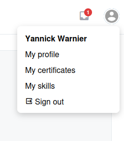

# Ihr Profil

Ihr Profil in Chamilo enthält Ihre persönlichen Informationen und Einstellungen. Andere Nutzer auf der Plattform können Teile Ihres Profils sehen, abhängig von Ihren Sichtbarkeitseinstellungen.

## Zugriff auf Ihr Profil

Klicken Sie auf Ihren **Avatar** in der oberen rechten Ecke der oberen Leiste und wählen Sie dann **Profil** aus dem Dropdown-Menü. Sie können es auch über den Bereich **Soziales Netzwerk** in der Seitenleiste aufrufen.

## Profilinformationen

Ihre Profilseite kann (abhängig von der Konfiguration) Folgendes anzeigen:

* **Avatar** — Ihr Profilbild. Klicken Sie auf **Profil bearbeiten**, um es zu ändern.
* **Vollständiger Name** — Ihr Vor- und Nachname, wie auf der Plattform registriert.
* **E-Mail** — Ihre E-Mail-Adresse. Andere Nutzer können darauf klicken, um Ihnen innerhalb von Chamilo eine Nachricht zu senden.
* **Sprache** — Ihre bevorzugte Sprache.
* **Zusätzliche Felder** — Abhängig von der Konfiguration Ihrer Plattform können Felder wie Telefonnummer, Skype-Kennung, LinkedIn-Profillink oder vom Administrator definierte benutzerdefinierte Felder angezeigt werden.

## Ihr Profil bearbeiten

Um Ihre Profilinformationen zu aktualisieren, klicken Sie auf **Profil bearbeiten**. Hier können Sie:

* Ihren Namen, Ihre E-Mail-Adresse und Ihr Passwort ändern
* Ihren Avatar/Ihr Bild hochladen oder ändern
* Ihre bevorzugte Sprache aktualisieren
* Zusätzliche Profilfelder ausfüllen (Skype, LinkedIn usw.)
* Benachrichtigungseinstellungen konfigurieren

Um Ihr Passwort zu ändern, klicken Sie auf **Passwort ändern**. Aus Sicherheitsgründen müssen Sie Ihr aktuelles Passwort sowie Ihr neues Passwort zweimal angeben.

Wenn Ihr Administrator die Option **Zwei-Faktor-Authentifizierung** (`2fa_enable`) für die Plattform aktiviert hat, können Sie in Ihrem Profil 2FA für Ihr eigenes Konto mit einer TOTP-Authenticator-App (Google Authenticator, Authy, 1Password usw.) einschalten. Nach der Aktivierung fordert der Anmeldevorgang zusätzlich zu Ihrem Passwort den zeitbasierten 6-stelligen Code an.

## Persönliche Daten

Unter **Soziales Netzwerk** > **Persönliche Daten** können Sie alle Informationen einsehen, die Chamilo über Sie speichert. Dieser Bereich umfasst:

* Eine nach Kategorien geordnete Zusammenfassung aller erfassten Daten
* Falls von Ihrer Organisation aktiviert, Ihren Annahme-Status für die **Nutzungsbedingungen** der Plattform
* Falls von Ihrer Organisation aktiviert, eine Option zum **Widerruf Ihrer Einwilligung** oder zum **Konto löschen**, wodurch eine Kontolöschungsanfrage ausgelöst wird, die Ihr Administrator bearbeitet

> Diese Funktion dient der Einhaltung von Datenschutzvorschriften. Wenden Sie sich an Ihren Administrator, wenn Sie Fragen zur Verarbeitung Ihrer Daten haben.