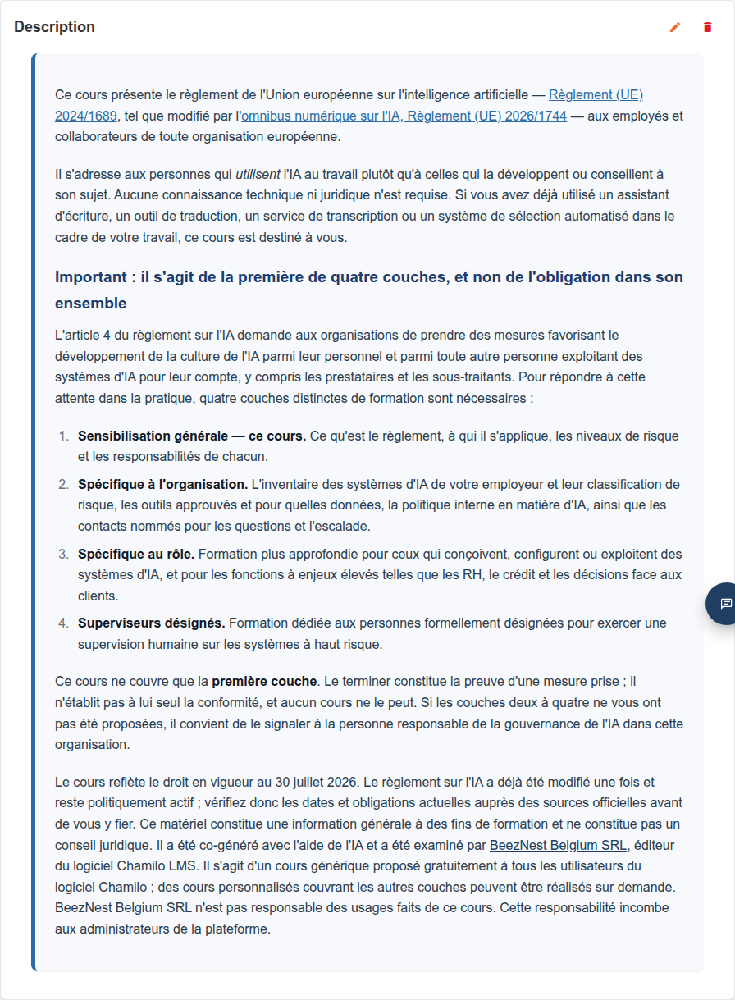
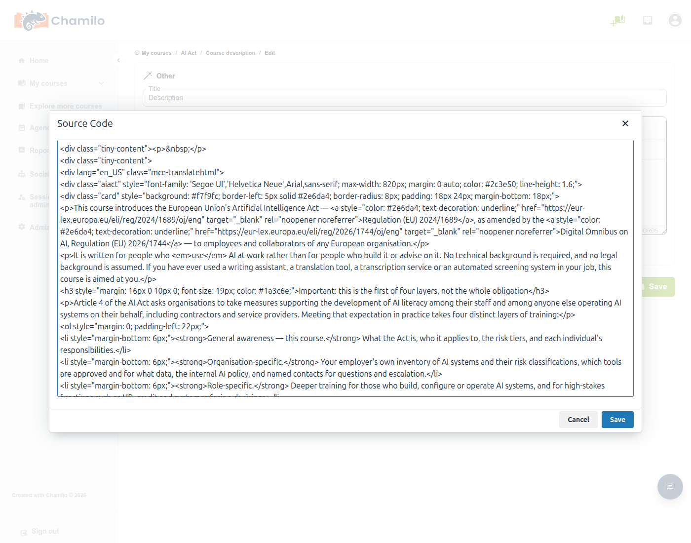

# Multi-Language Content

Chamilo lets you write **several language versions of the same piece of content in a single field** — a course description section, a document, a test question, a survey — and have each learner automatically see only the version written in their own language. This is the **translate_html** feature, named after the platform setting that governs it.

It involves three different people, each seeing a different side of it:

* **Your administrator** has to turn the feature on platform-wide before anyone can use it.
* **You (the teacher)** write the different language versions, using a button in the rich text editor.
* **The learner** benefits from it without ever knowing it exists — they simply see the content in their own language, with no setting to find or toggle.

## Enabling the Feature

This is an administrator task, not a teacher one. Under **Administration > Configuration settings > Editor**, the **Support multi-language HTML content** setting (`translate_html`) must be enabled. If you don't see the **Lang ISO** button described below in your editor toolbar, this is almost certainly why — ask your administrator. See [Editor Settings](../../admin-guide/platform-settings/editor-settings.md) for the full settings reference. From v3.0.0, this setting is enabled by default (it was not the case prior to this version) unless you have upgraded your version from a previous one where the setting was disabled.

Turning this setting off again does not delete or break any content already written this way — see [What Learners See](#what-learners-see) below.

## Writing Multi-Language Content

The feature is available anywhere you have the full rich text editor: [course description](../creating-your-course/course-description.md) sections, [documents](documents.md), test and survey questions, and more.

1. Write (or paste) the content in your default language, as normal.
2. Select that text, then click the **Lang ISO** button in the editor toolbar.

3. From the menu, pick the language you just wrote in — the list covers every language your platform has active. If the one you need isn't listed, use **Custom Chamilo ISO code...** at the bottom and type it in (e.g. `en_US`, `fr_FR`, `es`).

4. Chamilo wraps your selection with that language tag. Now write (or paste) the next language's version right after it, select it, and repeat with a different language.

Keep going for as many languages as you want to cover. All of them live in the same field — while you're editing, you'll see every language version stacked one after another; only when someone actually *views* the page does Chamilo hide everything except the one language that applies to them (see below).

### AI-Assisted Translation

If your administrator has configured an AI text provider, the same **Lang ISO** menu also offers **Add translation to...** at the top. This sends your existing content to the configured AI model and inserts a new, automatically translated block in the language you pick (or in every remaining language at once, if your platform allows it) — you don't have to write it yourself. Existing language blocks are left untouched, and languages already present are excluded from the list, so using it repeatedly won't create duplicates.

As with any AI-generated content, proofread the result — it's a fast way to get a solid first draft in a language you may not speak yourself, not a substitute for review.

## What Learners See

Each learner sees exactly one language version: Chamilo tries their own interface language first; if none of your blocks match it, it falls back to the course's own language, then to the platform's default language; if none of those match either, it shows whichever language you happen to have written first rather than leaving the content blank. This all happens automatically — there is nothing for the learner to configure, and nothing for you to configure per-learner either.

Here is the same course description section, as seen by three learners with different interface languages — nothing else about the course changed between these three screenshots, only the viewer's own language:

### Under the Hood

If you ever open a multi-language field's **Source code** view (the `<>` button in the editor toolbar), you'll see each language version wrapped like this:

Each version is wrapped in a `
` (or ``, for a short inline phrase rather than a whole block) — that `lang` attribute is what Chamilo matches against the viewer's language to decide what to show. It's worth recognizing this specific class name if you're ever inspecting page source or troubleshooting content that looks wrong: **`mce-translatehtml`** is the marker to look for.

This also explains why disabling `translate_html` in the platform settings doesn't break anything already written: the setting only controls whether the **Lang ISO** *authoring* button appears in the editor. The *display-side* filtering described above runs unconditionally, so previously-written multi-language content stays correctly filtered for every viewer even on a platform where an administrator has since turned the authoring button off.

## Titles Don't Work This Way

A course's title, a document's title, a test's title — these are plain text fields, not rich text, so they can't hold the `lang`-tagged markup described above. They stay as a single, neutral value regardless of who's looking at them, no matter how many language versions you've written into the content underneath.

The one exception: if your administrator has enabled **Save titles as HTML** (`save_titles_as_html`, also under **Administration > Configuration settings > Editor**) for the specific title field you're working with, that field becomes a real HTML field too, and the same **Lang ISO** technique described above can be applied to it. This is uncommon and mostly used for test questions — most titles across the platform remain plain text.

## Tips

* **Keep the source language first** — put your platform's most common language first in the field; it's the most natural fallback if you forget to tag a rarer language later.
* **Don't nest language blocks** — write each version as a separate, sequential block; wrapping one inside another isn't supported and the editor actively unwraps nested markers when you insert a new one.
* **A section that looks empty in one language** usually means no block was ever tagged for it (or its expanded course/platform-default fallback) — check the Source code view for the languages actually present.
