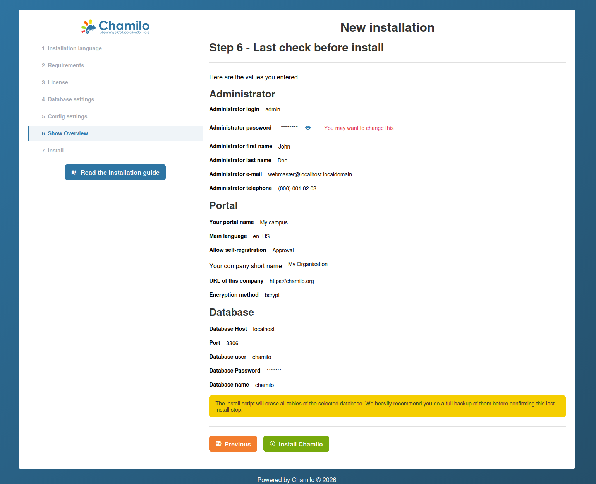

# Asistente de instalación

Chamilo 3.0 incluye un asistente de instalación web que le guía a través de la configuración inicial. El asistente se ejecuta automáticamente cuando accede a la plataforma por primera vez.

## Antes de empezar

Asegúrese de que se cumplen los siguientes requisitos previos:

1. Su servidor cumple todos los [requisitos del servidor](server-requirements.md).
2. Ha descargado una versión empaquetada (zip o tar.gz) de Chamilo.
3. Su servidor web está configurado para servir el directorio `public/` como raíz de documentos.
4. Su archivo `.env` existe y está vacío (el asistente le guiará en la configuración de la base de datos).

## Paso 1: Idioma de instalación

El primer paso le permite seleccionar el idioma del proceso de instalación. Elija su idioma preferido en el menú desplegable.

Si Chamilo detecta una instalación existente (para una actualización), mostrará el estado de la migración y ofrecerá una ruta de actualización en lugar de una instalación nueva.

## Paso 2: Comprobación de requisitos

El asistente comprueba el entorno de su servidor:

* La **versión de PHP** es 8.3, 8.4 u 8.5
* Las **extensiones de PHP requeridas** están instaladas (intl, gd, curl, zip, mbstring, xml, etc.)
* **Ajustes de PHP recomendados** — `date.timezone` está configurado, límites de carga/memoria adecuados
* **Permisos de directorios y archivos** — `var/`, `config/` y `public/upload/` son escribibles por el servidor web

Si no se cumple algún requisito, el asistente muestra advertencias o errores. Resuélvalos antes de continuar.

## Paso 3: Licencia

Este paso muestra la licencia GNU/GPLv3. Debe marcar la casilla **"Acepto"** para continuar.

Opcionalmente, puede desplegar la sección **Información de contacto** para proporcionar datos sobre su organización (nombre, correo electrónico, empresa, país). Es voluntario y ayuda a la comunidad de Chamilo a conocer quién usa la plataforma, pero también nos permitirá contactarle *muy raramente* sobre eventos que ocurran cerca de usted.

## Paso 4: Ajustes de la base de datos

Introduzca los datos de conexión a la base de datos:

| Campo | Descripción |
|-------|-------------|
| **Host de la base de datos** | El nombre de host o la IP de su servidor de base de datos (p. ej., `localhost` o `127.0.0.1`) |
| **Puerto de la base de datos** | Predeterminado: 3306 para MySQL/MariaDB |
| **Nombre de la base de datos** | El nombre de la base de datos a utilizar (solo alfanumérico y guiones bajos) |
| **Usuario de la base de datos** | Un usuario de base de datos con privilegios completos sobre la base de datos especificada |
| **Contraseña de la base de datos** | La contraseña del usuario de la base de datos |

Haga clic en **Comprobar conexión a la base de datos** para probar. El asistente no le permitirá continuar hasta que la conexión sea correcta. Si la base de datos ya existe, se muestra una advertencia.

## Paso 5: Ajustes de configuración

Este paso combina la creación de la cuenta de administrador, los ajustes del portal y la configuración de correo electrónico.

### Cuenta de administrador

| Campo | Descripción |
|-------|-------------|
| **Inicio de sesión** | El nombre de usuario del administrador |
| **Contraseña** | Elija una contraseña segura: esta cuenta tiene acceso completo a la plataforma |
| **Nombre** | El nombre del administrador |
| **Apellidos** | Los apellidos del administrador |
| **Correo electrónico** | Se utiliza para notificaciones del sistema y restablecimientos de contraseña |
| **Teléfono** | Número de contacto opcional |

Estos datos de administrador también serán utilizados por Chamilo para rellenar los datos de contacto de soporte, así que asegúrese de reconfigurarlos en los ajustes una vez concluida la instalación.

### Ajustes del portal

| Campo | Descripción |
|-------|-------------|
| **Idioma** | El idioma predeterminado de la interfaz |
| **Nombre del portal** | El nombre de su plataforma (p. ej., "LMS de Mi Organización") |
| **Nombre corto de la empresa** | El nombre abreviado de su organización |
| **URL de la empresa** | El sitio web de su organización |
| **Método de cifrado** | Algoritmo de hash de contraseñas — se recomienda **bcrypt** |
| **Permitir autorregistro** | Sí / No / Tras aprobación |
| **Permitir autorregistro como formador** | Sí / No |

### Configuración de correo electrónico

La sección de ajustes de correo electrónico le permite configurar el transporte de correo (SMTP, Amazon SES, Mailjet, etc.) y probar el envío. Consulte [Configuración de correo electrónico](email-configuration.md) para más detalles.

Todos estos ajustes se pueden cambiar más adelante desde el panel de administración.

## Paso 6: Última comprobación antes de instalar

Este paso muestra un resumen de todo lo que ha introducido para su revisión:

* Credenciales de administrador (la contraseña está oculta de forma predeterminada — haga clic en el icono del ojo para revelarla)
* Ajustes del portal
* Detalles de conexión a la base de datos

Revise con cuidado y, a continuación, haga clic en **Install Chamilo** para ejecutar la instalación. El asistente crea todas las tablas de la base de datos, rellena los datos iniciales y configura la plataforma.

## Paso 7: Instalación completada

Cuando la instalación finaliza correctamente, el asistente muestra:

* **Consejos para empezar** — Sugiere crear su primer curso para explorar la plataforma (como administrador, debe hacerlo desde el panel de administración)
* **Recomendaciones de seguridad**:
  * Haga que el directorio `config/` sea de solo lectura (`chmod 0555`)
  * Elimine el directorio `public/main/install/`
* Un **enlace a su portal** para iniciar sesión con las credenciales de administrador que acaba de crear

## Después de la instalación

Tras completar el asistente:

* **Elimine o restrinja el acceso al instalador** -- El asistente no debe ser accesible después de la instalación. Chamilo suele bloquearlo automáticamente, pero verifique que al volver a visitar la URL de instalación se redirija a la página de inicio de sesión.
* **Configure el envío de correo electrónico** -- Consulte [Configuración de correo electrónico](email-configuration.md).
* **Configure copias de seguridad** -- Antes de añadir contenido, configure copias de seguridad automatizadas de la base de datos y de los archivos (Chamilo no ofrece una solución para esto, pero copiar la carpeta var/ y la base de datos son los 2 elementos más importantes).
* **Revise los ajustes de seguridad** -- Consulte [Ajustes de seguridad](../platform-settings/security-settings.md).

## Resolución de problemas

| Problema | Solución |
|---------|----------|
| Página en blanco en la URL de instalación | Consulte los registros de errores de PHP. Cambie temporalmente a `APP_ENV=dev` en .env para ver los errores en el navegador. |
| Falla la conexión a la base de datos | Verifique las credenciales, confirme que la base de datos existe y compruebe que el servidor de base de datos permite conexiones desde el host del servidor web. |
| Errores de permiso denegado | Asegúrese de que `var/` es escribible por el usuario del servidor web. |
| Los recursos no se cargan (sin CSS/JS) | Ejecute `yarn install && yarn build` para compilar los recursos del frontend. |