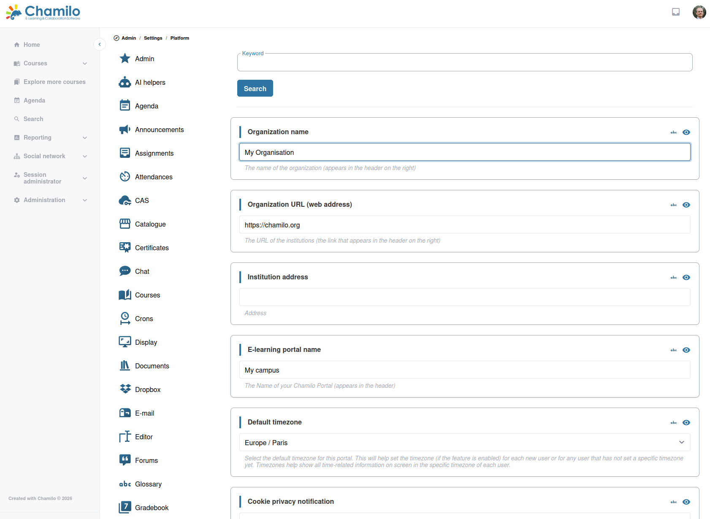

# Configuración de la plataforma

Chamilo dispone de un amplio sistema de configuración con ajustes organizados en categorías. El conjunto completo de categorías que se indica a continuación refleja la página **Configuración** del panel de administración — y el archivo subyacente `SettingsCurrentFixtures.php` del código fuente, que es la fuente de verdad para los nombres de variables, títulos y descripciones.

Acceda a la configuración de la plataforma desde el panel de administración haciendo clic en **Configuración**.

## Todas las categorías

Hay **39 categorías de configuración** en total, listadas a continuación en orden alfabético. El número que aparece después de cada enlace es el recuento de ajustes de esa categoría.

### Alcance de toda la plataforma

* **[Identidad del administrador](admin-settings.md)** (12) — Identidad y datos de contacto del administrador de la plataforma.
* **[Plataforma](platform-settings.md)** (29) — Identidad a nivel de plataforma, zona horaria, política de registro, usuarios en línea, indicadores de rendimiento.
* **[Visualización](display-settings.md)** (24) — Diseño de la página de inicio, gravatar, menús, comportamiento de la marca.
* **[Editor](editor-settings.md)** (26) — Barras de herramientas del editor de texto enriquecido (TinyMCE), plugins, asistentes de IA.
* **[Idiomas](language-settings.md)** (12) — Idiomas disponibles, idioma predeterminado, alternativas.
* **[Correo](mail-settings.md)** (18) — Diseño del correo saliente, identidad del remitente, firma.
* **[Flujos de trabajo](workflows-settings.md)** (23) — Interruptores de flujo de trabajo transversales (creación de cursos, validación de inscripción…).

### Autenticación, seguridad y privacidad

* **[Seguridad](security-settings.md)** (31) — Protección de inicio de sesión, política de contraseñas, cabeceras, 2FA, IDS.
* **[Registro](registration-settings.md)** (20) — Política de autorregistro y redirecciones posteriores al registro.
* **[Privacidad](privacy-settings.md)** (6) — Consentimiento, exportación de datos, solicitudes de eliminación de cuenta.
* **[CAS](cas-settings.md)** (7) — Configuración CAS heredada procedente de 1.x.

### Ciclo de vida de cursos y sesiones

* **[Curso](course-settings.md)** (45) — Valores predeterminados y políticas que se aplican a los cursos en toda la plataforma.
* **[Sesiones](session-settings.md)** (68) — Ciclo de vida de las sesiones, ventanas de acceso del tutor, visibilidad.
* **[Catálogo de cursos](catalog-settings.md)** (13) — Comportamiento del catálogo público de cursos.
* **[Perfil](profile-settings.md)** (29) — Qué campos aparecen en el perfil de usuario.

### Herramientas de curso

* **[Agenda](agenda-settings.md)** (11)
* **[Anuncios](announcement-settings.md)** (9)
* **[Tareas (Trabajos)](work-settings.md)** (12)
* **[Asistencia](attendance-settings.md)** (4)
* **[Chat](chat-settings.md)** (5)
* **[Documentos](document-settings.md)** (29)
* **[Buzón](dropbox-settings.md)** (8)
* **[Ejercicios (Pruebas)](exercise-settings.md)** (63)
* **[Foros](forum-settings.md)** (9)
* **[Glosario](glossary-settings.md)** (3)
* **[Grupos](group-settings.md)** (3)
* **[Itinerarios de aprendizaje](lp-settings.md)** (51)
* **[Encuestas](survey-settings.md)** (12)

### Evaluación y reconocimiento

* **[Libro de calificaciones (Evaluaciones)](gradebook-settings.md)** (34) — Visualización de puntuaciones, decimales, umbrales de certificado.
* **[Certificados](certificate-settings.md)** (9) — Valores predeterminados que se aplican cuando un alumno obtiene un certificado.
* **[Competencias](skill-settings.md)** (13) — Árbol de competencias, reglas de otorgamiento, integración con el perfil.
* **[Seguimiento](tracking-settings.md)** (10) — Qué se registra, qué informes se exponen.

### Comunicación y comunidad

* **[Mensajería](message-settings.md)** (7)
* **[Red social](social-settings.md)** (7)

### IA

* **[Asistentes de IA](ai-helpers-settings.md)** (13) — Proveedores por tipo de tarea (texto, imagen, vídeo, tutor, calificación).

### Operaciones e integración

* **[Tareas cron](crons-settings.md)** (3)
* **[Búsqueda](search-settings.md)** (3) — Configuración de búsqueda de texto completo Xapian.
* **[Tickets](ticket-settings.md)** (7) — Sistema de mesa de ayuda.
* **[Servicios web](webservice-settings.md)** (7) — Endpoints SOAP/REST heredados.

## Cómo funcionan los ajustes

* Los ajustes se almacenan en la base de datos (tabla `settings`) y se gestionan a través de la interfaz web
* Algunos ajustes están **bloqueados por URL** en instalaciones multi-URL (su valor se aplica a toda la plataforma y no puede sobrescribirse por URL; véanse las columnas `access_url_locked` y `access_url_changeable` de la tabla `settings`); otros (la mayoría) pueden sobrescribirse por URL de acceso
* Los cambios surten efecto de inmediato (no se requiere reiniciar el servidor), aunque la sesión de usuario podría mantener algunos de ellos en memoria. Si los cambios no se reflejan de inmediato, cierre sesión e inicie sesión de nuevo para vaciar la sesión.
* Algunos ajustes tienen dependencias: cambiar uno puede afectar el comportamiento de otros
* Los nombres de variable que se muestran en cada página (p. ej. `2fa_enable`) coinciden con la fila de la tabla `settings` de la base de datos (columna `variable`) y con las claves usadas en las sobrescrituras (`config/settings_overrides.yaml`) cuando corresponda.

Para más información, consulte [Configurations](https://github.com/chamilo/chamilo-lms/wiki/Configurations) en nuestro wiki.

## Consejos

* **Documente su configuración** — Conserve un registro de los ajustes que no son los predeterminados y del motivo por el que los modificó
* **Cambie una cosa cada vez** — Al resolver problemas, modifique un ajuste cada vez para poder identificar el efecto
* **Pruebe en un entorno de preproducción** — Ante cambios de configuración significativos, pruébelos primero en un servidor de preproducción