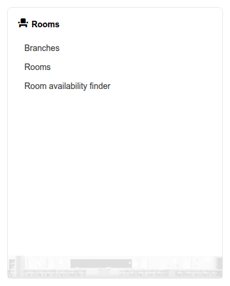

# Salas

El bloque **Salas** del panel de administración gestiona las ubicaciones físicas que Chamilo puede registrar para la formación presencial o semipresencial: sucursales (sedes), las salas que contienen y una herramienta para encontrar qué salas están libres en un momento determinado.

Este capítulo cubre la gestión de sucursales y salas desde el lado de administración. Para el lado orientado al docente —asignar una sala a una sesión de curso— consulte [Sucursales y salas](../../teacher-guide/branches-and-rooms.md) en la Guía del docente.

## Acceso al bloque Salas

Desde el panel de administración, el bloque **Salas** aparece junto a los demás bloques del panel. Haga clic en cualquiera de sus enlaces para abrir la herramienta correspondiente.

## Contenido del bloque

* **[Gestión de salas](managing-rooms.md)** — Crear y organizar sucursales (sedes) y las salas de cada una
* **[Buscador de disponibilidad de salas](room-availability-finder.md)** — Comprobar qué salas están libres para un intervalo de fecha y hora determinado

## Nota sobre multi-URL

En una instalación multi-URL (multi-inquilino), las sucursales y las salas están acotadas a una única URL de acceso cada una: nunca se comparten entre portales.