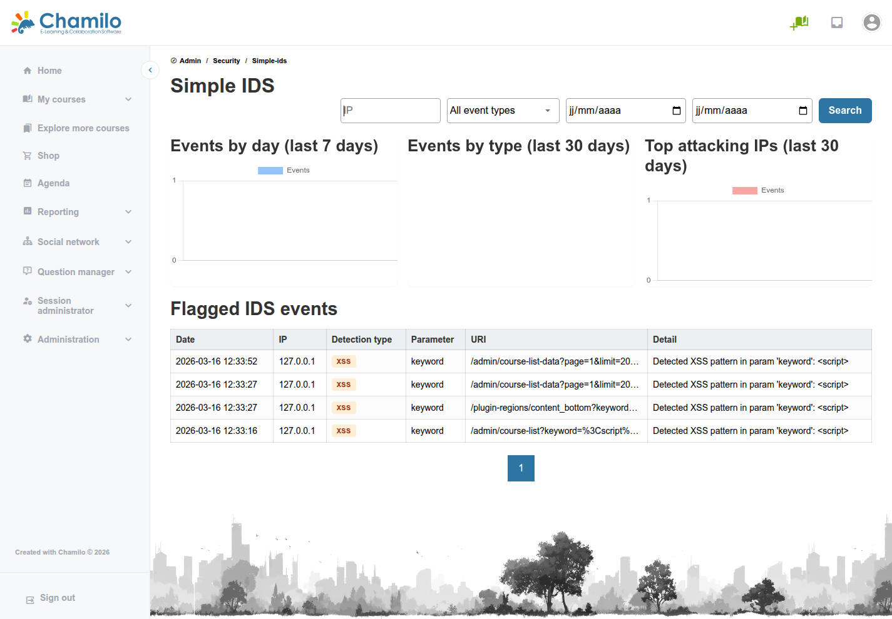

# Simple IDS

Chamilo incluye un sistema de detección de intrusiones (IDS) ligero e integrado en la aplicación. En cada petición, analiza los parámetros de consulta de la URL, la ruta de la petición y un par de cabeceras (`User-Agent`, `Referer`) en busca de firmas de ataque habituales —por ejemplo, cargas XSS o patrones de recorrido de rutas— y registra cualquier actividad sospechosa. La página Simple IDS le permite revisar lo que se ha marcado.

Los **cuerpos** de las peticiones no se analizan de forma intencionada, para evitar falsos positivos procedentes del contenido de los editores de texto enriquecido (el texto de los cursos contiene de forma legítima marcado similar a HTML/JavaScript).

## Acceso a Simple IDS

Desde el panel de administración, haga clic en **Seguridad > Simple IDS**.

## Qué muestra

* **Eventos por día (últimos 7 días)**, **Eventos por tipo (últimos 30 días)** y **IPs atacantes principales (últimos 30 días)** — Gráficos de resumen
* **Tabla de eventos IDS marcados** — Cada entrada muestra la fecha, la IP de origen, el tipo de detección (por ejemplo `XSS`), el parámetro afectado, el URI de la petición y una breve descripción de lo detectado

Utilice los filtros de **IP**, tipo de evento y rango de fechas situados encima de los gráficos para acotar los resultados.

## Cómo funciona

* Cada petición se analiza a la entrada; las coincidencias se añaden a `var/logs/ids/ids_events.log`
* A la salida, el mismo suscriptor añade a la respuesta las cabeceras de seguridad recomendadas por OWASP
* Si el bloqueo está activado, una petición que coincida con una firma se detiene de inmediato con una respuesta HTTP 400, en lugar de llegar al código de la aplicación

## Configuración

Simple IDS se controla mediante variables de entorno, definidas en `config/packages/chamilo_ids.yaml`:

| Variable | Propósito |
|----------|---------|
| `IDS_ENABLED` | Activa o desactiva el análisis y el registro de peticiones |
| `IDS_BLOCK` | Cuando está activado, una petición detectada se rechaza (HTTP 400) en lugar de solo registrarse |
| `IDS_SECURITY_HEADERS` | Controla si se añaden las cabeceras de respuesta recomendadas por OWASP |

Se trata de un detector ligero, de mejor esfuerzo, pensado para captar intentos evidentes de rastreo y explotación; no sustituye a un cortafuegos de aplicaciones web (WAF) dedicado en despliegues de alto riesgo.