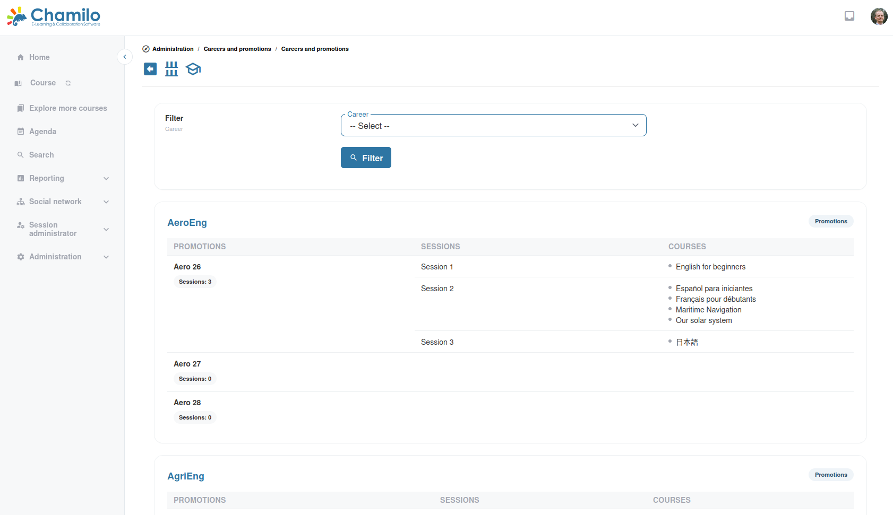

# Carreras y promociones

Chamilo incluye un sistema de gestión de carreras que permite definir itinerarios formativos y hacer un seguimiento de la progresión del alumnado a través de programas estructurados.

## Carreras

Una **carrera** representa un itinerario formativo estructurado: una secuencia de etapas de formación que el alumnado sigue para alcanzar un objetivo profesional.

### Crear una carrera

1. Desde el panel de administración, vaya a **Carreras**
2. Haga clic en **Crear una carrera**
3. Introduzca un **nombre** y una **descripción**
4. Guarde

## Promociones

Una **promoción** representa una cohorte o grupo de alumnado que avanza a través de una carrera. Piénselo como un grupo de personas que recorre el mismo itinerario de carrera al mismo tiempo.

### Vinculación con sesiones

Tras crear una promoción, se le vinculan sesiones. Esto define la secuencia de formación que el alumnado debe completar.

Más adelante puede replicar promociones para facilitar la creación de la siguiente promoción con copias de las mismas sesiones, de modo que la siguiente promoción se pueda construir al instante.

### Crear una promoción

1. Vaya a **Promociones**
2. Haga clic en **Crear una promoción**
3. Introduzca un **nombre** y una **descripción**
4. Vincúlela a una **carrera**
5. Asigne **sesiones** a la promoción
6. Guarde

## Cómo encaja todo

* Una **carrera** define el itinerario (p. ej., «Certificación de desarrollador junior»)
* Una **promoción** representa una cohorte (p. ej., «Promoción de marzo de 2026»)
* Las **sesiones** de la promoción imparten el contenido formativo real

## Consejos

* **Úselo para programas estructurados** — Las carreras y las promociones resultan más útiles en programas formativos de varias etapas en los que el alumnado avanza según una secuencia definida
* **Seguimiento de la finalización** — Utilice las herramientas de informes para supervisar cómo avanzan las promociones a lo largo de sus itinerarios de carrera