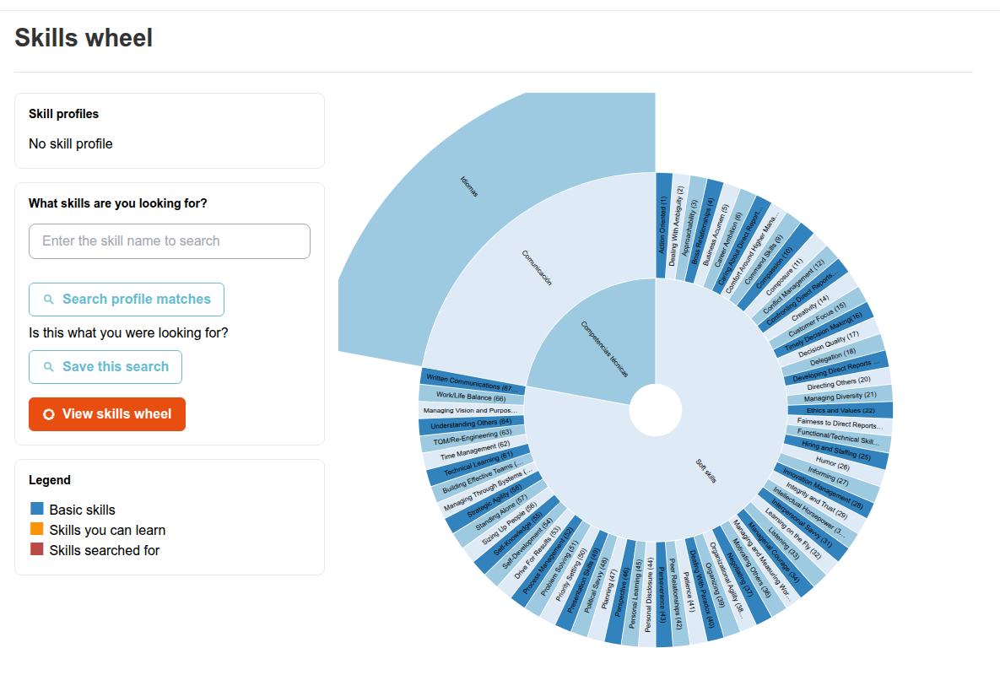

# Rueda de competencias

La rueda de competencias es un diagrama con forma de rueda y con zoom de todo el árbol de competencias: una alternativa visual a la lista plana de [Gestión de competencias](managing-skills.md).

## Acceso a la rueda de competencias

Desde el panel de administración, haga clic en **Competencias > Rueda de competencias**.

## Qué muestra

Cada segmento de la rueda es una competencia, expandible en sus competencias hijas. Un segmento indica si la competencia tiene un libro de calificaciones vinculado (véase [Competencias y evaluaciones](skills-assessments.md)) y, al ver a un usuario concreto, si ese usuario ya la ha alcanzado.

Haga clic en un segmento para acercar el zoom y revelar sus competencias hijas; haga clic en el círculo central para alejar el zoom.

Haga clic con el botón derecho en un segmento para abrir sus detalles: descripción, competencia padre y los cursos (si los hay) que la otorgan. Desde este diálogo, los administradores también pueden editar la competencia, crear una competencia hija bajo ella o añadirla a la búsqueda de perfiles descrita más abajo.

Los administradores y los usuarios con el rol de gestor de recursos humanos también disponen aquí de una búsqueda de perfiles: las competencias pueden agruparse en «perfiles» (conjuntos de competencias esperadas para un rol o una descripción de puesto determinados), y esta página permite buscar usuarios cuyas competencias adquiridas coincidan con un perfil dado, lo cual resulta útil para identificar quién está preparado para un rol o dónde hay lagunas en un equipo.