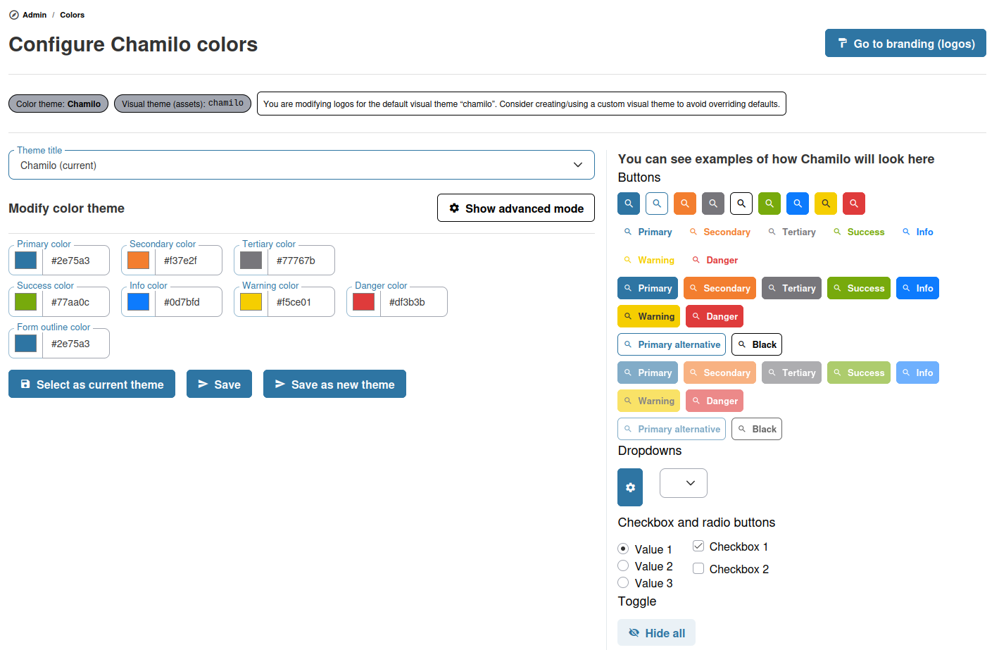

# Temas de color

Chamilo 2.0 introduce un sistema de temas de color que permite personalizar la apariencia visual de la plataforma.

## Cómo funcionan los temas

Los temas de color definen la paleta utilizada en toda la interfaz de Chamilo: colores primarios, colores de acento, fondos y colores de texto. Un tema se asocia a una URL de acceso: en un portal de una sola URL se convierte de hecho en el tema global, y en una configuración multi-URL cada URL puede tener el suyo.

## Aplicar un tema

1. Desde el panel de administración, vaya a **Temas de color**
2. Explore los temas disponibles
3. Seleccione un tema y haga clic en **Aplicar**
4. El tema se aplica de inmediato a la plataforma

## Temas por URL

En una configuración multi-URL, cada URL de acceso puede tener su propio tema de color. Esto permite que distintos portales tengan identidades visuales diferenciadas compartiendo la misma instalación de Chamilo.

## Consejos

* **Alinee con su marca** — Elija o personalice un tema que coincida con los colores de marca de su organización
* **Compruebe la legibilidad** — Tras aplicar un tema, verifique que el texto sea legible sobre los colores de fondo, especialmente en situaciones de alto contraste
* **Tenga en cuenta la accesibilidad** — Asegure un contraste de color suficiente para los usuarios con discapacidad visual