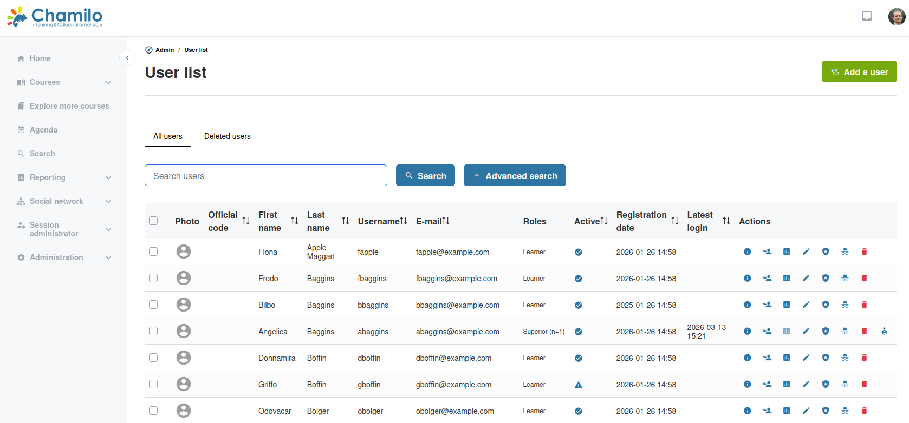
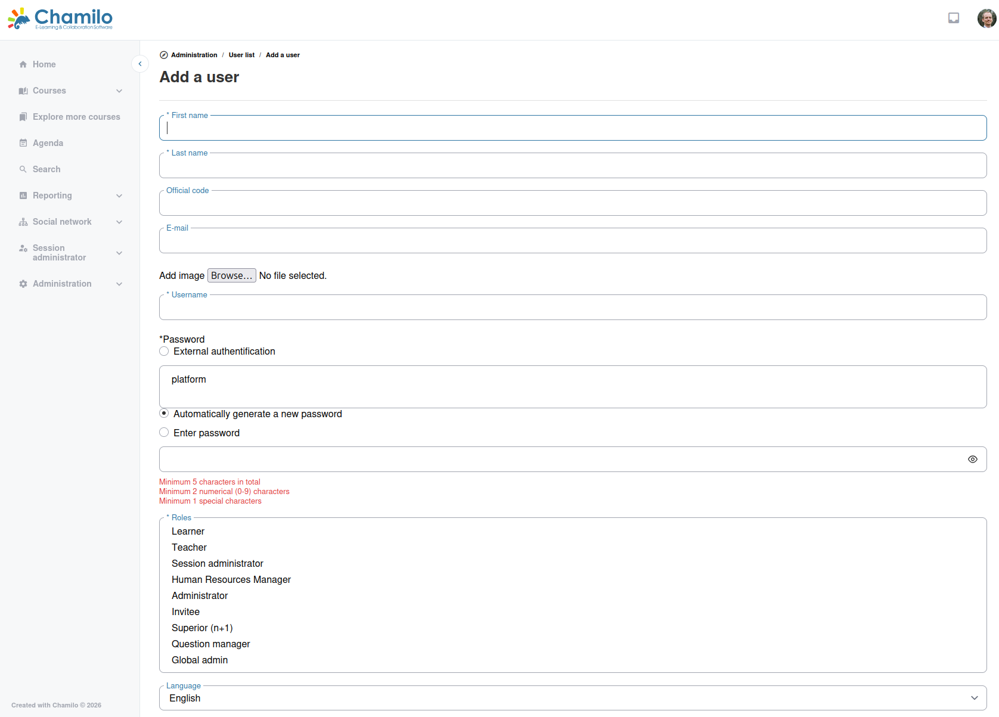
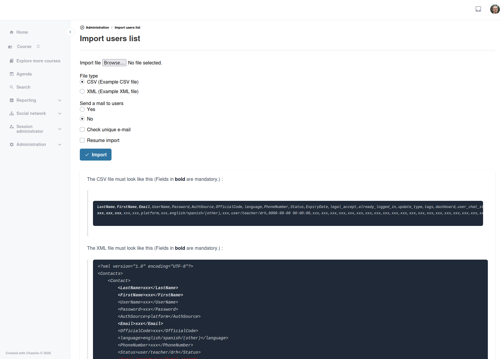

# Gestión de usuarios

Esta página cubre las tareas cotidianas de creación, edición y gestión de cuentas de usuario.

## Lista de usuarios

Desde el panel de administración, haga clic en **Lista de usuarios** para ver todos los usuarios de la plataforma. La lista muestra:

* Avatar
* Nombre
* Nombre de usuario
* Dirección de correo electrónico
* Roles
* Estado activo/inactivo
* Fecha de registro
* Fecha del último acceso

Utilice la herramienta **Búsqueda avanzada** para encontrar usuarios concretos por nombre, correo electrónico, rol u otros criterios.

## Creación de un usuario

1. Haga clic en **Añadir un usuario** desde el panel de administración
2. Complete los campos obligatorios:
   * **Nombre** y **Apellidos**
   * **Correo electrónico** — Debe ser único en la plataforma
   * **Nombre de usuario** — El nombre de acceso (debe ser único)
   * **Contraseña** — Establezca una contraseña inicial
   * **Roles** — Seleccione el rol o los roles de la plataforma del usuario (estudiante, profesor, administrador, etc.)
   * **Idioma** — El idioma de interfaz preferido del usuario
3. Opcionalmente, complete campos adicionales:
   * Código oficial (p. ej., identificador único en la organización)
   * Número de teléfono
   * Fecha de caducidad — Desactivar automáticamente la cuenta después de una fecha
   * Estado activo/inactivo
   * Campos extra de perfil (si están configurados)
4. Guardar

## Importación de usuarios

Para la creación masiva de usuarios, puede importar usuarios desde un archivo:

1. Haga clic en **Importar usuarios** desde el panel de administración
2. Cargue un archivo **CSV** o **XML** con los datos de los usuarios
3. Asigne las columnas del archivo a los campos de usuario de Chamilo
4. Elija cómo tratar a los usuarios existentes (actualizar u omitir)
5. Importar

El archivo de importación debe contener columnas al menos para: nombre, apellidos, correo electrónico, nombre de usuario y contraseña.

Nota: La columna **Status** es el nombre heredado de **Role** y solo acepta unos pocos valores, como 1 para profesor y 5 para estudiante. Un ajuste más fino de los roles solo puede hacerse después de forma manual, editando el usuario.

## Exportación de usuarios

Haga clic en **Exportar usuarios** para descargar la lista de usuarios como archivo CSV o XML. Puede filtrar qué usuarios exportar por rol, fecha de registro u otros criterios.

## Edición de un usuario

Haga clic en el nombre de un usuario en la lista de usuarios para editar su cuenta. Puede modificar:

* Información personal (nombre, correo electrónico, teléfono)
* Roles
* Contraseña (restablecer)
* Estado activo/inactivo
* Fecha de caducidad
* Campos extra de perfil

## Eliminación de un usuario

Al eliminar usuarios (normalmente profesores) que han creado contenido en la plataforma, el sistema podría impedirle eliminarlos de forma permanente y mostrará un mensaje de advertencia explicando que el usuario sigue vinculado a algunos de los recursos. Si confirma la eliminación, el sistema no eliminará el contenido en sí, sino que lo asociará a un usuario neutro (lo denominamos «usuario de respaldo» o *Fallback user*) por motivos de coherencia de los datos.

Para evitarlo, consulte los detalles del usuario, elimine uno a uno cada uno de sus cursos y, a continuación, elimine al usuario.

## Acciones de usuario

| Acción | Descripción |
|--------|-------------|
| **Desactivar** | Deshabilita la cuenta de un usuario sin eliminarla. El usuario no puede iniciar sesión, pero sus datos se conservan. |
| **Activar** | Vuelve a habilitar una cuenta desactivada previamente. |
| **Iniciar sesión como** | Inicia sesión en la plataforma como este usuario (suplantación). Útil para la resolución de problemas. |
| **Anonimizar** | Borra toda la información personal de la cuenta, según lo definido por el RGPD de la UE. |
| **Eliminar** | Eliminación lógica de la cuenta de usuario. Utilice la pestaña **Usuarios eliminados** para eliminar de forma permanente la cuenta y los datos asociados. |

> **Iniciar sesión como** es una función potente. Úsela de forma responsable y solo con fines legítimos de soporte.

## Operaciones por lotes

Seleccione varios usuarios en la lista de usuarios para realizar acciones por lotes:

* Activar o desactivar varios usuarios a la vez
* Eliminar varios usuarios
* Asignar usuarios a un curso o a una sesión

## Consejos

* **Utilice la importación CSV para inscripciones numerosas** — Al incorporar a muchos usuarios al inicio de un programa formativo, prepare un archivo CSV e importe de forma masiva
* **Establezca fechas de caducidad** — Para usuarios temporales (participantes en talleres, usuarios de prueba), establezca una fecha de caducidad para desactivar automáticamente sus cuentas
* **Desactive en lugar de eliminar** — Cuando un usuario se marcha, desactive primero su cuenta. Así se conservan sus registros de formación. Elimine solo si está seguro de que los datos ya no son necesarios.