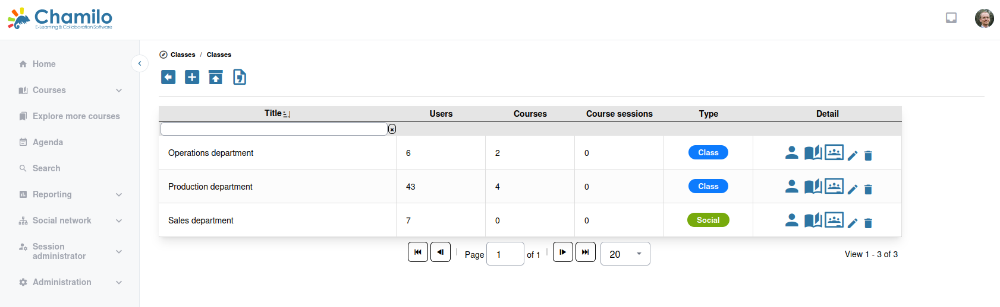

# Clases / Grupos de usuarios

Las clases en el panel de administración son grupos de alcance de plataforma utilizados para organizar a los usuarios con fines de gestión. Se distinguen de los grupos a nivel de curso (que crean los profesores dentro de un curso).

> Los grupos de usuarios y las [Clases](../../admin-guide/sessions/classes.md) comparten la misma interfaz. La única diferencia es el ajuste de **tipo de grupo**: elija «Class» para crear una clase (utilizada para la inscripción masiva en sesiones), o «User group» para grupos más sociales que pueden disponer de su propio espacio en la red social interna. Consulte [Clases](../../admin-guide/sessions/classes.md) para más detalles sobre la inscripción en sesiones.

## Creación de un grupo

1. Desde el panel de administración, vaya a **Classes**
2. Haga clic en **Add classes**
3. Introduzca un **título** y, de forma opcional, una **descripción**
4. Marque **Social group** si se tratará de un grupo social. Déjelo sin marcar si se tratará de una clase.
5. Añada una URL de referencia opcional y una imagen/logotipo.
6. Elija los **permisos** del grupo:
   * **Open** — Cualquier usuario puede unirse
   * **Closed** — Los usuarios deben ser añadidos por un administrador
7. Marque si desea que los miembros puedan abandonar la clase por sí mismos.
8. Guarde.

## Añadir miembros

1. Abra la lista de clases/grupos de usuarios
2. Haga clic en el icono de usuario **Subscribe users to class**
3. Busque usuarios por nombre, nombre de usuario o correo electrónico
4. Seleccione los usuarios que desea añadir, utilizando las flechas del lado derecho
5. Haga clic en el botón de confirmación para guardar

## Casos de uso

* **Organización por departamentos** — Agrupar usuarios por departamento o equipo
* **Inscripción masiva** — Añadir de una vez a todos los miembros de un grupo a un curso o a una sesión
* **Comunicación dirigida** — Enviar anuncios a grupos concretos
* **Informes** — Ver el progreso de la formación filtrado por grupo

## Gestión de grupos

* **Edit** — Cambiar el nombre, la descripción o la visibilidad del grupo
* **Manage members** — Añadir o quitar miembros
* **Delete** — Eliminar el grupo (no elimina las cuentas de los miembros)