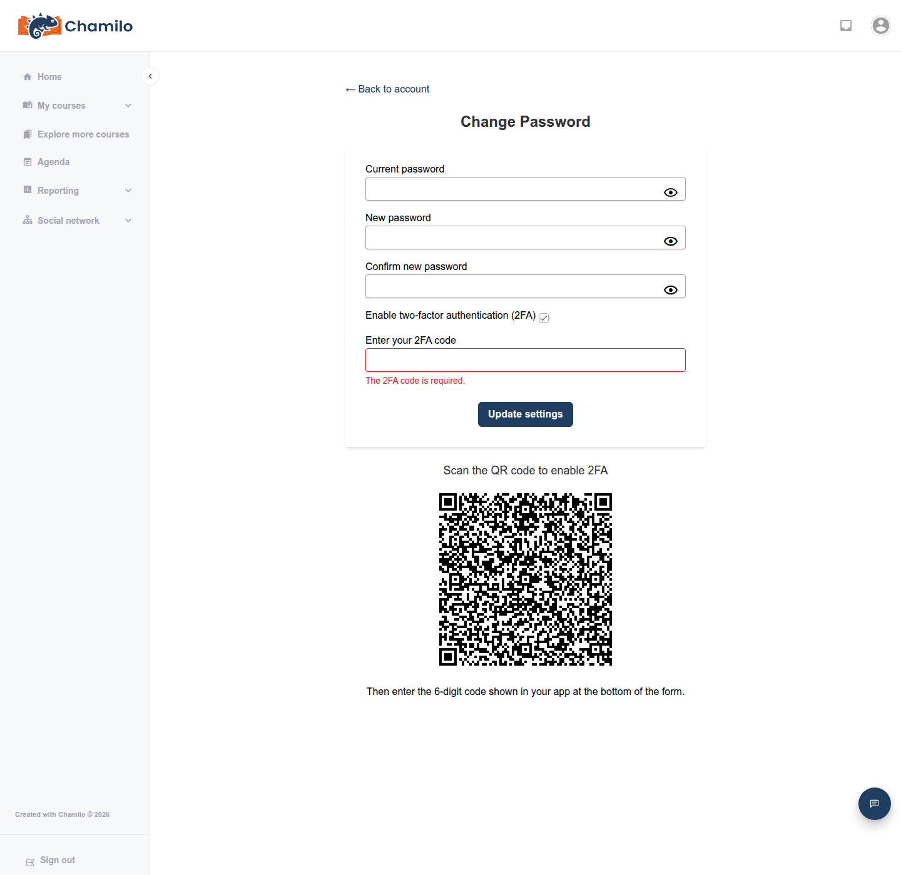

# Autenticación de dos factores

La autenticación de dos factores (2FA) añade un segundo paso al inicio de sesión — un código de 6 dígitos de una aplicación en su teléfono, además de su contraseña — de modo que conocer solo su contraseña no basta para acceder a su cuenta.

Esta función solo aparece si su administrador la ha habilitado en toda la plataforma. Si no la ve en la página de su cuenta, no se ha activado en su plataforma.

## Activar 2FA

1. Abra su **menú del avatar** y haga clic en **Mi perfil**.
2. Haga clic en **Cambiar contraseña**.
3. Introduzca su **contraseña actual**, marque la casilla **Habilitar autenticación de dos factores (2FA)** y haga clic en **Actualizar configuración**.
4. La página se recarga con un código QR y el mensaje «Escanee el código QR para habilitar 2FA». Escanéelo con una aplicación de autenticación en su teléfono (cualquier aplicación compatible con TOTP funciona, como Google Authenticator, Microsoft Authenticator o Authy).

5. Introduzca de nuevo su contraseña actual, junto con el código de 6 dígitos que muestra ahora su aplicación, en el campo **Código 2FA**, y haga clic otra vez en **Actualizar configuración**. Verá una confirmación de que 2FA se ha activado.

Marcar la casilla por sí sola no revela el código QR: solo lo ve después de ese primer envío, y los campos de contraseña se vacían cada vez que la página se recarga, por lo que también deberá volver a introducir su contraseña actual en este segundo envío.

## Iniciar sesión con 2FA habilitado

Tras introducir su nombre de usuario y contraseña como de costumbre, el formulario de inicio de sesión muestra un campo extra **Código 2FA** en la misma pantalla: introduzca el código actual de 6 dígitos de su aplicación de autenticación y envíe (el botón indica **Enviar código** en lugar de **Iniciar sesión** en este momento).

## Si pierde el acceso a su aplicación de autenticación

Chamilo no genera códigos de respaldo ni de recuperación para 2FA. Si pierde el dispositivo con su aplicación de autenticación, no podrá generar un código válido por sí mismo: contacte con el administrador de su plataforma, quien puede desactivar 2FA en su cuenta para que pueda iniciar sesión de nuevo y, si lo desea, configurarlo en un dispositivo nuevo.

## Desactivar 2FA

Vuelva a **Cambiar contraseña**, desmarque **Habilitar autenticación de dos factores (2FA)**, introduzca su contraseña actual y envíe.

## Consejos

* **Configúrela antes de necesitarla** — habilitar 2FA lleva un minuto y protege de forma significativa su cuenta.
* **Mantenga accesible su aplicación de autenticación** — perderla implica depender de su administrador para volver a entrar, ya que no hay códigos de respaldo.
* **No comparta sus códigos 2FA** — cualquiera con su contraseña y un código válido puede iniciar sesión como usted.