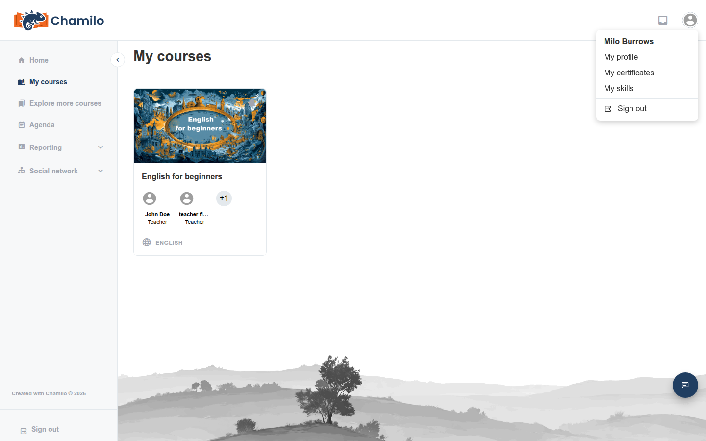
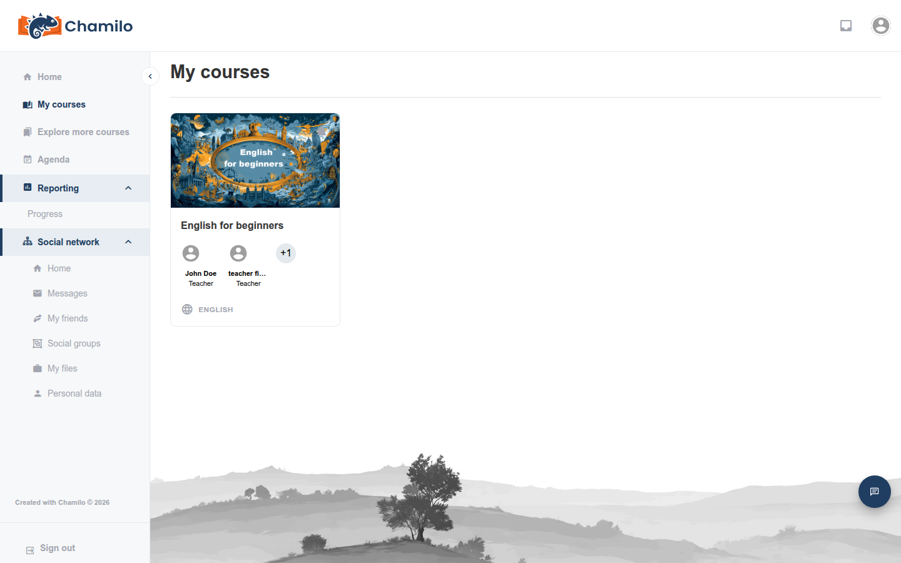

# Comprender la interfaz

Chamilo 3.0 tiene una interfaz limpia y moderna, diseñada para que la navegación sea sencilla. Esta página explica cada parte de la interfaz desde el punto de vista de un alumno.

## La barra superior

La barra superior está siempre visible en la parte superior de cada página. Contiene:

* **Logotipo de la plataforma** — Haga clic en él para volver a la página de inicio en cualquier momento.
* **Icono de bandeja de entrada**  — Muestra sus mensajes. Un distintivo rojo indica mensajes no leídos. Haga clic para abrir su [Bandeja de entrada](../inbox.md).
* **Icono de ticket de soporte**  — Si el administrador lo ha habilitado, le da acceso al sistema de tickets de soporte. No todas las plataformas lo activan, por lo que es posible que solo vea el icono de la bandeja de entrada y su avatar.
* **Su avatar** — Una imagen circular en la esquina superior derecha. Haga clic en ella para abrir un menú desplegable:

* **Mi perfil** — Edite su información personal, cambie su contraseña y (si está habilitado) configure la autenticación de dos factores
* **Mis certificados** — Todos los certificados que ha obtenido, en todos sus cursos
* **Mis competencias** — Insignias de competencia que se le han otorgado
* **Cerrar sesión**

## La barra lateral

La barra lateral de la izquierda es su navegación principal. Se puede contraer para dar más espacio al área de contenido. Haga clic en la flecha de conmutación de su borde derecho para expandirla o contraerla. Chamilo recuerda su preferencia.

La barra lateral contiene los siguientes enlaces (algunos pueden estar ocultos según la configuración de su plataforma):

| Elemento del menú | Icono | Descripción |
|-----------|------|-------------|
| **Inicio** |  | Vuelve al panel principal |
| **Mis cursos** |  | Lista todos los cursos en los que está inscrito |
| **Mis sesiones** |  | Lista sus sesiones de formación (actuales, pasadas, próximas) |
| **Explorar más cursos** |  | Explore el catálogo de cursos para encontrar e inscribirse por su cuenta en cursos nuevos |
| **Agenda** |  | Su calendario personal y de cursos |
| **Informes** |  | Se expande a **Progreso** — su propio resumen de [Mi progreso](../my-progress.md) |
| **Red social** |  | Se expande a la [Red social](../social-network.md) y enlaces relacionados, si está habilitada |
| **Videoconferencia** |  | Acceso a sesiones de vídeo en directo (si está configurado) |

**Informes** y **Red social** no son enlaces simples: al hacer clic en ellos se despliega una pequeña lista de subelementos justo en la barra lateral:

* Bajo **Informes**: solo **Progreso**, que le lleva a [Mi progreso](../my-progress.md).
* Bajo **Red social**: **Inicio** (el muro social), **Mensajes** (un acceso directo a su [Bandeja de entrada](../inbox.md)), **Mis amigos**, **Grupos sociales** — y, agrupados aquí de forma un tanto inesperada, **Mis archivos** (su almacenamiento personal de archivos) y **Datos personales** (una exportación de los datos personales que la plataforma conserva sobre usted). Estos dos últimos no son realmente funciones «sociales»; simplemente se encuentran en esta parte de la barra lateral.

Si su cuenta tiene roles adicionales (por ejemplo, también imparte un curso), es posible que vea elementos extra en la barra lateral —como **Administración**— que una cuenta solo de alumno nunca ve.

En la parte inferior de la barra lateral encontrará una opción **Cerrar sesión** para salir rápidamente cuando haya terminado. Esta opción también está disponible en el menú desplegable del icono de su avatar, en la esquina superior derecha.
Si la plataforma se gestiona mediante métodos de autenticación externos, es posible que estas opciones de cierre de sesión no estén disponibles.

## El área de contenido principal

El área central de la pantalla muestra el contenido de la página actual. En la parte superior, a menudo verá una **ruta de navegación** (migas de pan) que indica su ubicación actual en la plataforma (por ejemplo: Inicio > Música rock > Documentos). Use las migas de pan para volver a una página superior.

## La página de inicio del curso

Cuando entras en un curso, ves la **página de inicio del curso**:

* **Título del curso** — Se muestra de forma destacada en la parte superior
* **Introducción del curso** — Una descripción opcional en texto enriquecido escrita por tu profesor
* **Cuadrícula de herramientas** — Una cuadrícula de iconos que representan las herramientas disponibles en este curso (Documents, Exercises, Forums, etc.)

Solo aparecen en esta cuadrícula las herramientas que tu profesor ha hecho visibles — consulta [Orientarse en un curso](../courses/course-tools-overview.md) para saber qué hace cada una. Los controles para editar el curso en sí (previsualizar como estudiante, mostrar/ocultar herramientas, reordenarlas) solo aparecen para profesores y administradores del curso — no los verás en un curso en el que estás inscrito como aprendiz.

## Colores de los iconos

Esto sigue siendo experimental y no está del todo completo en Chamilo 3.0, pero intentamos aplicar las siguientes reglas a todos los botones e iconos de acción de la interfaz:

* **Verde** para acciones de creación. Incluye añadir, crear, importar, guardar y copiar contenido.
* **Azul** para acciones de visualización. Incluye exportar, ver, previsualizar en listas o en vistas detalladas, buscar y descargar.
* **Naranja** para acciones de edición. Incluye editar, mover, configurar, activar/desactivar, ocultar y mostrar.
* **Rojo** para acciones de eliminación. Incluye eliminar, quitar, dar de baja.
* **Gris** para acciones de cancelación. Simplemente dejar las cosas en el statu quo.

## Diseño adaptable

Chamilo 3.0 se adapta a distintos tamaños de pantalla. En un dispositivo móvil o en una ventana de navegador estrecha:

* La barra lateral está oculta por defecto y se puede abrir tocando el icono de menú
* Las tarjetas de curso se muestran en una sola columna en lugar de en una cuadrícula
* Las tablas se vuelven desplazables horizontalmente

Esto significa que puedes acceder a tus cursos desde un teléfono, una tableta o un ordenador, aunque la interfaz puede verse ligeramente distinta según el dispositivo.