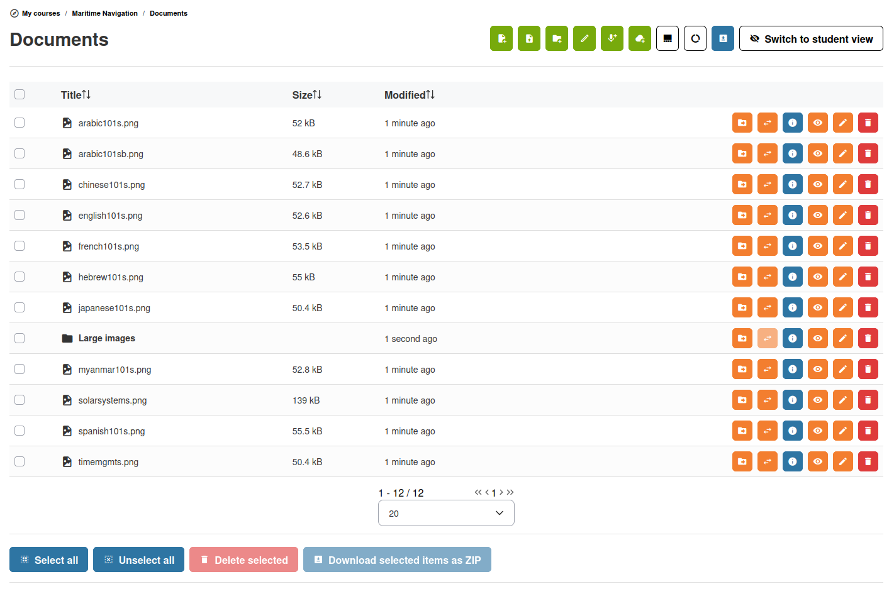

# Documentos

La herramienta de documentos es el repositorio de archivos de su curso. Puede cargar archivos, crear documentos en formato HTML, organizar el contenido en carpetas y dar a los estudiantes acceso a todos los materiales que necesiten.

## Acceso a la herramienta Documentos

Abra la herramienta **Documentos**  desde la página de inicio del curso. Verá un explorador de archivos que muestra la carpeta raíz de la biblioteca de documentos de su curso.

## Carga de archivos

1. Haga clic en el botón **Cargar** 
2. Seleccione uno o más archivos de su ordenador (puede arrastrar y soltar archivos en el área de carga)
3. Los archivos se cargan y aparecen en la carpeta actual

Chamilo admite la mayoría de los tipos de archivo habituales: PDF, documentos ofimáticos (.docx, .odt), presentaciones (.pptx, .odp), hojas de cálculo (.xlsx, .ods), imágenes (PNG, JPG, SVG, GIF), archivos de audio, archivos de vídeo (incluido WEBM), archivos HTML y más.

Algunos formatos pueden estar prohibidos por el administrador del portal mediante un ajuste de filtrado de lista blanca/lista negra en la sección de seguridad de la administración.

Para una mejor legibilidad por parte de los estudiantes, recomendamos cargar archivos que un navegador pueda ver o abrir sin herramientas adicionales. Esto hace que su curso sea más portable y, por tanto, más accesible para dispositivos móviles y más legible para personas con capacidades especiales.

## Creación de contenido

Además de cargar archivos, puede crear contenido directamente en Chamilo:

### Páginas web

1. Haga clic en **Nuevo documento**
2. Utilice el editor de texto enriquecido para redactar su contenido con formato, imágenes, tablas y enlaces
3. Introduzca un **título** para la página
4. Guarde

El editor de texto enriquecido (TinyMCE) ofrece funciones similares a las de un procesador de textos, entre ellas:

* Formato de texto (negrita, cursiva, encabezados, listas)
* Tablas
* Imágenes (cargar o enlazar a imágenes existentes)
* Vídeos y audio incrustados
* Enlaces a otros recursos
* Edición del código fuente HTML para usuarios avanzados

### Generación de medios con IA

Cuando los asistentes de IA están habilitados en la plataforma, puede pedir a la IA que genere una **imagen** o un **vídeo corto** para ilustrar un párrafo del documento que está editando. Seleccione un párrafo, abra el diálogo **Generar medios con IA** y la IA producirá un elemento multimedia que podrá revisar e insertar. El diálogo respeta los permisos a nivel de curso y solo aparece en los cursos en los que se permite la generación de medios con IA.

### Grabación de audio

Si su navegador lo admite, puede grabar audio directamente en la herramienta de documentos — útil para crear instrucciones de audio o contenido de aprendizaje de idiomas. Esto requiere una configuración HTTPS para Chamilo, ya que la grabación de audio utiliza tecnología que el navegador solo permite si la conexión es segura.

## Organización con carpetas

Mantenga organizada su biblioteca de documentos mediante carpetas:

1. Haga clic en **Nueva carpeta** 
2. Introduzca un nombre de carpeta
3. Guarde

Puede crear carpetas anidadas para construir una jerarquía lógica de contenido (p. ej., `Module 1 > Week 1 > Readings`).

### Mover archivos

* Localice su archivo en la lista
* Haga clic en **Mover** 
* Seleccione la carpeta de destino
* Confirme

## Gestión de documentos

Para cada archivo o carpeta, puede:

| Acción | Icono | Descripción |
|--------|------|-------------|
| **Editar** |  | Cambiar el nombre del archivo o editar su contenido (en páginas web) |
| **Eliminar** |  | Quitar el archivo o la carpeta |
| **Descargar** |  | Descargar el archivo a su ordenador |
| **Visibilidad** |  | Ocultar o mostrar el archivo a los estudiantes |
| **Reemplazar** |  | Sustituir el archivo por una versión actualizada |
| **Mover** |  | Mover a otra carpeta |

Reemplazar un archivo es una función importante cuando utiliza documentos para construir itinerarios de aprendizaje, ya que al reemplazar el documento este se actualizará sin que los estudiantes pierdan el progreso guardado para ese documento.

### Acciones masivas

Seleccione varios archivos mediante casillas de verificación y, a continuación, use la barra de herramientas para eliminar o descargar todos los elementos seleccionados a la vez.

## Integración de OnlyOffice

Si su administrador ha configurado el complemento **OnlyOffice**, puede editar archivos de Word, Excel y PowerPoint (o LibreOffice) directamente en el navegador sin descargarlos. Busque la opción **Editar con OnlyOffice**  al visualizar un archivo compatible.

Los documentos se almacenan en Chamilo; OnlyOffice solo se utiliza para **visualizar** o editar los documentos en el navegador, sin necesidad de ninguna herramienta adicional.

## Archivos en la nube

Si utiliza almacenamiento en la nube (Azure Blob, AWS S3 o Google Cloud) para sus archivos, estos se almacenan en la nube, pero puede vincularlos desde aquí. Esto es transparente para usted y sus estudiantes: la herramienta de documentos funciona de la misma manera independientemente del backend de almacenamiento.

## Consejos

* **Organice con antelación** — Cree la estructura de carpetas antes de cargar el contenido para no tener que reorganizarlo más adelante. Si ha creado otros cursos con la estructura adecuada, puede usarlos como plantilla más adelante
* **Use nombres de archivo descriptivos** — Ayude a los estudiantes a encontrar lo que necesitan con nombres claros y significativos
* **Oculte el trabajo en curso** — Use el conmutador de visibilidad para ocultar los documentos que aún está preparando
* **Enlace desde las rutas de aprendizaje** — Referencie documentos dentro de sus rutas de aprendizaje para crear secuencias de aprendizaje guiadas
* **Compruebe la cuota de disco** — Si su curso tiene un límite de almacenamiento, elimine los archivos obsoletos para liberar espacio