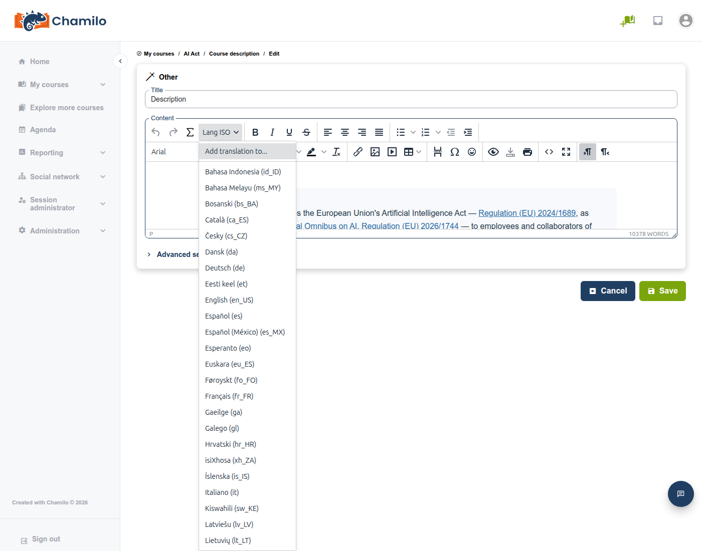
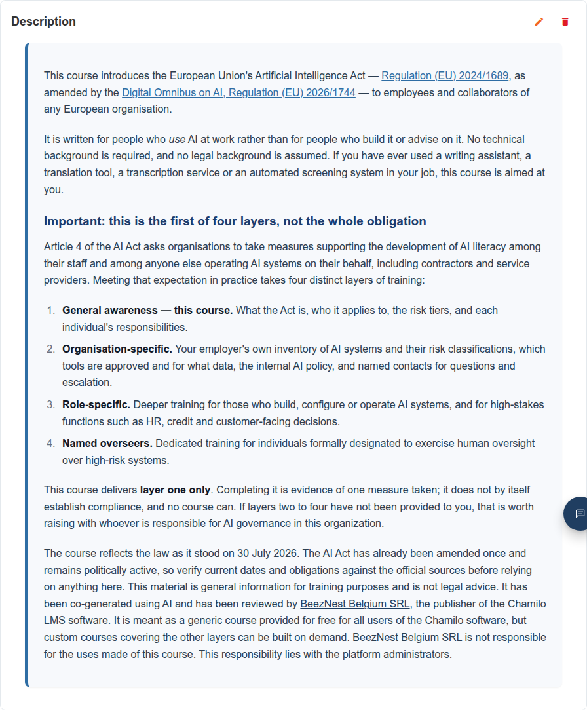
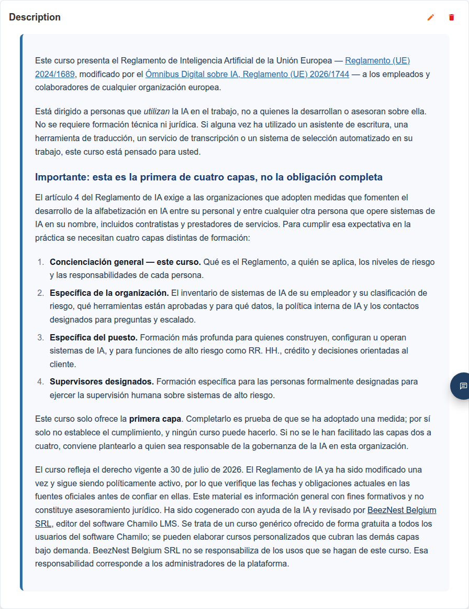

# Contenido en varios idiomas

Chamilo le permite redactar **varias versiones lingüísticas del mismo contenido en un único campo** — una sección de descripción del curso, un documento, una pregunta de examen, una encuesta — y que cada alumno vea automáticamente solo la versión escrita en su propio idioma. Esta es la función **translate_html**, llamada así por el ajuste de la plataforma que la controla.

Implica a tres personas distintas, cada una de las cuales ve un aspecto diferente:

* **Su administrador** debe activar la función en toda la plataforma antes de que nadie pueda usarla.
* **Usted (el profesor)** redacta las distintas versiones lingüísticas, mediante un botón del editor de texto enriquecido.
* **El alumno** se beneficia de ella sin saber nunca que existe: simplemente ve el contenido en su propio idioma, sin ningún ajuste que buscar ni activar.

## Activación de la función

Esta es una tarea de administrador, no de profesor. En **Administración > Ajustes de configuración > Editor**, el ajuste **Soporte de contenido HTML en varios idiomas** (`translate_html`) debe estar activado. Si no ve el botón **Lang ISO** descrito más abajo en la barra de herramientas del editor, esa es casi con toda seguridad la razón: pídaselo a su administrador. Consulte [Ajustes del editor](../../admin-guide/platform-settings/editor-settings.md) para la referencia completa de ajustes. A partir de la v3.0.0, este ajuste está activado de forma predeterminada (no era así antes de esta versión), salvo que haya actualizado desde una versión anterior en la que el ajuste estuviera desactivado.

Desactivar de nuevo este ajuste no elimina ni rompe ningún contenido ya escrito de esta forma; véase [Qué ven los alumnos](#what-learners-see) más abajo.

## Redacción de contenido en varios idiomas

La función está disponible en cualquier lugar donde disponga del editor de texto enriquecido completo: secciones de [descripción del curso](../creating-your-course/course-description.md), [documentos](documents.md), preguntas de exámenes y encuestas, y más.

1. Redacte (o pegue) el contenido en su idioma predeterminado, como de costumbre.
2. Seleccione ese texto y, a continuación, haga clic en el botón **Lang ISO** de la barra de herramientas del editor.

3. En el menú, elija el idioma en el que acaba de escribir: la lista cubre todos los idiomas activos de su plataforma. Si el que necesita no aparece, use **Custom Chamilo ISO code...** al final e introdúzcalo (p. ej. `en_US`, `fr_FR`, `es`).

4. Chamilo envuelve su selección con esa etiqueta de idioma. Ahora redacte (o pegue) la versión del siguiente idioma justo a continuación, selecciónela y repita con un idioma distinto.

Continúe con tantos idiomas como desee cubrir. Todos viven en el mismo campo: mientras edita, verá todas las versiones lingüísticas apiladas una tras otra; solo cuando alguien *visualiza* realmente la página Chamilo oculta todo excepto el idioma que le corresponde (véase más abajo).

### Traducción asistida por IA

Si su administrador ha configurado un proveedor de texto con IA, el mismo menú **Lang ISO** también ofrece **Add translation to...** en la parte superior. Esto envía su contenido existente al modelo de IA configurado e inserta un bloque nuevo, traducido automáticamente, en el idioma que elija (o en todos los idiomas restantes a la vez, si su plataforma lo permite): no tiene que escribirlo usted mismo. Los bloques de idioma existentes no se modifican, y los idiomas ya presentes se excluyen de la lista, de modo que usarlo repetidamente no crea duplicados.

Como con cualquier contenido generado por IA, revise el resultado: es una forma rápida de obtener un primer borrador sólido en un idioma que quizá no hable, no un sustituto de la revisión.

## Qué ven los alumnos

Cada alumno ve exactamente una versión lingüística: Chamilo prueba primero el idioma de su propia interfaz; si ninguno de sus bloques coincide, recurre al idioma del propio curso y, después, al idioma predeterminado de la plataforma; si tampoco coinciden, muestra el idioma que haya escrito primero en lugar de dejar el contenido en blanco. Todo ocurre de forma automática: el alumno no tiene nada que configurar, ni usted tampoco por alumno.

Aquí está la misma sección de descripción del curso, vista por tres alumnos con distintos idiomas de interfaz; nada más del curso cambió entre estas tres capturas, solo el idioma del visor:

### Bajo el capó

Si alguna vez abre la vista de **código fuente** de un campo multiidioma (el botón `<>` de la barra de herramientas del editor), verá cada versión de idioma envuelta de esta forma:

Cada versión está envuelta en un `
` (o ``, para una frase corta en línea en lugar de un bloque completo): ese atributo `lang` es lo que Chamilo compara con el idioma del visor para decidir qué mostrar. Conviene reconocer este nombre de clase concreto si alguna vez inspecciona el código fuente de la página o soluciona contenido que se ve mal: **`mce-translatehtml`** es el marcador que hay que buscar.

Esto también explica por qué desactivar `translate_html` en la configuración de la plataforma no rompe nada ya escrito: el ajuste solo controla si aparece el botón de *autoría* **Lang ISO** en el editor. El filtrado *en el lado de visualización* descrito más arriba se ejecuta de forma incondicional, de modo que el contenido multiidioma escrito previamente sigue filtrándose correctamente para cada visor incluso en una plataforma en la que un administrador haya desactivado después el botón de autoría.

## Los títulos no funcionan de esta manera

El título de un curso, el título de un documento, el título de una prueba: estos son campos de texto plano, no de texto enriquecido, por lo que no pueden contener el marcado etiquetado con `lang` descrito más arriba. Permanecen como un único valor neutro independientemente de quién los mire, por muchas versiones de idioma que haya escrito en el contenido subyacente.

La única excepción: si su administrador ha habilitado **Guardar títulos como HTML** (`save_titles_as_html`, también en **Administración > Configuración > Editor**) para el campo de título concreto con el que está trabajando, ese campo se convierte también en un campo HTML real, y se le puede aplicar la misma técnica **Lang ISO** descrita más arriba. Esto es poco habitual y se usa sobre todo para preguntas de prueba; la mayoría de los títulos de la plataforma siguen siendo texto plano.

## Consejos

* **Mantenga el idioma de origen primero** — ponga primero en el campo el idioma más habitual de su plataforma; es el respaldo más natural si olvida etiquetar más adelante un idioma menos frecuente.
* **No anide bloques de idioma** — escriba cada versión como un bloque separado y secuencial; envolver uno dentro de otro no está soportado y el editor desenvuelve activamente los marcadores anidados cuando inserta uno nuevo.
* **Una sección que parece vacía en un idioma** suele significar que nunca se etiquetó un bloque para él (o para su respaldo ampliado de curso/plataforma por defecto); compruebe la vista de código fuente para ver los idiomas realmente presentes.