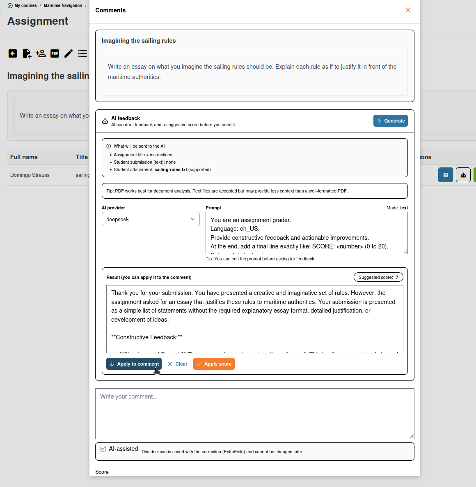

# Calificación con IA

La calificación con IA le ayuda a evaluar las entregas abiertas de los estudiantes — ensayos, respuestas escritas y tareas subidas — proporcionando sugerencias de puntuación y comentarios generados por IA.

## Dónde aparece la calificación con IA

La calificación con IA está disponible en dos contextos:

* **Preguntas de ejercicios de respuesta abierta** — Cuando califica manualmente preguntas de respuesta libre en un ejercicio
* **Entregas de tareas** — Cuando revisa y puntúa las publicaciones de los estudiantes en la herramienta Tareas

Busque el botón **Calificación con IA** (indicado por un icono de robot ) en la interfaz de calificación.

## Cómo funciona

1. Abra una entrega o respuesta que necesite calificación
2. Haga clic en el botón **Calificación con IA**
3. La IA analiza la respuesta del estudiante y produce:
   * Una **puntuación sugerida** basada en la calidad y la pertinencia de la respuesta
   * **Comentarios de retroalimentación** que explican las fortalezas y debilidades de la respuesta
4. Revise las sugerencias de la IA
5. **Acepte, modifique o rechace** la puntuación y los comentarios
6. Guarde su calificación final

## Notas importantes

* **La calificación con IA es una sugerencia** — Usted siempre tiene la última palabra. La IA ofrece un punto de partida que puede ajustar según su criterio profesional.
* **La revisión es esencial** — La IA puede malinterpretar el contexto, pasar por alto matices o puntuar de forma incorrecta. Revise siempre la calificación sugerida antes de confirmarla.
* **Funciona mejor con criterios claros** — Cuanto más específicas sean las instrucciones de la tarea y la rúbrica de calificación, mejores serán las sugerencias de la IA.

## Divulgación de contenido generado por IA

Los comentarios generados por IA se etiquetan con un aviso de divulgación, que indica que se crearon mediante inteligencia artificial. Esta transparencia ayuda a los estudiantes a comprender el origen de la calificación.

## Consejos

* **Úselo en clases numerosas** — La calificación con IA es más valiosa cuando hay muchas entregas que revisar, ya que acelera la evaluación inicial
* **Proporcione descripciones detalladas de las tareas** — Unas instrucciones claras ayudan a la IA a comprender cómo es una buena respuesta
* **Calibre las expectativas** — Califique primero algunas entregas de forma manual para establecer sus criterios y, a continuación, use la calificación con IA para el resto
* **Aproveche los comentarios** — La retroalimentación generada por IA puede ser un punto de partida útil para sus comentarios, incluso si ajusta la puntuación