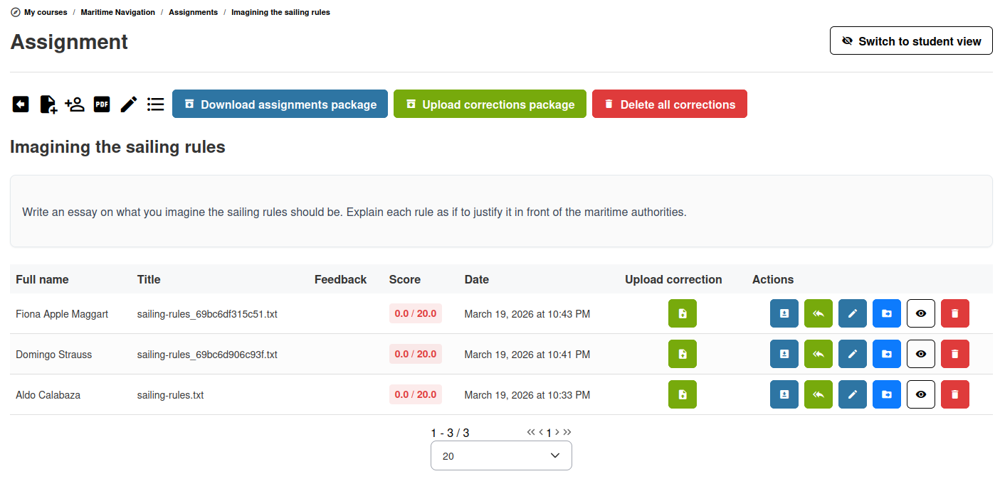

# Tareas

La herramienta de tareas (también llamada «publicaciones de estudiantes») le permite recoger el trabajo de los alumnos —ensayos, proyectos, informes o cualquier entrega basada en archivos— y calificarlo.

## Crear una tarea

1. Abra la herramienta **Tareas**  desde la página de inicio del curso
2. Haga clic en **Crear una tarea**
3. Complete los detalles:
   * **Nombre de la tarea** — El nombre de la tarea (p. ej., «Informe del proyecto final»)
   * **Descripción** — Instrucciones para los alumnos, incluyendo qué entregar y cómo se evaluará (admite texto enriquecido)
   * **Puntuación máxima** — Sobre qué total se calificará la tarea
   * **Añadir al libro de calificaciones** — Añadir como elemento evaluado en la herramienta de evaluación (libro de calificaciones), de modo que pueda formar parte de la consecución de los objetivos del curso
   * **Fecha límite** — La fecha y hora oficiales (publicadas) a partir de las cuales las entregas se marcan como tardías (las subidas se siguen aceptando)
   * **Finaliza el (cierre completo)** — La fecha y hora de corte definitivo a partir de las cuales no es posible ninguna subida
   * **Añadir al calendario** — Crear un evento para referenciar la fecha de entrega de esta tarea
   * **Tipo de entrega** — Elija entre **Permitir solo texto**, **Permitir solo archivos** o **Permitir archivos o texto en línea**
4. Guardar

Una vez creada una tarea, también puede:
* Subir documentos plantilla desde la página de detalle de la tarea
* Asignar la tarea a usuarios específicos (en lugar de a todos los usuarios del curso)

Y una vez que los alumnos hayan entregado sus tareas, puede:
* Exportar una lista PDF de las entregas
* Mostrar una lista solo de los alumnos que no han entregado su tarea
* Descargar todas las tareas en un ZIP grande
* Subir todas las correcciones en un ZIP grande
* Eliminar todas las correcciones que usted envió (esto no elimina las entregas de los alumnos)

## Cómo entregan los alumnos

Los alumnos abren la tarea y:

1. Hacen clic en **Subir archivo** o en el botón de entrega
2. Seleccionan un archivo de su ordenador (o escriben texto directamente, según la configuración)
3. Añaden un comentario opcional
4. Entregan

Los alumnos pueden ver si ya han entregado y, si está permitido, actualizar su entrega.

## Revisar las entregas

Como profesor, abra una tarea para ver la lista de todas las entregas:

* **Nombre del estudiante** — Quién entregó
* **Fecha de entrega** — Cuándo se entregó el trabajo
* **Archivo** — Descargar el archivo entregado
* **Estado** — Si la entrega ha sido calificada
* **Comentarios** — Cualquier comentario dejado por el alumno o por usted

### Calificar una entrega

1. Haga clic en una entrega para abrirla
2. Revise el archivo entregado
3. Introduzca una **puntuación**
4. Escriba **comentarios de retroalimentación** para el alumno
5. Opcionalmente, suba un **archivo corregido** como adjunto
6. Guardar

### Calificación asistida por IA

Si las herramientas de IA están configuradas en su plataforma, es posible que vea una opción de **calificación con IA** al revisar las entregas. Esta utiliza un modelo de IA para sugerir una puntuación y comentarios para trabajos de respuesta abierta. Consulte [Calificación con IA](../ai-tools/ai-grading.md) para más detalles.

## Gestionar las entregas

Acciones de grupo:
* **Descargar paquete de tareas** — Descargar todas las entregas como un único archivo ZIP para revisión sin conexión
* **Subir paquete de correcciones** — Si descargó todas las entregas en un único archivo ZIP, editó los archivos en su ordenador y los volvió a comprimir, puede enviar el zip como un paquete de correcciones. No cambie los nombres de archivo o no funcionará.
* **Entregas tardías** — Las entregas posteriores a la fecha límite se marcan, pero pueden aceptarse según su configuración

Acciones sobre una entrega individual:
* **Subir corrección** — Subir una corrección para un alumno 
* **Descargar** — Descargar la entrega de un alumno
* **Corregir y calificar** — Añadir una corrección y una calificación a la entrega del alumno 
* **Editar** — Editar el título del documento o la retroalimentación anterior de la entrega
* **Mover** — Transferir una entrega entre carpetas de tareas (p. ej. si el estudiante entregó en la tarea incorrecta)
* **Visibilidad** — Controlar si los alumnos pueden ver las entregas de los demás

## Vincular con el libro de calificaciones

Las puntuaciones de las tareas pueden incluirse en el libro de calificaciones del curso (herramienta «Evaluaciones»). Esto permite que las calificaciones de las tareas contribuyan a la nota global del alumno y a la elegibilidad para el certificado. Consulte [Libro de calificaciones](gradebook.md) para más detalles.

## Consejos

* **Sea específico en las instrucciones** — Describa con claridad qué deben entregar los estudiantes, el formato esperado y los criterios de evaluación
* **Establezca plazos realistas** — Utilice la herramienta Agenda para que los plazos sean visibles en el calendario del curso
* **Use la función de archivo corregido** — Suba versiones anotadas del trabajo de los estudiantes para que puedan ver sus correcciones concretas
* **Active la visibilidad entre pares con cuidado** — Permitir que los estudiantes vean el trabajo de los demás puede fomentar el aprendizaje, pero puede no ser adecuado para todas las tareas