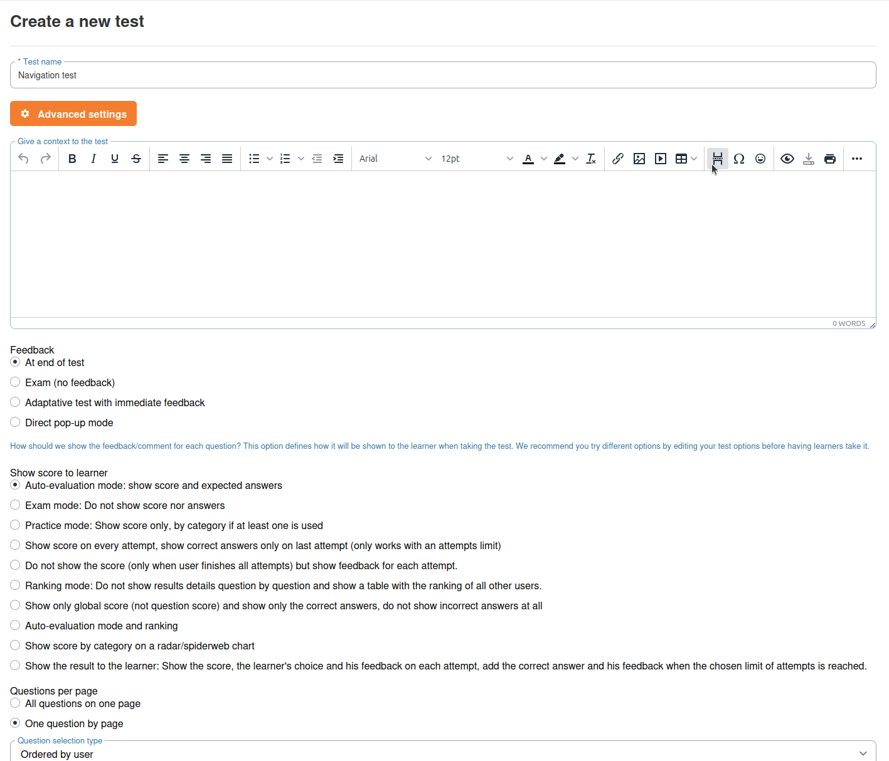

# Ejercicios

La herramienta de ejercicios (también denominada «tests») permite crear cuestionarios y exámenes con calificación automática. Chamilo admite una amplia variedad de tipos de pregunta, desde la opción múltiple simple hasta preguntas interactivas de tipo hotspot.

## Crear un ejercicio

1. Abra la herramienta **Ejercicios**  desde la página de inicio del curso
2. Haga clic en **Nuevo ejercicio**
3. Introduzca un **título** y, de forma opcional, una **descripción**
4. Configure los ajustes del ejercicio (véase más abajo)
5. Guarde y, a continuación, añada preguntas

## Ajustes del ejercicio

### Visualización y navegación

| Ajuste | Opciones | Descripción |
|---------|---------|-------------|
| **Disposición de las preguntas** | Todas en una página / Una por página | Mostrar todas las preguntas a la vez o de una en una |
| **Ocultar los títulos de las preguntas** | Sí / No | Si se muestran o no los títulos de las preguntas a los alumnos |
| **Mostrar el botón Anterior** | Sí / No | Permitir que los alumnos vuelvan a las preguntas anteriores |
| **Impedir la navegación hacia atrás** | Sí / No | Obligar a los alumnos a responder en orden sin poder retroceder |

### Tiempo y disponibilidad

| Ajuste | Descripción |
|---------|-------------|
| **Límite de tiempo** | Tiempo máximo (en minutos) para completar el ejercicio. Se muestra un temporizador de cuenta atrás al alumno |
| **Fecha de inicio** | Momento a partir del cual el ejercicio está disponible para los alumnos |
| **Fecha de fin** | Momento a partir del cual el ejercicio deja de estar disponible |

### Intentos y puntuación

| Ajuste | Descripción |
|---------|-------------|
| **Número máximo de intentos** | Cuántas veces puede realizar el alumno el ejercicio (0 = ilimitado) |
| **Porcentaje de aprobado** | La puntuación mínima para aprobar (p. ej., 70 %). Los alumnos que no alcancen este umbral ven un mensaje de suspenso |
| **Propagar la puntuación negativa** | Si los puntos negativos de preguntas individuales reducen la puntuación total por debajo de cero |

### Retroalimentación

| Ajuste | Opciones |
|---------|---------|
| **Al final** | Mostrar resultados y respuestas correctas después de que el alumno envíe el ejercicio |
| **Inmediata** | Mostrar retroalimentación después de cada pregunta (útil para ejercicios de aprendizaje) |
| **Modo examen** | No mostrar ninguna retroalimentación ni resultados |

### Visualización de resultados

Controle lo que ven los alumnos después de completar el ejercicio:

* Mostrar puntuación y respuestas esperadas
* Mostrar solo la puntuación
* Mostrar puntuación con desglose por categorías
* Mostrar clasificación respecto a otros alumnos
* Mostrar solo en el último intento
* Mostrar visualización de gráfico de radar

### Mensajes de finalización

* **Mensaje de éxito** — Texto personalizado que se muestra cuando el alumno aprueba
* **Mensaje de fracaso** — Texto personalizado que se muestra cuando el alumno no alcanza el porcentaje de aprobado

### Aleatorización de preguntas

| Ajuste | Descripción |
|---------|-------------|
| **Orden aleatorio de las preguntas** | Mezclar el orden de las preguntas en cada intento |
| **Respuestas aleatorias** | Mezclar las opciones de respuesta dentro de cada pregunta |
| **Aleatorio por categoría** | Seleccionar preguntas aleatorias de cada categoría de preguntas |

También puede configurar estrategias avanzadas de selección que combinan categorías y aleatorización.

## Tipos de pregunta

Chamilo ofrece un conjunto rico de tipos de pregunta organizados en varias categorías:

### Elección única

* **Opción múltiple (respuesta única)** — El alumno selecciona una respuesta correcta de una lista de opciones
* **Respuesta única con imágenes** — Igual que la anterior, pero las opciones de respuesta se muestran como imágenes

### Opción múltiple

* **Respuesta múltiple** — El alumno selecciona una o más respuestas correctas
* **Respuesta múltiple (desplegable)** — Las opciones de respuesta se presentan como menús desplegables
* **Verdadero/Falso** — Una serie de enunciados que el alumno marca como verdaderos o falsos
* **Verdadero/Falso con grado de certeza** — Verdadero/falso con un nivel de confianza adicional, que permite una puntuación más matizada

### Completar huecos

* **Completar huecos** — El alumno completa las palabras que faltan en un texto. Usted define los huecos y las respuestas aceptadas al crear la pregunta.

### Emparejamiento

* **Emparejamiento** — El alumno conecta elementos de dos columnas
* **Emparejamiento (arrastrable)** — El mismo concepto, pero con una interfaz de arrastrar y soltar
* **Arrastrable** — Arrastrar elementos a las posiciones correctas

### Respuesta abierta

* **Respuesta libre (ensayo)** — El alumno escribe una respuesta de texto. Requiere calificación manual (o calificación asistida por IA si está configurada)
* **Expresión oral** — El alumno graba una respuesta de audio con su micrófono
* **Subir respuesta** — El alumno sube un archivo como respuesta

### Hotspot

* **Hotspot** — El alumno hace clic en áreas específicas de una imagen para responder
* **Delineación hotspot** — El alumno dibuja límites alrededor de áreas en una imagen

### Calculada

* **Respuesta calculada** — Preguntas numéricas con una fórmula y un intervalo de tolerancia. Útil para cursos de matemáticas y ciencias.

### Especiales

* **Comprensión lectora** — Pruebas basadas en la lectura de un pasaje
* **Anotación** — El profesor sube una imagen y el alumno la anota
* **Respuesta en documento de Office** — Cuando el plugin OnlyOffice está habilitado, el alumno responde a la pregunta editando un documento de Office incrustado (Word, Excel, PowerPoint). Su respuesta se guarda como un archivo independiente dentro del ejercicio para poder revisarla junto con el resto de su intento.

## Añadir preguntas a un ejercicio

1. Abra el ejercicio y haga clic en **Add a question**
2. Seleccione el tipo de pregunta
3. Introduzca el **texto de la pregunta** (admite texto enriquecido con imágenes y formato)
4. Defina las **respuestas** y su puntuación:
   * Para cada opción de respuesta, indique si es correcta y cuántos puntos vale
   * Puede asignar puntos negativos a las respuestas incorrectas para desincentivar las conjeturas
5. Opcionalmente, añada **retroalimentación** — explicaciones que se muestran al alumno después de responder
6. Establezca el **nivel de dificultad** y la **categoría** (útil para la selección aleatoria y los informes)
7. Guarde

## Categorías de preguntas

Puede organizar las preguntas en categorías (p. ej., "Módulo 1", "Vocabulario", "Avanzado"). Las categorías son útiles para:

* Organizar bancos de preguntas grandes
* Permitir la selección aleatoria por categoría (p. ej., "5 preguntas del Módulo 1, 3 del Módulo 2")
* Ver las puntuaciones desglosadas por categoría en los informes

## Reutilización de preguntas

Las preguntas se pueden reutilizar en distintos ejercicios del mismo curso. Al añadir una pregunta, puede crear una nueva o seleccionar una existente del banco de preguntas.

## Importar ejercicios

Chamilo admite la importación de ejercicios desde formatos externos:

* **IMS QTI / Common Cartridge** — El formato estándar de cuestionarios de e-learning
* **Formato Moodle** — Importar cuestionarios desde exportaciones de Moodle

Para importar, busque la opción **Import** en la herramienta de ejercicios y suba su archivo.

## Consejos

* **Combine tipos de pregunta** — Combine opción múltiple, rellenar huecos y preguntas abiertas para una evaluación completa
* **Use categorías** — Organice las preguntas por tema para permitir una selección aleatoria dirigida
* **Establezca un porcentaje de aprobado** — Dé a los alumnos un objetivo claro y vincúlelo a la generación de certificados mediante el Gradebook
* **Use retroalimentación inmediata para la práctica** — Cree ejercicios de práctica sin calificación con retroalimentación inmediata para que los alumnos aprendan de sus errores
* **Aleatorice para preservar la integridad** — Active el orden aleatorio de preguntas y de respuestas para reducir las posibilidades de copia