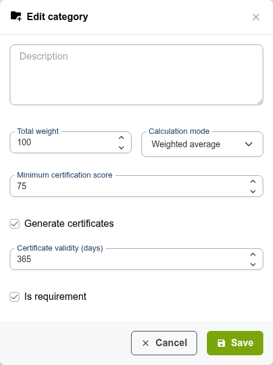

# Evaluaciones

Las evaluaciones (anteriormente *gradebook*) agregan las puntuaciones de ejercicios, tareas y otras actividades calificadas en una vista unificada del rendimiento de cada estudiante. También controlan la generación de certificados.

## Cómo funcionan las evaluaciones

Las evaluaciones son sistemas de puntuación ponderada. Usted define:

1. **Qué actividades** contribuyen a la calificación (ejercicios, tareas, asistencia, etc.)
2. **El peso** de cada actividad (cuánto cuenta para la calificación final)
3. **La puntuación mínima de certificación** (el umbral para obtener un certificado)
4. **Una puntuación mínima por actividad** — Cada actividad del libro de calificaciones puede tener su propia **Puntuación mínima**. Los estudiantes que obtengan una puntuación inferior a ese mínimo en una actividad clave pueden verse impedidos de alcanzar los objetivos y de obtener el certificado, aunque su total ponderado global sea, por lo demás, suficientemente alto.

Las actividades pueden ser de 2 tipos:
* **Actividad de aula** (o actividad presencial), en la que las calificaciones deben importarse desde otra fuente
* **Actividad en línea** seleccionada del curso, en la que las calificaciones se obtienen mediante la realización de la actividad en el curso

Chamilo calcula la calificación global de cada estudiante a partir de estos pesos.

## Configuración de la evaluación

1. Abra la herramienta **Evaluaciones**  desde la página de inicio del curso
2. Verá el resumen de las evaluaciones, inicialmente vacío

### Añadir actividades

1. Haga clic en **Añadir actividad en línea**
2. Elija el tipo:
   * **Test** — Vincular un ejercicio concreto del curso
   * **Assignment** — Vincular una carpeta de publicaciones de estudiantes
   * **Learning path** — Vincular la finalización de un itinerario de aprendizaje
   * **Attendance** — Vincular una hoja de asistencia
   * **Forum thread** — Vincular un hilo de foro (que debe calificarse de forma manual)
   * **Survey** — Vincular una encuesta
3. Seleccione la actividad concreta dentro del tipo elegido
4. Establezca el **Peso** de esta actividad (p. ej., 30 % para el examen parcial, 40 % para el proyecto final)
5. Establezca la **Puntuación mínima** si corresponde
6. Guarde

El peso total de todas las actividades debe sumar 100 %.

### Subcategorías

Para esquemas de calificación complejos, puede crear **subcategorías** para agrupar actividades relacionadas:

* **Ejemplo**: Una subcategoría «Tareas» (peso: 30 %) que contiene cinco tareas individuales, cada una equivalente al 20 % de la subcategoría
* Las subcategorías permiten organizar la evaluación de forma jerárquica manteniendo sencillo el cálculo global

## Visualización de las calificaciones

La evaluación muestra una tabla con:

* El nombre de cada estudiante
* Las puntuaciones de cada actividad
* El total ponderado
* Si el estudiante reúne los requisitos para un certificado

Puede ordenar por cualquier columna para identificar rápidamente a los estudiantes con mejor rendimiento o a los que tienen dificultades.

### Gráficos de distribución de puntuaciones

Debajo de la tabla, y en la página **Vista gráfica**, la evaluación dibuja un gráfico de barras
por actividad más uno para el total. Cada gráfico es un gráfico de columnas: el
eje horizontal enumera sus rangos de puntuación de menor a mayor, y la
altura de cada barra es el número de estudiantes en ese rango.

El gráfico **Total** también marca la media de la clase. Un punto rojo se sitúa en el rango
que contiene la media, y la leyenda indica el porcentaje exacto.

Estos gráficos aparecen solo cuando están definidas las reglas de visualización de puntuaciones. Si ve el
mensaje *To view graph score rule must be enabled*, defina primero sus rangos
en la configuración de puntuación de la evaluación.

## Certificados

Para habilitar la generación de certificados:

1. En la configuración de la evaluación, establezca una **puntuación mínima de certificación** (p. ej., 70 %)
2. Cuando el total ponderado de un estudiante alcance o supere este umbral (y no haya suspendido ninguna puntuación mínima por actividad), podrá descargar su certificado
3. El certificado se genera a partir de una plantilla configurada por el administrador de la plataforma

Una vez habilitado **Generate certificates** en la categoría raíz, aparece un campo **Certificate validity (days)**. Déjelo en `0` para certificados que no caduquen nunca, o establezca un número de días transcurridos los cuales el certificado caduca — Chamilo puede entonces recordar a los estudiantes a medida que se acerca esa fecha de caducidad, de forma automática (cron, configurado por el administrador) o manualmente desde la lista de certificados.

Consulte [Certificados y competencias](../tracking-and-reporting/certificates-and-skills.md#certificate-validity-and-expiry) para más detalles.

## Vinculación con competencias

Puede asociar **competencias** (*skills*) a la evaluación. Cuando un estudiante alcanza los objetivos establecidos para completar la evaluación, puede obtener un certificado, una competencia o ambos. Las competencias son visibles en su perfil en el espacio de red social. Esto construye un registro de competencias a lo largo del tiempo.

## Exportación de calificaciones

Haga clic en el botón **Exportar**  para descargar las calificaciones como una hoja de cálculo. Esto resulta útil para:

* Compartir las calificaciones con sistemas administrativos
* Realizar análisis adicionales fuera de Chamilo
* Conservar registros sin conexión

## Consejos

* **Planifique los pesos con antelación** — Defina el esquema de calificación al inicio del curso para que los estudiantes sepan qué esperar
* **Utilice subcategorías en cursos complejos** — Agrupe las tareas, los cuestionarios y la participación en categorías claras
* **Establezca umbrales de aprobado significativos** — La puntuación de certificación debe reflejar la competencia real, no solo la participación
* **Revise con regularidad** — Consulte el libro de calificaciones periódicamente para asegurarse de que todas las actividades estén correctamente vinculadas y de que las puntuaciones se registren