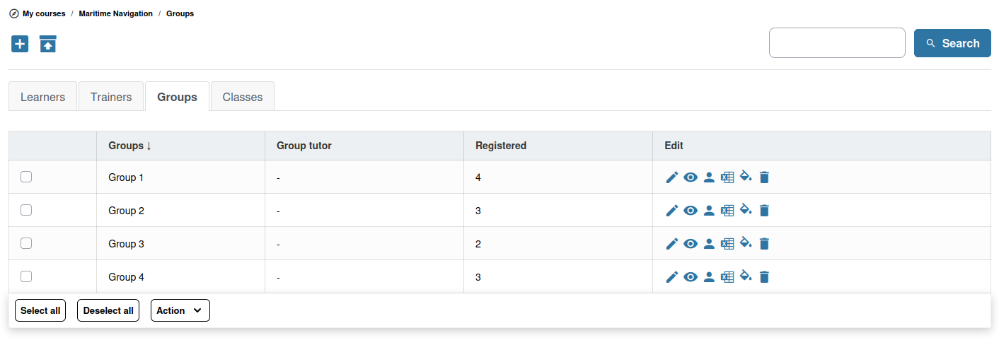

# Grupos

Los grupos permiten dividir a los alumnos en equipos más pequeños para el trabajo colaborativo. Cada grupo puede disponer de sus propias herramientas compartidas, como documentos, foros y un wiki.

## Creación de grupos

1. Abra la herramienta **Grupos** desde la página de inicio del curso
2. Haga clic en **Crear grupos**
3. Configure los ajustes del grupo:
   * **Número de grupos** — Cuántos grupos se van a crear
   * **Máximo de miembros por grupo** — El límite de tamaño de cada grupo (0 para ilimitado)
   * **Autorregistro** — Si los alumnos pueden unirse a los grupos por sí mismos
   * **Autobaja** — Si los alumnos pueden abandonar un grupo por sí mismos

## Herramientas de grupo

Cada grupo puede tener acceso a un subconjunto de herramientas del curso que se comparten únicamente entre los miembros del grupo:

* **Documentos** — Un espacio de archivos compartido para el grupo
* **Foro** — Un foro de discusión específico del grupo
* **Wiki** — Un wiki colaborativo para el grupo
* **Chat** — Un espacio de chat para el grupo
* **Agenda** — Eventos de calendario con alcance de grupo
* **Anuncios** — Enviar anuncios solo a los miembros del grupo
* **Tareas** — Recoger el trabajo del grupo

Para cada herramienta puede elegir su nivel de acceso: **No disponible**, **Público** (cualquier miembro del curso) o **Privado** (solo miembros del grupo). Estos ajustes se pueden aplicar a nivel de categoría de grupo, de modo que varios grupos de la misma categoría compartan la misma configuración de herramientas.

## Gestión de los miembros del grupo

Puede gestionar la pertenencia a los grupos de varias formas:

* **Asignación manual** — Añadir alumnos concretos a cada grupo
* **Rellenar grupos seleccionados** — Distribuir automáticamente a los alumnos no inscritos entre los grupos seleccionados, respetando la capacidad de cada grupo y el límite de grupos por usuario
* **Autorregistro** — Permitir que los alumnos elijan su propio grupo
* **Importar desde clases** — Crear grupos automáticamente a partir de las clases ya inscritas en el curso

Para gestionar los miembros de forma manual, haga clic en el nombre de un grupo y utilice la sección **Miembros** para añadir o quitar alumnos.

## Tutores de grupo

Puede asignar **tutores** a los grupos. Un tutor suele ser un alumno o un asistente que ayuda a gestionar el trabajo del grupo. Los tutores pueden tener permisos adicionales dentro del grupo, como moderar el foro del grupo.

## Seguimiento del trabajo de grupo

Como profesor del curso, puede acceder a todos los grupos y a sus herramientas compartidas con independencia de la pertenencia. Esto le permite:

* Revisar los documentos subidos por cada grupo
* Leer las discusiones del foro del grupo
* Comprobar las contribuciones al wiki
* Evaluar la colaboración del grupo