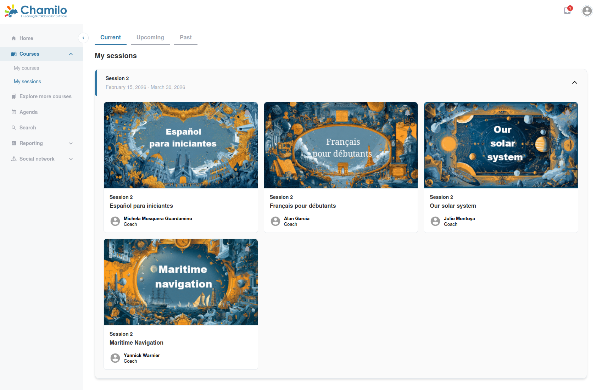

# Sesiones

Las sesiones en Chamilo son una forma de impartir el mismo curso a distintos grupos de alumnos en momentos diferentes, sin duplicar el contenido del curso. Piense en una sesión como una edición programada o una cohorte de un curso.

## Cómo funcionan las sesiones

Un **curso** es un contenedor de contenido y herramientas. Una **sesión** asigna ese curso a un grupo concreto de alumnos durante un periodo de tiempo determinado. Esto significa:

* El mismo curso puede reutilizarse en varias sesiones
* Cada sesión tiene sus propios alumnos inscritos y sus propias fechas de inicio y fin
* Cada sesión tiene sus propios resultados: las calificaciones, el progreso y los datos de seguimiento se mantienen separados por sesión
* El contenido base del curso se comparte, pero los docentes pueden personalizar determinados elementos por sesión

## Sus sesiones

En la barra lateral, haga clic en **Mis sesiones** para ver sus sesiones. Están organizadas en tres vistas:

* **Sesiones actuales** — Sesiones que están activas en este momento
* **Sesiones pasadas** — Sesiones que han finalizado
* **Sesiones próximas** — Sesiones que aún no han comenzado

Cada sesión muestra los cursos que contiene. Haga clic en un curso dentro de una sesión para acceder a él.

## Impartir docencia en una sesión

Cuando entra en un curso a través de una sesión, la experiencia es similar a la de un curso habitual, con algunas diferencias:

* El **nombre de la sesión** aparece junto al título del curso, de modo que siempre sabe en qué sesión está trabajando
* Los datos de los alumnos (progreso, calificaciones, entregas) son específicos de esta sesión
* Algunos ajustes (como la posibilidad de cambiar la visibilidad de las herramientas) pueden estar bloqueados por el administrador de la sesión

## Roles de sesión

Las sesiones introducen roles adicionales:

| Role | Description |
|------|-------------|
| **Administrador de sesión** | Gestiona la creación y la configuración de las sesiones |
| **Tutor de sesión** | Supervisa todos los cursos de una sesión (puede acceder al seguimiento entre cursos) |
| **Tutor de curso** | Imparte un curso concreto dentro de una sesión |

Si se le asigna como **tutor de curso** en una sesión, puede gestionar el contenido de ese curso y hacer el seguimiento del progreso de los alumnos de la sesión.

> Las sesiones suelen ser gestionadas por los administradores. Si necesita crear o modificar una sesión, póngase en contacto con el administrador de la plataforma o con el administrador de la sesión.