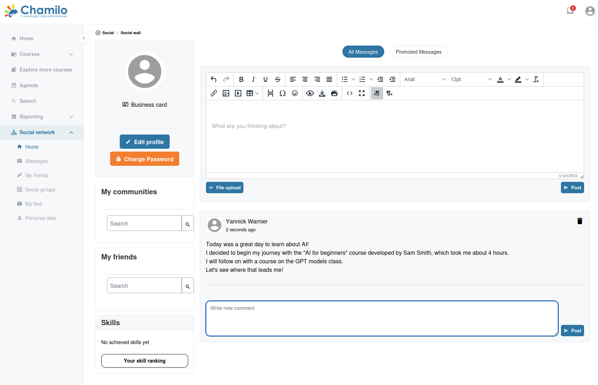

# Red social

Chamilo incluye una red social integrada que le permite conectar con otros usuarios de la plataforma. Esta función puede estar habilitada o deshabilitada por el administrador de la plataforma.

## Acceso a la red social

Haga clic en **Red social** en la barra lateral para acceder a las funciones sociales. Si no ve esta opción, es posible que el administrador la haya deshabilitado.

## Su muro social

El muro social muestra un feed de actividad suya y de sus conexiones. Puede:

* **Publicar actualizaciones** — Compartir texto y enlaces con sus conexiones
* **Dar «me gusta» y comentar** — Interactuar con las publicaciones de otros usuarios
* **Ver la actividad** — Ver las publicaciones recientes de las personas con las que está conectado

## Conexiones

Puede conectar con otros usuarios de la plataforma:

* **Buscar usuarios** — Encontrar colegas y alumnos por nombre
* **Enviar solicitudes de conexión** — Invitar a otros usuarios a conectar
* **Gestionar conexiones** — Aceptar, rechazar o eliminar conexiones

> **Nota:** Los alumnos solo pueden buscar y añadir a otros alumnos como amigos; no pueden enviar solicitudes de amistad a los profesores. Como profesor, sin embargo, puede buscar alumnos y solicitar añadirlos como amigos.

## Mensajería

La red social se integra con el sistema de mensajería de la plataforma:

* **Enviar mensajes**  — Escribir mensajes directos a otros usuarios
* **Bandeja de entrada**  — Leer y responder a los mensajes recibidos
* **Mensajes enviados**  — Revisar los mensajes que ha enviado

### Redacción y respuesta

Al redactar un mensaje nuevo, puede dirigirlo a varios destinatarios a la vez. Del mismo modo, al responder a un mensaje, puede incluir a varios usuarios en su respuesta, lo cual resulta útil para la coordinación grupal sin un grupo social formal.

### Etiquetas de mensajes

Si la configuración de su plataforma utiliza etiquetas de mensajes (normalmente gestionadas a nivel de plataforma), la bandeja de entrada muestra una lista de etiquetas en la que puede hacer clic para filtrar los mensajes por esa etiqueta, lo que agiliza la localización de hilos relacionados a medida que crece la bandeja de entrada.

## Grupos sociales

Los grupos sociales permiten a los usuarios reunirse en torno a intereses o proyectos comunes:

* **Unirse a grupos** — Explorar y unirse a grupos existentes
* **Crear grupos** — Iniciar un nuevo grupo social (si está permitido)
* **Debates de grupo** — Compartir publicaciones en el contexto de un grupo

> Los grupos sociales son distintos de los **grupos de curso** (tratados en la sección [Grupos](collaboration-and-communication/groups.md)). Los grupos de curso están vinculados a un curso concreto, mientras que los grupos sociales son de toda la plataforma.