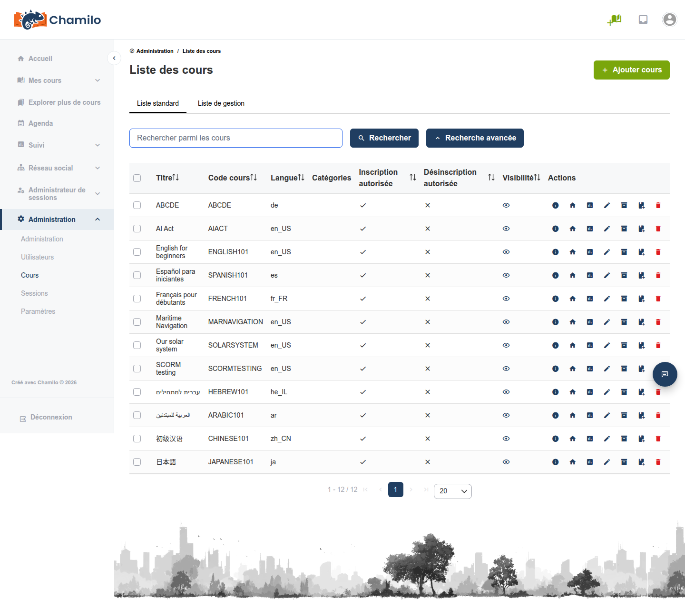

# Gestion des cours

En tant qu’administrateur, vous pouvez gérer tous les cours de la plateforme, quel que soit leur créateur.

## Liste des cours

Depuis le panneau d’administration, cliquez sur **Liste des cours** pour voir tous les cours. La liste affiche :

* Titre et code du cours
* Langue
* Catégories
* Statut de visibilité

Utilisez l’outil **Recherche avancée** pour trouver des cours spécifiques.

## Création d’un cours

En tant qu’administrateur, vous pouvez créer des cours et les attribuer à n’importe quel enseignant :

1. Cliquez sur **Ajouter un cours** depuis le panneau d’administration
2. Renseignez les informations du cours (titre, code, catégorie, langue)
3. Attribuez un enseignant au cours
4. Enregistrez

Remarque : Dans Chamilo 1.11.x, le code du cours apparaissait dans l’URL du cours et il était impossible de le modifier après la création du cours. Ce comportement a changé à partir de la version 2.x. Le code du cours n’est plus visible dans l’URL, et les versions futures pourraient permettre aux enseignants de modifier le code du cours par la suite, celui-ci devenant moins essentiel pour la plateforme.

## Gestion d’un cours existant

Trouvez un cours dans la liste pour accéder aux options de gestion dans la colonne *Actions* :

* **Information** — Afficher les informations relatives au cours 
* **Accueil du cours** — Vous envoie directement à la page d’accueil du cours 
* **Rapports** — Consulter les données d’engagement et de performance
* **Modifier** — Changer le titre du cours, la catégorie, la visibilité et d’autres paramètres
* **Créer une sauvegarde** — Accéder à la section de maintenance du cours, où vous pouvez créer des copies et effectuer d’autres opérations
* **Ajouter au catalogue** — Ajouter ce cours au catalogue des cours
* **Supprimer** — Supprimer définitivement le cours et tout son contenu

> La suppression d’un cours retire définitivement tout le contenu, les données des apprenants, les notes et les informations de suivi. Envisagez d’exporter le cours au préalable comme sauvegarde.

## Opérations en masse

Sélectionnez plusieurs cours dans la liste pour effectuer des actions par lot, telles que leur suppression. Pour exporter un cours, entrez dans le cours et utilisez l’outil **Maintenance** — il n’existe pas d’action d’export en masse dans la liste des cours de l’administration.

## Paramètres de visibilité des cours

Les administrateurs peuvent outrepasser la visibilité définie par les enseignants :

| Visibilité | Effet |
|-----------|--------|
| **Public** | Accessible à tous, y compris les visiteurs anonymes |
| **Ouvert** | Accessible à tous les utilisateurs connectés |
| **Privé** | Seuls les utilisateurs inscrits peuvent accéder au cours |
| **Fermé** | Personne ne peut accéder au cours (sauf l’enseignant et les administrateurs) |
| **Masqué** | Personne ne peut voir ni accéder au cours (sauf les administrateurs) |