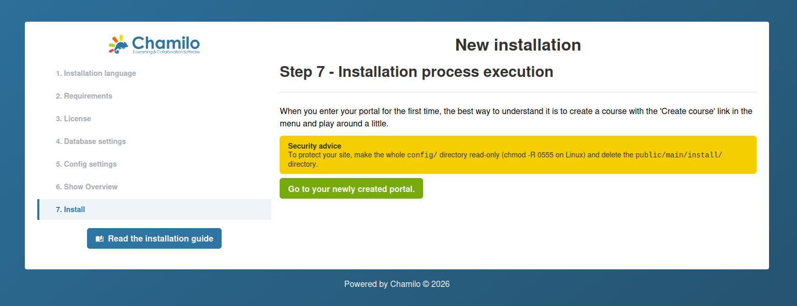

# Assistant d’installation

Chamilo 3.0 inclut un assistant d’installation web qui vous guide lors de la configuration initiale. L’assistant se lance automatiquement lorsque vous accédez à la plateforme pour la première fois.

## Avant de commencer

Assurez-vous que les prérequis suivants sont remplis :

1. Votre serveur satisfait à toutes les [exigences serveur](server-requirements.md).
2. Vous avez téléchargé une version empaquetée (zip ou tar.gz) de Chamilo.
3. Votre serveur web est configuré pour servir le répertoire `public/` comme racine des documents.
4. Votre fichier `.env` existe et est vide (l’assistant vous guidera pour la configuration de la base de données).

## Étape 1 : Langue d’installation

La première étape vous permet de sélectionner la langue du processus d’installation. Choisissez votre langue préférée dans la liste déroulante.

Si Chamilo détecte une installation existante (pour une mise à niveau), il affichera l’état de la migration et proposera un chemin de mise à niveau plutôt qu’une installation neuve.

## Étape 2 : Vérification des prérequis

L’assistant vérifie l’environnement de votre serveur :

* La **version PHP** est 8.3, 8.4 ou 8.5
* Les **extensions PHP requises** sont installées (intl, gd, curl, zip, mbstring, xml, etc.)
* Les **paramètres PHP recommandés** — `date.timezone` est configuré, limites d’envoi/mémoire suffisantes
* Les **permissions des répertoires et fichiers** — `var/`, `config/` et `public/upload/` sont inscriptibles par le serveur web

Si certains prérequis ne sont pas remplis, l’assistant affiche des avertissements ou des erreurs. Résolvez-les avant de continuer.

## Étape 3 : Licence

Cette étape affiche la licence GNU/GPLv3. Vous devez cocher la case **« J’accepte »** pour continuer.

Facultativement, vous pouvez développer la section **Informations de contact** pour indiquer des détails sur votre organisation (nom, e-mail, société, pays). C’est volontaire et cela aide la communauté Chamilo à comprendre qui utilise la plateforme, mais cela nous permettra aussi de vous contacter *très rarement* au sujet d’événements se déroulant près de chez vous.

## Étape 4 : Paramètres de la base de données

Saisissez les détails de connexion à votre base de données :

| Champ | Description |
|-------|-------------|
| **Hôte de la base de données** | Le nom d’hôte ou l’adresse IP de votre serveur de base de données (par ex. `localhost` ou `127.0.0.1`) |
| **Port de la base de données** | Par défaut : 3306 pour MySQL/MariaDB |
| **Nom de la base de données** | Le nom de la base de données à utiliser (alphanumériques et tirets bas uniquement) |
| **Utilisateur de la base de données** | Un utilisateur de base de données disposant de tous les privilèges sur la base indiquée |
| **Mot de passe de la base de données** | Le mot de passe de l’utilisateur de la base de données |

Cliquez sur **Vérifier la connexion à la base de données** pour tester. L’assistant ne vous laissera pas continuer tant que la connexion n’est pas réussie. Si la base de données existe déjà, un avertissement s’affiche.

## Étape 5 : Paramètres de configuration

Cette étape combine la création du compte administrateur, les paramètres du portail et la configuration e-mail.

### Compte administrateur

| Champ | Description |
|-------|-------------|
| **Identifiant** | Le nom d’utilisateur de l’administrateur |
| **Mot de passe** | Choisissez un mot de passe fort — ce compte a un accès complet à la plateforme |
| **Prénom** | Le prénom de l’administrateur |
| **Nom** | Le nom de l’administrateur |
| **E-mail** | Utilisé pour les notifications système et la réinitialisation des mots de passe |
| **Téléphone** | Numéro de contact facultatif |

Ces informations d’administrateur seront également utilisées par Chamilo pour renseigner les coordonnées de support : pensez à les reconfigurer dans les paramètres une fois l’installation terminée.

### Paramètres du portail

| Champ | Description |
|-------|-------------|
| **Langue** | La langue d’interface par défaut |
| **Nom du portail** | Le nom de votre plateforme (par ex. « LMS de mon organisation ») |
| **Nom court de l’organisation** | Le nom abrégé de votre organisation |
| **URL de l’organisation** | Le site web de votre organisation |
| **Méthode de chiffrement** | Algorithme de hachage des mots de passe — **bcrypt** est recommandé |
| **Autoriser l’auto-inscription** | Oui / Non / Après approbation |
| **Autoriser l’auto-inscription en tant que formateur** | Oui / Non |

### Configuration e-mail

La section des paramètres e-mail vous permet de configurer le transport de messagerie (SMTP, Amazon SES, Mailjet, etc.) et de tester l’envoi. Voir [Configuration e-mail](email-configuration.md) pour plus de détails.

Tous ces paramètres peuvent être modifiés ultérieurement depuis le panneau d’administration.

## Étape 6 : Dernière vérification avant l’installation

Cette étape affiche un récapitulatif de tout ce que vous avez saisi, pour relecture :

* Identifiants de l’administrateur (le mot de passe est masqué par défaut — cliquez sur l’icône œil pour l’afficher)
* Paramètres du portail
* Détails de connexion à la base de données

Vérifiez attentivement, puis cliquez sur **Install Chamilo** pour lancer l’installation. L’assistant crée toutes les tables de la base de données, insère les données initiales et configure la plateforme.

## Étape 7 : Installation terminée

Une fois l’installation terminée avec succès, l’assistant affiche :

* **Conseils pour bien démarrer** — Il est suggéré de créer votre premier cours pour explorer la plateforme (en tant qu’administrateur, vous devez le faire depuis le panneau d’administration)
* **Recommandations de sécurité** :
  * Rendre le répertoire `config/` en lecture seule (`chmod 0555`)
  * Supprimer le répertoire `public/main/install/`
* Un **lien vers votre portail** pour vous connecter avec les identifiants administrateur que vous venez de créer

## Après l’installation

Après avoir terminé l’assistant :

* **Supprimer ou restreindre l’accès à l’installateur** -- L’assistant ne doit plus être accessible après l’installation. Chamilo le verrouille généralement automatiquement, mais vérifiez qu’un nouvel accès à l’URL d’installation redirige vers la page de connexion.
* **Configurer la livraison des e-mails** -- Voir [Configuration e-mail](email-configuration.md).
* **Mettre en place les sauvegardes** -- Avant d’ajouter du contenu, configurez des sauvegardes automatisées de la base de données et des fichiers (Chamilo ne fournit pas de solution pour cela, mais copier le dossier var/ et la base de données sont les 2 éléments les plus importants).
* **Revoir les paramètres de sécurité** -- Voir [Paramètres de sécurité](../platform-settings/security-settings.md).

## Dépannage

| Problème | Solution |
|---------|----------|
| Page blanche à l’URL d’installation | Consultez les journaux d’erreurs PHP. Passez temporairement à `APP_ENV=dev` dans .env pour afficher les erreurs dans le navigateur. |
| Échec de la connexion à la base de données | Vérifiez les identifiants, confirmez que la base de données existe, vérifiez que le serveur de base de données autorise les connexions depuis l’hôte du serveur web. |
| Erreurs de permission refusée | Assurez-vous que `var/` est inscriptible par l’utilisateur du serveur web. |
| Ressources non chargées (pas de CSS/JS) | Exécutez `yarn install && yarn build` pour compiler les ressources frontend. |