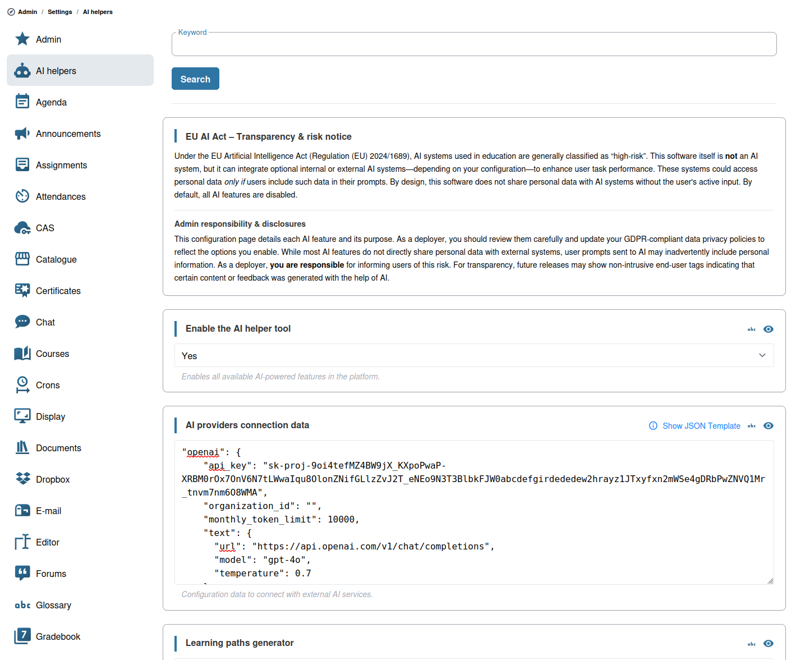

# Configuration de l’IA

Chamilo 3.0 inclut des fonctionnalités basées sur l’IA qui nécessitent une configuration avant d’être disponibles pour les enseignants et les apprenants.

## Fournisseurs d’IA pris en charge

Chamilo prend en charge plusieurs fournisseurs d’IA :

| Fournisseur | Capacités |
|----------|-------------|
| **DeepSeek** | Génération de texte |
| **Google Gemini** | Génération de texte, d’images et de vidéos |
| **Grok** | Génération de texte, d’images et de vidéos |
| **Mistral** | Génération de texte |
| **OpenAI** | Génération de texte, d’images et de vidéos |

Chaque fournisseur peut être configuré pour différents types de tâches d’IA :

* **Texte** — Utilisé pour la génération d’exercices, la génération de parcours d’apprentissage, la notation par IA et le tuteur IA
* **Image** — Utilisé pour la génération d’images par IA
* **Vidéo** — Utilisé pour la génération de vidéos par IA (lorsque c’est pris en charge)
* **Document** — Utilisé pour l’analyse de documents par IA

## Étapes de configuration

### 1. Obtenir des clés API

Créez un compte auprès du fournisseur d’IA choisi et obtenez une clé API :

* **DeepSeek** : [platform.deepseek.com](https://platform.deepseek.com/)
* **Google Gemini** : Google AI Studio ou Google Cloud
* **Grok** : [console.x.ai](https://console.x.ai/)
* **Mistral** : [console.mistral.ai](https://console.mistral.ai/)
* **OpenAI** : [platform.openai.com](https://platform.openai.com/)

### 2. Configurer les fournisseurs dans Chamilo

Dans les paramètres de la plateforme, accédez à la section **Assistants IA** :

1. **Activer les assistants IA** — Activer globalement les fonctionnalités d’IA
2. **Configurer les fournisseurs d’IA** — Ajouter un ou plusieurs fournisseurs avec :
   * **Nom du fournisseur** (deepseek, gemini, grok, mistral, openai)
   * **Clé API** — Votre clé API pour le fournisseur
   * **Modèle** — Le modèle spécifique à utiliser (par ex. `gpt-4`, `gemini-pro`, `mistral-large`)
   * **URL de l’API** — L’URL du point de terminaison (préconfigurée pour les fournisseurs standard)

Vous pouvez configurer plusieurs fournisseurs. Le premier fournisseur de la configuration devient le fournisseur par défaut.

### 3. Activer les fonctionnalités par cours

Les fonctionnalités d’IA peuvent être activées ou désactivées au niveau du cours. Les enseignants peuvent activer ou désactiver :

* **Chatbot tuteur IA** — L’assistant IA pour les apprenants
* **Correcteur de devoirs** — Recommandation de notation générée par l’IA
* **Générateur d’exercices** — Questions de quiz générées par l’IA
* **Générateur de parcours d’apprentissage** — Séquences d’apprentissage générées par l’IA
* **Générateur d’images/vidéos** — Images et vidéos générées par l’IA dans les documents

Cela permet à différents cours d’utiliser des configurations d’IA différentes selon leurs besoins.

## Considérations relatives aux coûts

Les appels API d’IA engendrent des coûts. Tenez compte des points suivants :

* **Définir des limites d’utilisation** — Surveiller et limiter l’utilisation de l’API d’IA afin de maîtriser les coûts
* **Choisir les modèles avec discernement** — Des modèles plus petits et moins coûteux peuvent suffire pour de nombreuses tâches éducatives
* **Suivre l’utilisation** — Chamilo consigne les requêtes d’IA afin de vous aider à surveiller la consommation

## Conseils

* **Commencer avec un seul fournisseur** — Configurer et tester un fournisseur avant d’en ajouter d’autres
* **Tester avec un cours** — Activer d’abord les fonctionnalités d’IA dans un cours de test afin de vérifier qu’elles fonctionnent comme prévu
* **Communiquer avec les enseignants** — Informer les enseignants des fonctionnalités d’IA disponibles et de la manière de les utiliser
* **Surveiller la qualité** — Examiner régulièrement le contenu généré par l’IA afin de garantir qu’il répond à vos normes pédagogiques