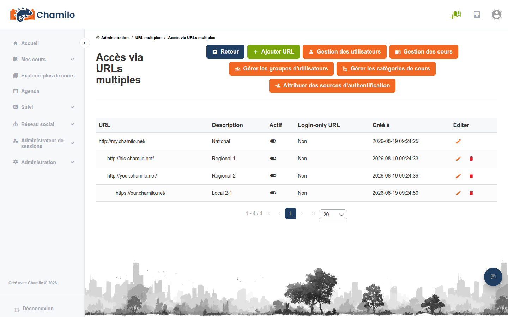

# URLs d’accès

Les URLs d’accès permettent à une seule installation Chamilo de desservir plusieurs portails distincts.

Cet outil est également accessible depuis le bloc [Plateforme](../platform/README.md) du tableau de bord d’administration, sous **Configurer plusieurs URL d’accès**.

## Cas d’usage

* **Déploiements multi-locataires** — Héberger des portails de formation distincts pour différentes organisations sur un seul serveur
* **Portails départementaux** — Offrir à chaque département son propre portail habillé (par ex. `hr.training.company.com`, `it.training.company.com`)
* **Portails régionaux** — Portails séparés pour différentes régions ou langues

## Fonctionnement

Chaque URL d’accès est un point d’entrée distinct vers la même installation Chamilo :

* Les utilisateurs peuvent être affectés à une ou plusieurs URLs d’accès
* Les cours et les sessions appartiennent à des URLs d’accès spécifiques
* Les paramètres de la plateforme peuvent être personnalisés par URL d’accès
* L’habillage et les thèmes peuvent différer selon l’URL
* Les utilisateurs d’un portail ne voient pas les utilisateurs ni les cours d’un autre (sauf partage explicite)

## Configuration

### Activation du multi-URL

Le multi-URL doit être activé dans la configuration Chamilo (généralement dans les paramètres d’environnement). Cela se fait habituellement lors de l’installation initiale.

### Création d’une URL d’accès

1. Depuis le panneau d’administration, accédez à **URLs d’accès**
2. Cliquez sur **Ajouter une URL**
3. Saisissez l’URL (par ex. `https://portal2.yoursite.com`) et une description
4. Choisissez éventuellement une **URL parente** pour imbriquer cette URL sous une autre — voir [Hiérarchie des URLs](#url-hierarchy) ci-dessous
5. Enregistrez

### Affectation des utilisateurs et des cours

* **Utilisateurs** — Affectez les utilisateurs à des URLs d’accès spécifiques. Un utilisateur peut appartenir à plusieurs URLs.
* **Cours** — Affectez les cours à des URLs d’accès spécifiques
* **Sessions** — Affectez les sessions à des URLs d’accès spécifiques

### Paramètres par URL

Chaque URL d’accès peut disposer de ses propres :

* **Thème de couleurs** — Habillage visuel distinct
* **Nom de plateforme et logo** — Identité personnalisée
* **Surcharges de paramètres** — Certains paramètres de la plateforme peuvent être personnalisés par URL

## Hiérarchie des URLs

Les URLs d’accès peuvent être organisées en arborescence parent/enfant plutôt qu’en liste plate. Lors de la création ou de la modification d’une URL, un administrateur global non restreint (voir [Administrateurs de sous-arbre](#subtree-administrators) ci-dessous) peut choisir n’importe quelle autre URL comme **URL parente** :

* La liste déroulante ne propose jamais l’URL en cours de modification, ni aucun de ses propres descendants, comme parent possible — cela empêche de créer un cycle. Le backend revalide cette contrainte indépendamment de ce que l’interface affiche.
* Si une URL est créée sans choisir de parent, elle prend par défaut l’**URL de connexion uniquement** s’il en existe une (voir [Paramètres par URL](#per-url-settings) ci-dessus), ou sinon la première URL d’accès — le même comportement par défaut qu’avant l’existence de cette fonctionnalité.
* L’URL la plus haute d’un arbre — celle qui n’a pas de parent — est la **racine** de cet arbre. Une même installation Chamilo peut héberger plusieurs arbres indépendants.

Partout où les URLs d’accès sont listées — le tableau de bord multi-URL et la page de gestion des URLs d’accès — l’arbre est représenté par une indentation, un parent immédiatement suivi de ses propres enfants (frères et sœurs triés par ordre alphabétique), au lieu d’une colonne « Parent » séparée :

## Administrateurs de sous-arbre

La hiérarchie des URLs détermine également ce qu’un [administrateur global](../users/user-roles.md) peut gérer :

* Un administrateur enregistré sur l’URL **racine** d’un arbre est **non restreint** : il gère toutes les URLs d’accès, exactement comme avant l’existence de cette fonctionnalité.
* Un administrateur enregistré uniquement sur une URL **non racine** est **limité** : les pages Multi-URL et URLs d’accès n’affichent que cette URL et ses descendants, et le graphique des connexions du tableau de bord multi-URL indique « Connexions (vos URLs) » au lieu de « Connexions (toutes les URLs combinées) ».

Quel que soit le périmètre, les actions suivantes restent réservées à un administrateur global **non restreint** — un administrateur limité ne peut pas les effectuer, même pour les URLs de son propre sous-arbre :

* Créer une nouvelle URL d’accès
* Modifier l’URL, la description ou le parent d’une URL d’accès
* Activer ou désactiver une URL d’accès
* Supprimer une URL d’accès (l’URL racine de l’installation entière ne peut jamais être supprimée, par quiconque)
* S’enregistrer eux-mêmes dans toutes les URLs d’accès à la fois

Un administrateur limité peut néanmoins gérer tout ce qui est *affecté* aux URLs de son sous-arbre — utilisateurs, cours, sessions, habillage et paramètres — mais pas les entrées d’URL d’accès elles-mêmes.

## Conseils

* **Décidez tôt** — Si vous optez pour une configuration multi-URL, vous devez le faire dès le début de votre projet Chamilo, car cela nécessite de laisser la première URL relativement vide de contenu. Activer le multi-URL a posteriori est plus délicat (nécessite des modifications manuelles des bases de données).
* **Planifiez la structure des URL** — Décidez de votre schéma d'URL avant de créer les URL d'accès, car modifier les URL plus tard affecte tous les liens et favoris existants
* **Configuration DNS** — Chaque URL d'accès doit résoudre vers le même serveur Chamilo. Configurez les enregistrements DNS en conséquence.
* **Administrateur global** — Utilisez le rôle d'administrateur global pour gérer l'ensemble des URL d'accès. Pour déléguer la gestion d'une seule branche, inscrivez l'administrateur sur une URL non racine — voir [Administrateurs de sous-arbre](#subtree-administrators)