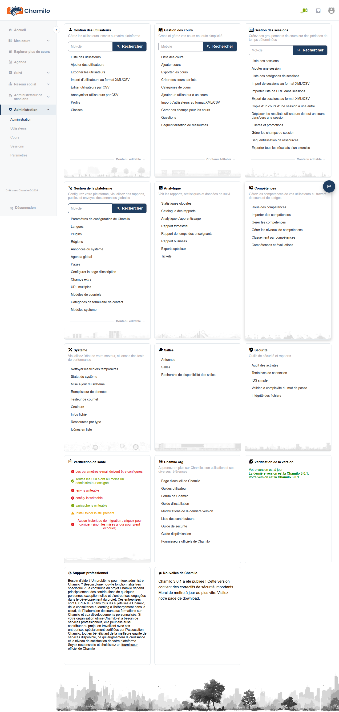

# Salles

Le bloc **Salles** du tableau de bord d’administration gère les lieux physiques que Chamilo peut suivre pour les formations en présentiel ou hybrides : les sites (branches), les salles qu’ils contiennent, et un outil pour trouver quelles salles sont libres à un moment donné.

Ce chapitre traite de la gestion côté administrateur des sites et des salles. Pour le côté enseignant — l’attribution d’une salle à une session de cours — voir [Sites et salles](../../teacher-guide/branches-and-rooms.md) dans le Guide de l’enseignant.

## Accéder au bloc Salles

Depuis le panneau d’administration, le bloc **Salles** apparaît aux côtés des autres blocs du tableau de bord. Cliquez sur l’un de ses liens pour ouvrir l’outil correspondant.

## Contenu du bloc

* **[Gestion des salles](managing-rooms.md)** — Créer et organiser les sites (branches), ainsi que les salles de chacun d’eux
* **[Recherche de disponibilité des salles](room-availability-finder.md)** — Vérifier quelles salles sont libres pour une date et une plage horaire données

## Note sur le multi-URL

Sur une installation multi-URL (multi-tenant), les sites et les salles sont limités à une seule URL d’accès chacun — ils ne sont jamais partagés entre portails.