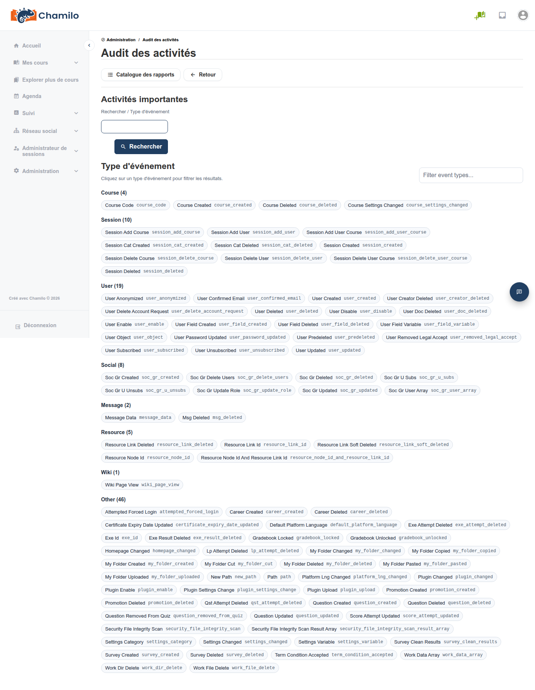

# Audit des activités

Le rapport Audit des activités vous permet de parcourir les activités administratives et de plateforme importantes, filtrées par type d’événement. Il s’agit du même rapport sous-jacent auparavant accessible depuis **Suivi > Audit des activités administratives** ; il est désormais également lié directement depuis le bloc Sécurité, car il s’agit principalement d’un outil de sécurité et de responsabilisation.

## Accéder à l’audit des activités

Depuis le panneau d’administration, cliquez sur **Sécurité > Audit des activités**.

## Ce qu’il affiche

Les événements sont regroupés en catégories :

* **Cours** — Création, suppression et modifications des paramètres de cours
* **Session** — Création, suppression et modifications d’inscription des sessions et des catégories de sessions
* **Utilisateur** — Création de comptes, suppression, mises à jour de mot de passe, modifications de champs, et plus encore
* **Social** — Création, suppression et modifications d’appartenance des groupes sociaux
* **Message** — Modifications et suppressions de données de messages
* **Ressource** — Création et suppression de ressources et de liens de ressources
* **Wiki** — Consultations de pages wiki
* **Autre** — Tout le reste, y compris l’activité des plugins, le verrouillage du carnet de notes, les suppressions de tentatives d’exercices, les tentatives de connexion forcée et les modifications des paramètres au niveau de la plateforme

Cliquez sur une pastille de type d’événement (par exemple **Tentative de connexion forcée**) pour filtrer le rapport jusqu’à un tableau des entrées correspondantes. Vous pouvez également rechercher directement par mot-clé à l’aide du champ **Recherche** au-dessus de la liste des types d’événements.

## Cas d’usage

* Enquêter sur qui a supprimé un cours, une session ou un compte utilisateur, et quand
* Confirmer si une modification administrative spécifique (une mise à jour des paramètres, une installation de plugin) a été effectuée par un administrateur attendu
* Assurer le suivi des événements **Tentative de connexion forcée** en parallèle du rapport [Tentatives de connexion](login-attempts.md)