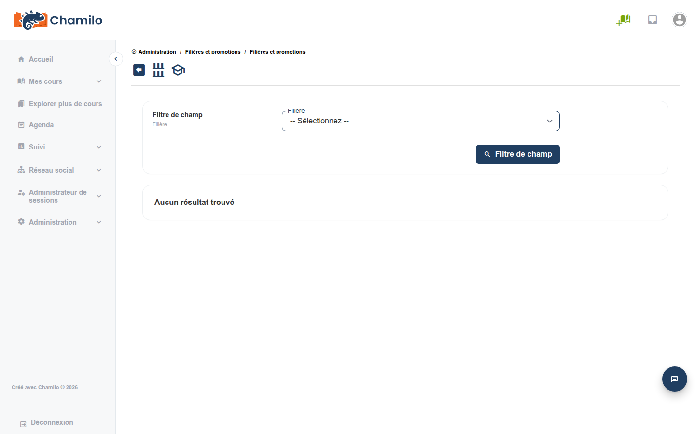

# Carrières et promotions

Chamilo inclut un système de gestion des carrières qui vous permet de définir des parcours de formation et de suivre la progression des apprenants au sein de programmes structurés.

## Carrières

Une **carrière** représente un parcours de formation structuré — une séquence d’étapes de formation qu’un apprenant suit pour atteindre un objectif professionnel.

### Créer une carrière

1. Depuis le panneau d’administration, accédez à **Carrières**
2. Cliquez sur **Créer une carrière**
3. Saisissez un **nom** et une **description**
4. Enregistrez

## Promotions

Une **promotion** représente une cohorte ou une promotion d’apprenants progressant dans une carrière. Considérez-la comme un groupe de personnes suivant le même parcours de carrière au même moment.

### Liaison aux sessions

Après avoir créé une promotion, vous y associez des sessions. Cela définit la séquence de formation qu’un apprenant doit suivre.

Vous pouvez ensuite répliquer des promotions afin de faciliter la création de la promotion suivante avec des copies des mêmes sessions, de sorte que votre prochaine promotion puisse être constituée en un instant.

### Créer une promotion

1. Accédez à **Promotions**
2. Cliquez sur **Créer une promotion**
3. Saisissez un **nom** et une **description**
4. Associez-la à une **carrière**
5. Attribuez des **sessions** à la promotion
6. Enregistrez

## Comment tout s’articule

* Une **carrière** définit le parcours (par ex. « Certification Junior Developer »)
* Une **promotion** représente une cohorte (par ex. « Promotion de mars 2026 »)
* Les **sessions** au sein de la promotion délivrent le contenu de formation proprement dit

## Conseils

* **Utilisez-les pour des programmes structurés** — Les carrières et les promotions sont surtout utiles pour les programmes de formation en plusieurs étapes, dans lesquels les apprenants progressent selon une séquence définie
* **Suivez l’achèvement** — Utilisez les outils de reporting pour surveiller la progression des promotions dans leurs parcours de carrière