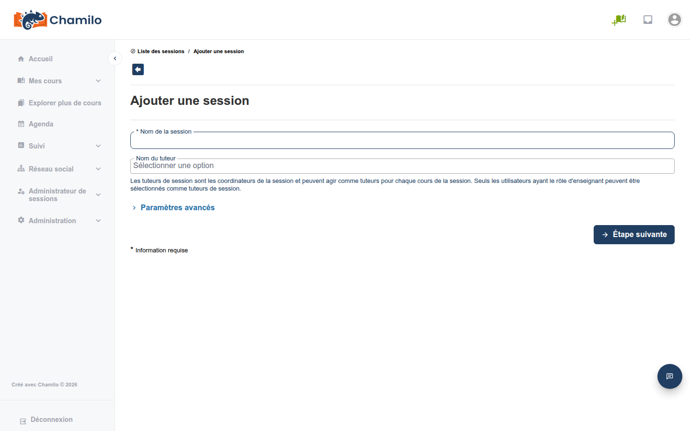
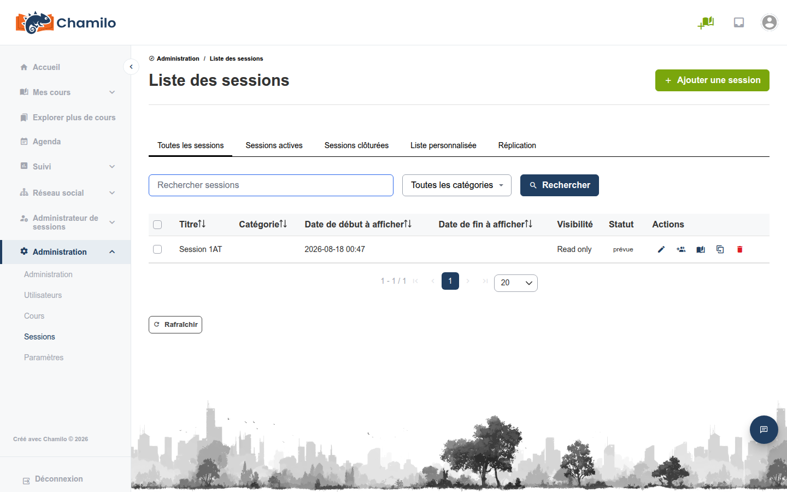
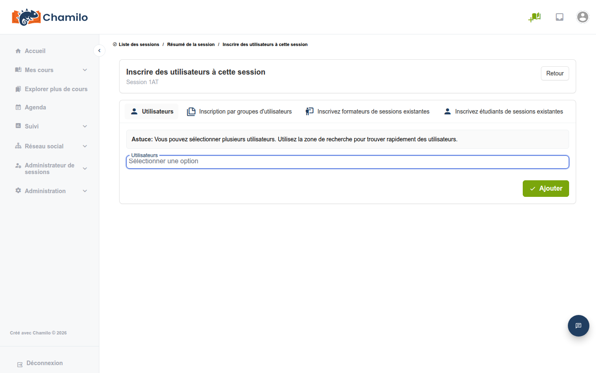

# Gestion des sessions

## Création d'une session

1. Depuis le panneau d'administration, cliquez sur **Créer une session**
2. Renseignez les informations de la session :
   * **Nom de la session** — Un nom descriptif (par ex. « Intégration printemps 2026 »)
   * **Dates de début et de fin** — Période de déroulement de la session (facultatif — les sessions peuvent être sans date de fin). Il existe 3 jeux de dates : dates d'affichage, dates de limitation de l'accès des apprenants et dates de limitation de l'accès des tuteurs
   * **Tuteur de session** — La personne qui supervise l'ensemble de la session
   * **Catégorie** — Affectation à une catégorie de session pour l'organisation
   * **Visibilité** — Contrôle de l'accès et du comportement d'affichage dans les listes
3. **Ajouter des cours** — Sélectionnez un ou plusieurs cours à inclure dans la session
4. **Inscrire des apprenants** — Ajoutez des utilisateurs individuels ou des classes d'utilisateurs
5. **Affecter des tuteurs de cours** — Pour chaque cours, affectez un enseignant (tuteur de cours)
6. Enregistrez

## Dates de session

Les sessions prennent en charge une configuration souple des dates :

| Date | Objet |
|------|---------|
| **Début/fin d'affichage** | Moment où la session apparaît dans les listes des apprenants |
| **Début/fin d'accès** | Moment où les apprenants peuvent réellement accéder au contenu de la session |
| **Début/fin d'accès des tuteurs** | Moment où les tuteurs peuvent accéder à la session (souvent avant le début et après la fin de l'accès des apprenants) |

Cela permet de préparer la session avant l'arrivée des apprenants et de maintenir l'accès des tuteurs après la fin de la session pour la notation et le reporting.

## Liste des sessions

La liste des sessions affiche toutes les sessions avec :

* Nom de la session
* Dates de début et de fin
* Statut (active, à venir, passée)

Utilisez la recherche et les filtres pour trouver des sessions par nom, date, catégorie ou statut.

## Modification d'une session

Cliquez sur une session pour la modifier :

* Modifier les dates, le nom ou la catégorie
* Ajouter ou retirer des cours
* Changer les tuteurs de cours
* Ajouter ou retirer des apprenants
* Consulter les données de suivi de la session

## Inscription des utilisateurs

Vous pouvez inscrire des utilisateurs à une session par :

* **Inscription individuelle** — Recherchez et ajoutez des utilisateurs un par un
* **Inscription par classe** — Ajoutez une classe entière (groupe d'utilisateurs prédéfinis) en une seule opération
* **Import CSV** — Téléversez un fichier d'affectations utilisateur-session

## Accès aux sessions

Les apprenants accèdent à leurs sessions via **Mes sessions** dans la barre latérale. Les sessions sont organisées en :

* **Sessions en cours** — Actuellement actives
* **Sessions passées** — Terminées
* **Sessions à venir** — Pas encore commencées

## Conseils

* **Planifiez les dates avec soin** — Veillez à ce que les dates d'accès des tuteurs dépassent celles des apprenants afin que les tuteurs puissent préparer et assurer le suivi
* **Utilisez les classes pour les inscriptions récurrentes** — Si vous inscrivez souvent les mêmes groupes, créez des classes et affectez-les aux sessions
* **Gardez les sessions organisées** — Utilisez des catégories et des conventions de nommage claires pour faciliter la gestion