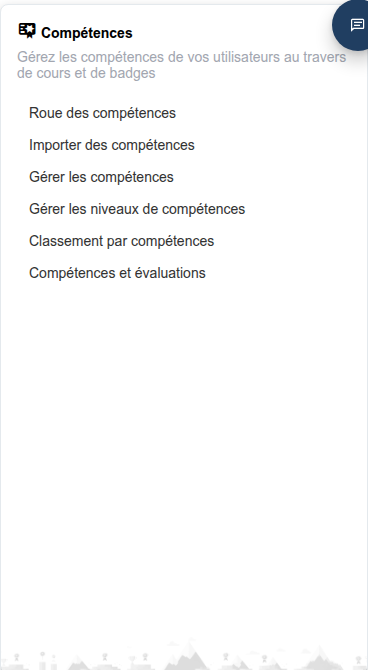

# Compétences

Le bloc **Compétences** du tableau de bord d’administration regroupe les outils permettant de définir, d’organiser et de suivre les badges de compétences (« skills ») sur l’ensemble de la plateforme. Une compétence peut être attribuée automatiquement lorsqu’un apprenant atteint un seuil du carnet de notes, termine des cours spécifiques, ou manuellement par un enseignant, et peut s’accompagner d’une icône de type badge ainsi que d’un niveau (par exemple Bronze/Argent/Or).

L’ensemble du bloc n’apparaît que si le paramètre **Activer l’outil compétences** (`skill.allow_skills_tool`, sous Paramètres de configuration > Compétences) est activé — il l’est par défaut.

## Accéder au bloc Compétences

Depuis le panneau d’administration, le bloc **Compétences** apparaît aux côtés des autres blocs du tableau de bord. Cliquez sur l’un de ses liens pour ouvrir l’outil correspondant.

## Contenu du bloc

* **[Gérer les compétences](managing-skills.md)** — Créer des compétences, les importer en masse et attribuer chacune à une échelle de niveaux
* **[Roue des compétences](skills-wheel.md)** — Une carte visuelle zoomable de l’arbre complet des compétences
* **[Classement des compétences](skills-ranking.md)** — Un classement des utilisateurs selon les compétences acquises
* **[Compétences et évaluations](skills-assessments.md)** — Relier les catégories du carnet de notes aux compétences qu’elles attribuent

## Paramètres associés

Quelques autres paramètres sous Paramètres de configuration > Compétences modifient qui peut faire quoi avec ce bloc :

* **Autoriser la gestion des compétences RH** (`allow_hr_skills_management`) — Permet aux utilisateurs Gestionnaire des ressources humaines de gérer les compétences aux côtés des administrateurs
* **Autoriser les compétences privées** (`allow_private_skills`)
* **Les enseignants peuvent attribuer des compétences** (`skills_teachers_can_assign_skills`)
* **Masquer les niveaux de compétences** (`hide_skill_levels`)
* **Afficher le nom complet de la compétence sur la roue des compétences** (`show_full_skill_name_on_skill_wheel`)