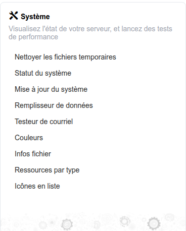

# Système

Le bloc **Système** du tableau de bord d’administration regroupe les outils de maintenance au niveau du serveur, le flux de mise à jour automatique, les utilitaires d’inspection du stockage et des ressources, ainsi que l’identité visuelle de la plateforme.

## Accéder au bloc Système

Depuis le panneau d’administration, le bloc **Système** apparaît aux côtés des autres blocs du tableau de bord. Cliquez sur l’un de ses liens pour ouvrir l’outil correspondant.

## Contenu du bloc

* **[Outils système](system-tools.md)** — Nettoyer les fichiers temporaires, exécuter le flux de mise à jour automatique, inspecter les fichiers et ressources stockés, et parcourir le jeu d’icônes intégré
* **État du système** — Traité dans [État du système](../maintenance/system-status.md), sous Maintenance
* **[Identité visuelle](branding/README.md)** — Thèmes de couleurs (le lien « Couleurs » du bloc ouvre la même page Thèmes de couleurs), personnalisation du portail et modèles

Deux éléments supplémentaires — **Data filler** et **E-mail tester** — n’apparaissent que lorsque le serveur comporte un répertoire `tests/`, ce qui correspond à une configuration de développement/AQ, et non de production. Ils n’apparaissent pas sur une installation de production typique ; voir [Outils système](system-tools.md#development-only-tools) pour ce qu’ils font lorsqu’ils sont présents.