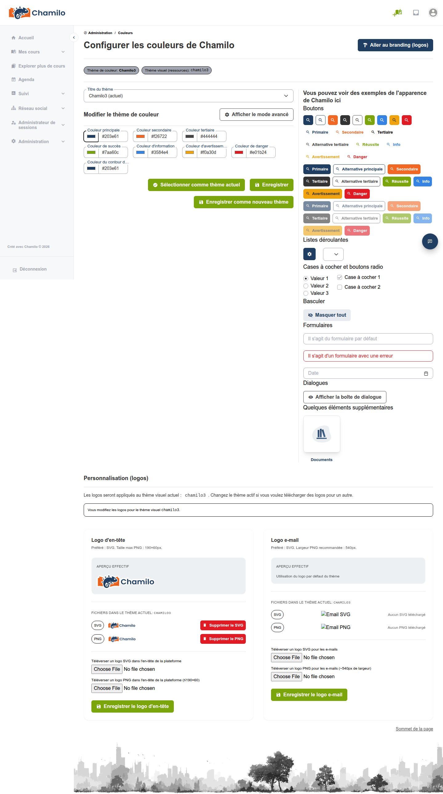

# Thèmes de couleurs

Chamilo 2.0 introduit un système de thèmes de couleurs qui vous permet de personnaliser l’apparence visuelle de la plateforme.

## Fonctionnement des thèmes

Les thèmes de couleurs définissent la palette utilisée dans l’interface de Chamilo — couleurs primaires, couleurs d’accent, arrière-plans et couleurs de texte. Un thème est associé à une URL d’accès : dans un portail à URL unique, il devient de fait le thème global ; dans une configuration multi-URL, chaque URL peut avoir le sien.

## Application d’un thème

1. Depuis le panneau d’administration, accédez à **Thèmes de couleurs**
2. Parcourez les thèmes disponibles
3. Sélectionnez un thème et cliquez sur **Appliquer**
4. Le thème est immédiatement appliqué à la plateforme

## Thèmes par URL

Dans une configuration multi-URL, chaque URL d’accès peut disposer de son propre thème de couleurs. Cela permet à différents portails d’avoir des identités visuelles distinctes tout en partageant la même installation Chamilo.

## Conseils

* **Adaptez-vous à votre marque** — Choisissez ou personnalisez un thème qui correspond aux couleurs de la marque de votre organisation
* **Vérifiez la lisibilité** — Après application d’un thème, contrôlez que le texte reste lisible sur les couleurs d’arrière-plan, en particulier dans les situations à fort contraste
* **Pensez à l’accessibilité** — Assurez un contraste de couleurs suffisant pour les utilisateurs malvoyants