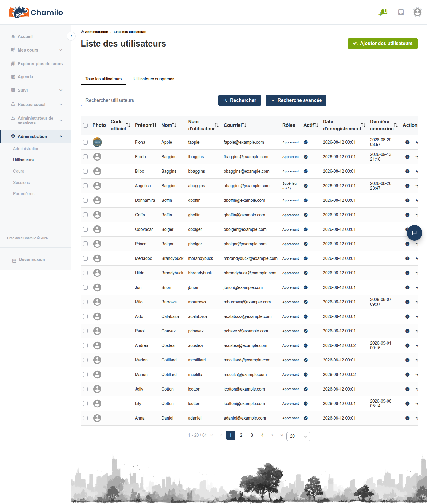
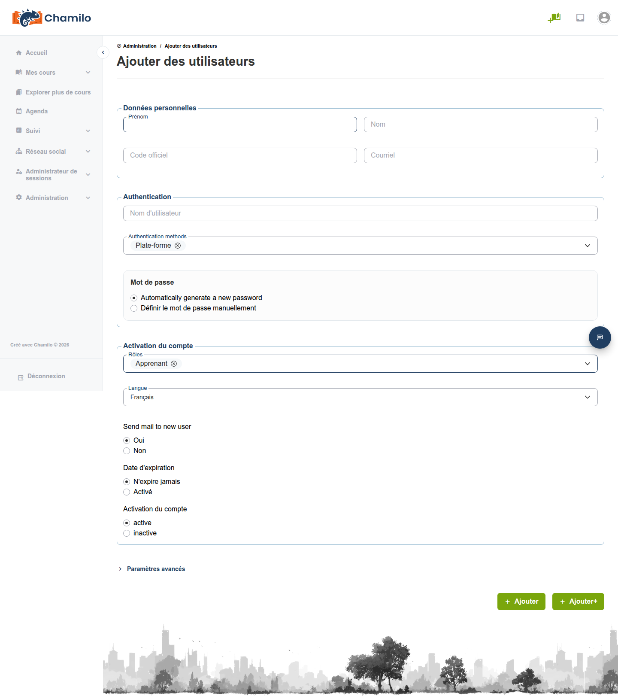
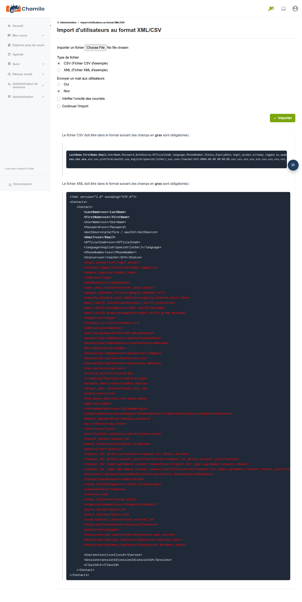

# Gestion des utilisateurs

Cette page couvre les tâches quotidiennes de création, de modification et de gestion des comptes utilisateurs.

## Liste des utilisateurs

Depuis le panneau d’administration, cliquez sur **Liste des utilisateurs** pour voir tous les utilisateurs de la plateforme. La liste affiche :

* Avatar
* Nom
* Identifiant
* Adresse e-mail
* Rôles
* Statut actif/inactif
* Date d’inscription
* Date de dernière connexion

Utilisez l’outil **Recherche avancée** pour trouver des utilisateurs spécifiques par nom, e-mail, rôle ou d’autres critères.

## Création d’un utilisateur

1. Cliquez sur **Ajouter un utilisateur** depuis le panneau d’administration
2. Renseignez les champs obligatoires :
   * **Prénom** et **Nom**
   * **E-mail** — Doit être unique sur la plateforme
   * **Identifiant** — Le nom de connexion (doit être unique)
   * **Mot de passe** — Définissez un mot de passe initial
   * **Rôles** — Sélectionnez le ou les rôles de l’utilisateur sur la plateforme (étudiant, enseignant, administrateur, etc.)
   * **Langue** — La langue d’interface préférée de l’utilisateur
3. Renseignez éventuellement des champs supplémentaires :
   * Code officiel (p. ex. identifiant unique dans l’organisation)
   * Numéro de téléphone
   * Date d’expiration — Désactive automatiquement le compte après une date
   * Statut actif/inactif
   * Champs de profil supplémentaires (s’ils sont configurés)
4. Enregistrer

## Importation d’utilisateurs

Pour une création d’utilisateurs en masse, vous pouvez importer des utilisateurs à partir d’un fichier :

1. Cliquez sur **Importer des utilisateurs** depuis le panneau d’administration
2. Téléversez un fichier **CSV** ou **XML** contenant les données utilisateurs
3. Faites correspondre les colonnes du fichier aux champs utilisateur de Chamilo
4. Choisissez comment traiter les utilisateurs existants (mettre à jour ou ignorer)
5. Importer

Le fichier d’importation doit contenir au moins les colonnes suivantes : prénom, nom, e-mail, identifiant et mot de passe.

Remarque : La colonne **Status** est le nom historique de **Rôle** et n’accepte que quelques valeurs, comme 1 pour enseignant, 5 pour étudiant. Un réglage plus fin des rôles ne peut être effectué que manuellement par la suite, en modifiant l’utilisateur.

## Exportation d’utilisateurs

Cliquez sur **Exporter des utilisateurs** pour télécharger la liste des utilisateurs au format CSV ou XML. Vous pouvez filtrer les utilisateurs à exporter par rôle, date d’inscription ou d’autres critères.

## Modification d’un utilisateur

Cliquez sur le nom d’un utilisateur dans la liste des utilisateurs pour modifier son compte. Vous pouvez modifier :

* Les informations personnelles (nom, e-mail, téléphone)
* Les rôles
* Le mot de passe (réinitialisation)
* Le statut actif/inactif
* La date d’expiration
* Les champs de profil supplémentaires

## Suppression d’un utilisateur

Lors de la suppression d’utilisateurs (généralement des enseignants) qui ont créé du contenu sur la plateforme, le système peut vous empêcher de les supprimer définitivement et afficher un message d’avertissement indiquant que l’utilisateur est encore rattaché à certaines ressources. Si vous confirmez la suppression, le système ne supprimera pas le contenu lui-même, mais le rattachera à un utilisateur neutre (appelé « utilisateur de repli » ou *Fallback user*) pour des raisons de cohérence des données.

Pour l’éviter, consultez les détails de l’utilisateur, supprimez chacun de ses cours un par un, puis supprimez l’utilisateur.

## Actions sur les utilisateurs

| Action | Description |
|--------|-------------|
| **Désactiver** | Désactive le compte d’un utilisateur sans le supprimer. L’utilisateur ne peut plus se connecter, mais ses données sont conservées. |
| **Activer** | Réactive un compte précédemment désactivé. |
| **Se connecter en tant que** | Se connecter à la plateforme en tant que cet utilisateur (usurpation d’identité). Utile pour le dépannage. |
| **Anonymiser** | Efface toutes les informations personnelles du compte, conformément au RGPD de l’UE. |
| **Supprimer** | Suppression logique du compte utilisateur. Utilisez l’onglet **Utilisateurs supprimés** pour supprimer définitivement le compte et les données associées. |

> **Se connecter en tant que** est une fonctionnalité puissante. Utilisez-la de manière responsable et uniquement à des fins d’assistance légitimes.

## Opérations par lots

Sélectionnez plusieurs utilisateurs dans la liste des utilisateurs pour effectuer des actions par lots :

* Activer ou désactiver plusieurs utilisateurs à la fois
* Supprimer plusieurs utilisateurs
* Affecter des utilisateurs à un cours ou à une session

## Conseils

* **Utilisez l’importation CSV pour les inscriptions nombreuses** — Lors de l’accueil de nombreux utilisateurs au début d’un programme de formation, préparez un fichier CSV et importez-le en masse
* **Définissez des dates d’expiration** — Pour les utilisateurs temporaires (participants à un atelier, utilisateurs d’essai), définissez une date d’expiration afin de désactiver automatiquement leurs comptes
* **Désactivez plutôt que de supprimer** — Lorsqu’un utilisateur part, désactivez d’abord son compte. Cela préserve ses historiques de formation. Ne supprimez que si vous êtes certain que les données ne sont plus nécessaires.