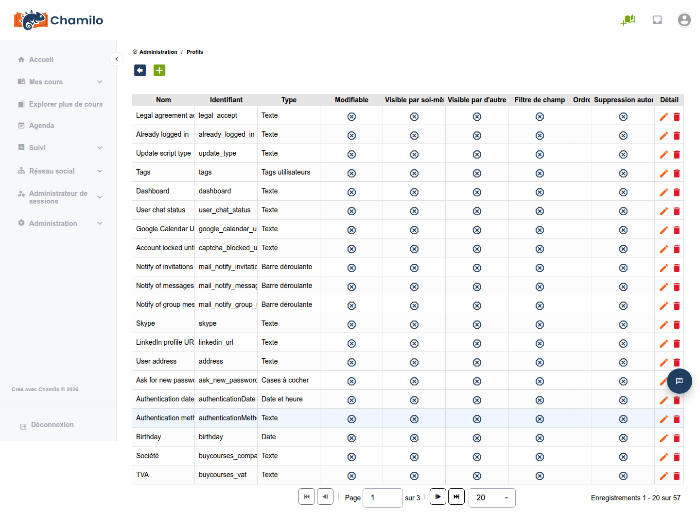

# Profilage des utilisateurs

Chamilo vous permet de définir des champs de profil personnalisés (champs supplémentaires) afin de collecter des informations additionnelles sur les utilisateurs, au-delà du nom, de l’e-mail et du rôle standard.

## Champs de profil supplémentaires

Les champs supplémentaires vous permettent de stocker des métadonnées propres à votre organisation, telles que :

* Identifiant employé
* Département
* Intitulé de poste
* Localisation/bureau
* Numéro de téléphone
* Identifiants personnalisés

## Création de champs supplémentaires

1. Depuis le panneau d’administration, accédez à **Extra fields** ou **Profile fields**
2. Cliquez sur **Add**
3. Configurez le champ :
   * **Name** — Le titre du champ affiché aux utilisateurs
   * **Description** — Description facultative
   * **Helper text** — Texte d’aide affiché sous le champ dans tout formulaire qui l’inclut
   * **Field type** — Texte, liste déroulante, date, case à cocher, etc.
   * **Field label** — Le nom interne du champ, pour l’intégration des plugins 
   * **Possible values** — Si le champ est un sélecteur parmi ces valeurs 
   * **Default value** — Une valeur par défaut facultative
   * **Visible to self** — Indique si le champ est visible sur le profil par l’utilisateur lui-même
   * **Visible to others** — Indique si le champ est visible par les autres utilisateurs de la plateforme
   * **Can change** — Indique si l’utilisateur peut modifier lui-même son propre champ (ou si seuls les administrateurs le peuvent)
   * **Filter** — Si le champ est de type sélecteur, indique s’il doit être inclus comme filtre dans les pages d’administration (par ex. pour inscrire des utilisateurs à des cours ou des sessions)
   * **Order** — Si vous souhaitez gérer l’ordre d’affichage des champs, vous devrez attribuer un ordre numérique à chaque champ
   * **Remove on anonymization** — Important pour les règles et lois relatives à la vie privée : si l’utilisateur est anonymisé mais non supprimé, ce champ doit-il être considéré comme un éventuel détenteur de données à caractère personnel ? 
4. Enregistrez

## Types de champs

Le moteur de champs supplémentaires prend en charge un large éventail de types de saisie. Les plus courants sont :

| Type | Description |
|------|-------------|
| **Text** | Une saisie de texte sur une seule ligne |
| **Textarea** | Une saisie de texte multiligne |
| **Radio** | Un groupe de boutons radio à choix unique |
| **Dropdown / Dropdown multiple** | Une liste d’options prédéfinies (sélection simple ou multiple) |
| **Double select** | Deux listes déroulantes dépendantes (par ex. pays → ville) |
| **Checkbox** | Un bascule oui/non |
| **Date / Date and time** | Sélecteur de date ou de date+heure |
| **Integer** | Une saisie numérique |
| **Tag** | Plusieurs valeurs d’étiquette en texte libre |
| **File** | Champ de téléversement de fichier |
| **Video URL** | Une URL pointant vers une vidéo |
| **Mobile phone number** | Un champ de numéro de téléphone formaté |
| **Timezone** | Un sélecteur de fuseau horaire |
| **Social profile** | Un lien vers un profil de réseau social |
| **Divider** | Un séparateur visuel dans le formulaire (sans valeur) |

L’ensemble exact des types utilisables dépend de la version de Chamilo ; la liste déroulante des types de champs dans la page d’administration **Extra fields** fait foi.

## Utilisation des champs supplémentaires

Les champs supplémentaires apparaissent :

* Dans les formulaires de création (s’ils sont visibles par l’utilisateur) et de modification d’utilisateur
* Sur les pages de profil utilisateur (s’ils sont visibles par l’utilisateur)
* Dans les importations d’utilisateurs (vous pouvez inclure les valeurs des champs supplémentaires dans les importations CSV)
* Dans les exports et les rapports (filtrer ou regrouper selon les valeurs des champs supplémentaires)

## Conseils

* **Planifiez avant de créer** — Définissez les informations dont vous avez besoin avant de créer les champs, car modifier les types de champs après la saisie des données peut poser problème
* **Utilisez des listes déroulantes pour la cohérence** — Lorsqu’un champ a un ensemble connu de valeurs possibles, utilisez une liste déroulante plutôt que du texte libre afin d’assurer la cohérence des données
* **Utilisez-les pour le reporting** — Les champs supplémentaires sont utiles pour filtrer les rapports (par ex. « afficher tous les utilisateurs du département X ayant suivi la formation Y »)